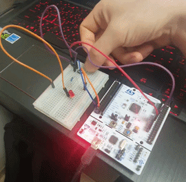
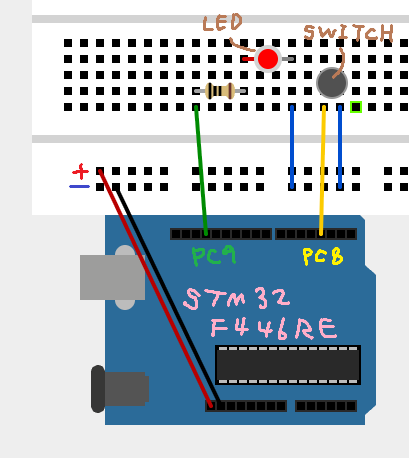
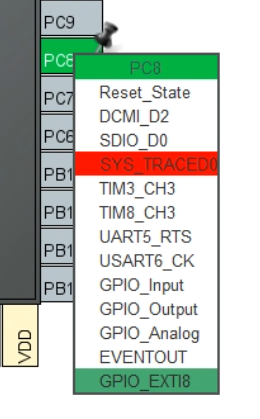
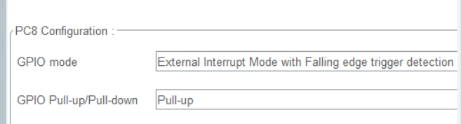
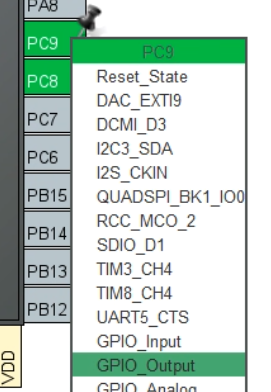
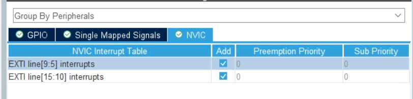

```c
/* USER CODE BEGIN 4 */
// 외부 인터럽트가 발생하면 하드웨어에 의해 자동으로 호출되는 콜백 함수
void HAL_GPIO_EXTI_Callback(uint16_t GPIO_Pin)
{
    // PC8 핀(EXTI8)에서 인터럽트가 발생했는지 확인
    if (GPIO_Pin == GPIO_PIN_8)
    {
        // PC9에 연결된 LED의 상태를 반전 (ON -> OFF / OFF -> ON)
        HAL_GPIO_TogglePin(GPIOC, GPIO_PIN_9);
    }
}
/* USER CODE END 4 */
```


