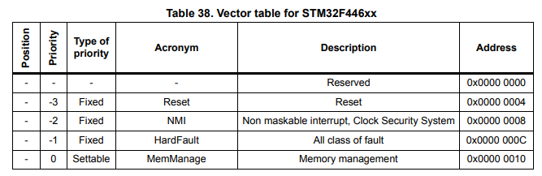
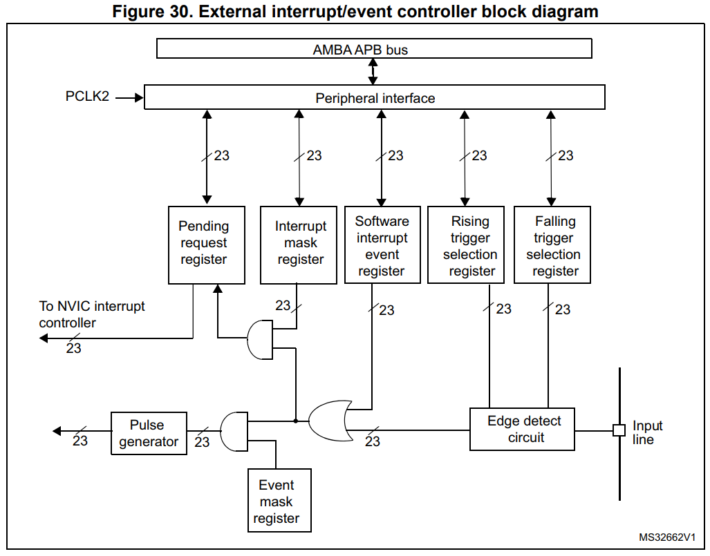
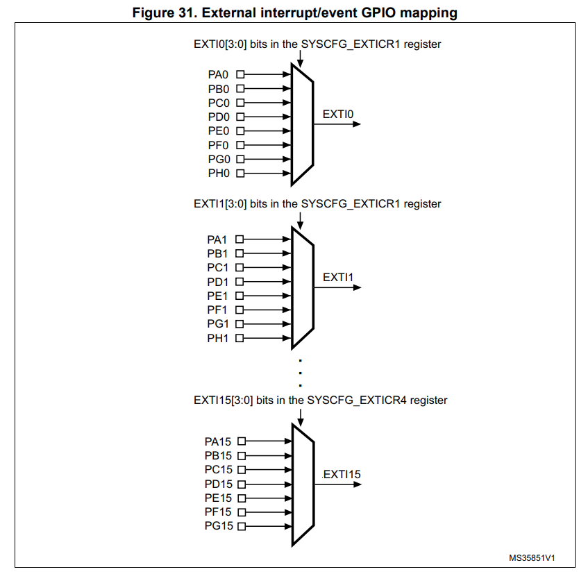
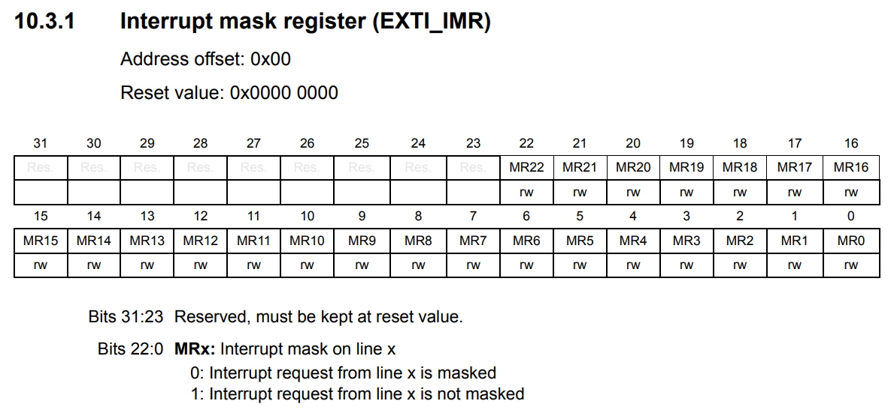
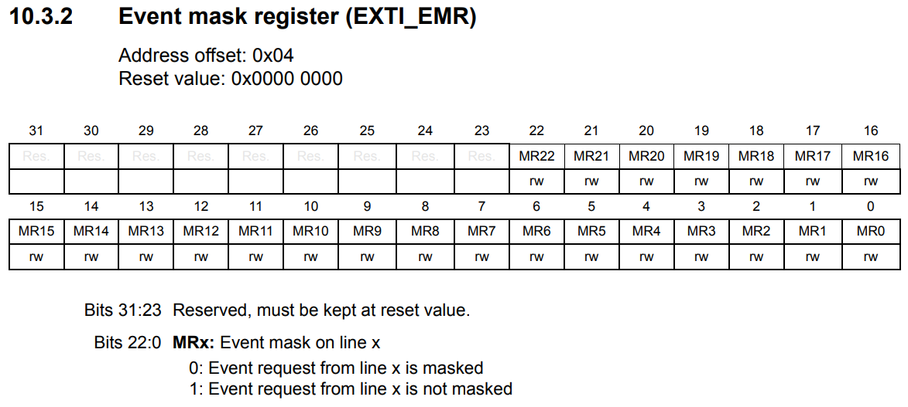
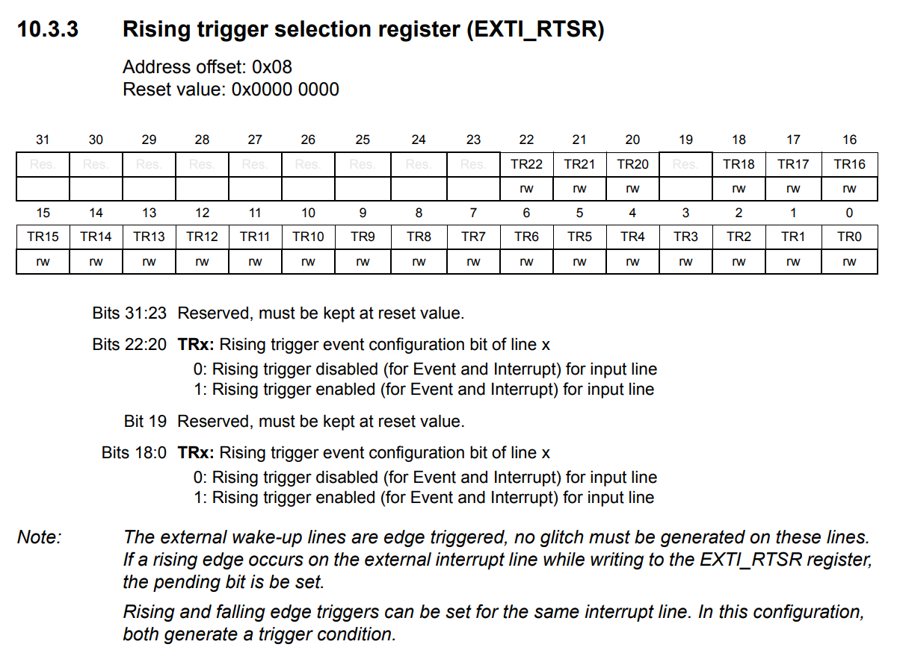
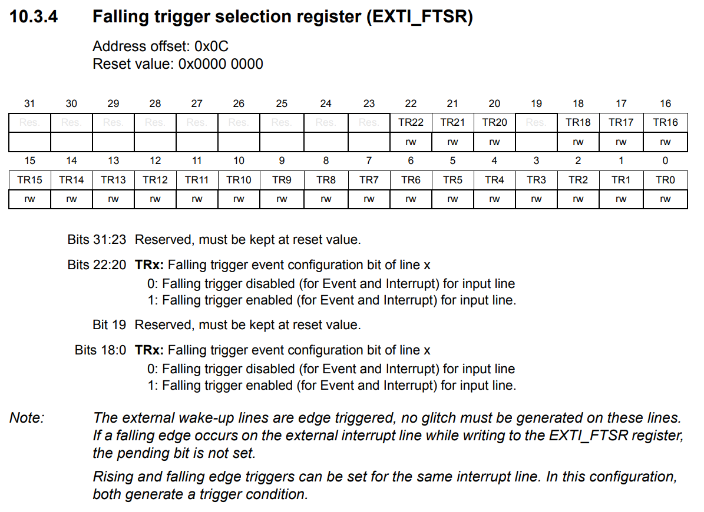
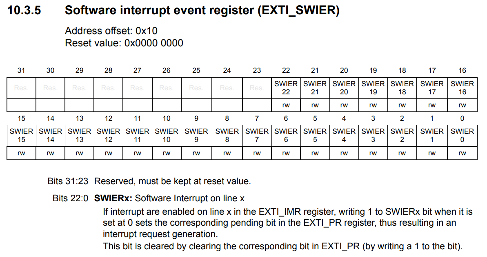
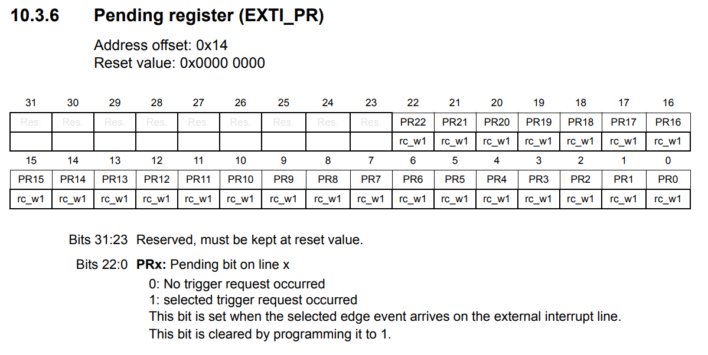
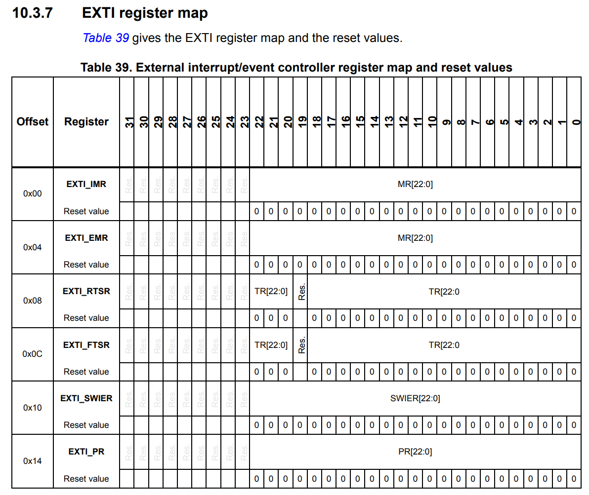

# WEEK 5
- 인터럽트의 개념과 임베디드 시스템에서의 인터럽트의 필요성에 대한 정리
- 인터럽트와 Polling의 차이에 대한 정리
- **과제** : polling과 interrupt 방식으로 각각 버튼 입력받아 uart 출력 or led 키기
 - **hint!** : delay를 길게 주게 되면 인터럽트와 polling의 차이를 눈에 띄게 볼 수 있습니다!

 **[참고하기좋은사이트](https://wikidocs.net/222580)**
 
## 인터럽트와 풀링

 CPU가 외부 장치나 이벤트의 발생을 감지하고 처리하는 두 가지 핵심 방식입니다.
 
 인터럽트는 이벤트가 발생했을 때 하드웨어가 CPU에 신호를 보내어 알리는 방식이고, 폴링은 CPU가 주기적으로 직접 장치 상태를 확인하는 방식입니다.

 **Polling**은 CPU가 이벤트의 발생을 감지하기 위해 매 주기마다 확인하는 것.

 **Interrupt**은 이벤트가 발생한 주변 장치에서 CPU로 interrupt신호를 보내는 것.

## 1. 폴링 (Polling)

### 개념
CPU가 주 프로그램 루프(Main Loop)를 실행하면서 특정 레지스터의 상태 플래그(Flag)나 입출력 핀의 상태를 주기적으로 계속 확인하여 조건이 충족되었는지 점검하는 방식입니다.

### 동작 방식
* CPU가 특정 이벤트(예: UART 데이터 수신, 타이머 완료 등)가 발생했는지 레지스터를 직접 확인(Read)합니다.
* 조건이 참($1$)이 될 때까지 무한 루프나 반복문 내에서 기다렸다가, 데이터가 준비되면 다음 로직을 수행합니다.

### 장점 및 단점
* **장점:** 구현이 매우 간단하고, 디버깅이 쉬우며 인터럽트 오버헤드(문맥 교체 등)가 없습니다.
* **단점:** 이벤트가 발생할 때까지 CPU가 아무런 작업도 하지 못하고 대기해야 하므로 CPU 자원 소모가 크고, 실시간 반응성이 떨어집니다.

## 2. 인터럽트 (Interrupt)

### 개념
CPU가 주 프로그램을 수행하는 도중 내부 주변장치(Peripheral)나 외부 핀에 이벤트가 발생하면, 하드웨어가 즉시 CPU에 신호를 보내 실행 중인 작업을 멈추고 지정된 처리 함수(ISR, Interrupt Service Routine)로 제어를 넘기는 방식입니다.

## 3. 인터럽트(Interrupt) vs 폴링(Polling) 통합 비교

| 구분 | 폴링 (Polling) | 인터럽트 (Interrupt) |
| :--- | :--- | :--- |
| **작동 방식** | CPU가 반복문(Main Loop) 내에서 주기적으로 레지스터 플래그나 핀 상태를 직접 확인 | 하드웨어가 이벤트를 감지하여 CPU에 처리 요청 신호를 전송 |
| **제어 주체** | 소프트웨어 (CPU가 직접 주기적으로 확인) | 하드웨어 (주변장치, NVIC, EXTI 등 이벤트 발생 시 CPU에 통보) |
| **CPU 효율성** | 낮음 (상태 확인을 위한 무한 대기 루프로 자원 waste 및 전력 소모) | 높음 (이벤트 전까지 다른 작업 수행 가능) |
| **응답성 (반응 속도)** | 무한 루프 주기 및 체크 시점에 따라 반응이 느릴 수 있어 실시간성 저하 | 신호 즉시 ISR로 전환하여 높은 실시간성 제공 |
| **전력 관리** | CPU가 계속 동작해야 하므로 전력 소모가 큼 | 대기 시간 동안 MCU를 저전력 모드(Stop/Sleep)로 전환 가능 |
| **구현 난이도** | 매우 간단하고 직관적임 | 상대적으로 복잡함 (ISR 관리, 문맥 교체(Context Switching), 우선순위(Priority) 등 고려 필요) |
| **주요 활용** | 단순 센서 데이터 읽기, 짧은 대기 구간 | 버튼 입력, UART/SPI 데이터 수신, 타이머 매칭 등 |

## 임베디드의 인터럽트 (Interrupt)
[reference_manual_235p](Interrupts and events)

인터럽트가 여러개 들어오면? 지금 하는 작업이 더 중요하면? : 우선순위

### STM32의 중단 처리 장치 NVIC(Nested Vectored Interrupt Controller)의 주요 특징
> "MCU(마이크로컨트롤러)가 여러 가지 긴급한 일(인터럽트)을 처리할 때 작업 순서와 우선순위를 정해주는 핵심 제어 센터"에 대한 설명

* **NVIC (중첩 벡터 인터럽트 컨트롤러)**: CPU와 직접 연결되어 외부/내부 signal이 발생했을 때 작업 중인 코드를 잠시 멈추고 우선순위가 높은 작업부터 빠르게 처리해 주는 장치입니다.
* **96 maskable interrupt channels**: CPU 내부 전용 인터럽트 16개를 제외하고, 개발자가 켜고 끌 수 있는(Maskable) 주변 장치 인터럽트 신호를 최대 96개까지 관리할 수 있습니다.
* **16 programmable priority levels (4 bits)**: 인터럽트의 우선순위를 16단계로 나누어 설정할 수 있습니다. 숫자가 낮을수록 더 급한 인터럽트이며, 중요한 일이 터지면 하던 일을 멈추고 바로 넘어가게 됩니다(중첩/Nested 기능).
* **low-latency handling**: CPU 핵심 부위와 밀접하게 붙어 있어서 인터럽트 요청이 들어왔을 때 즉각적이고 매우 빠르게 반응합니다.
* **power management control**: 저전력 모드(Sleep, Stop 모드 등)에서 인터럽트가 발생했을 때 시스템을 다시 깨우는(Wakeup) 연동 제어를 담당합니다.
* **PM0214 참조**: 시스템 컨트롤 레지스터 설정이나 세부 프로그래밍 정보는 별도의 프로그래밍 매뉴얼(PM0214)을 참고하라는 안내입니다.

    > 외부 인터럽트 vs 내부 전용 인터럽트
    > 
    >    * **외부/주변 장치 인터럽트 (Maskable Interrupts, 96개)**
    >    * CPU 외부에 있는 기능들이 보낸 요청입니다.
    >    * 예: 버튼 입력을 감지한 EXTI, 데이터를 다 읽은 UART, DMA 완료, 타이머 알람 등
    >   * 개발자가 상황에 따라 사용하지 않도록 끄거나(Masking) 켜는 것이 자유롭습니다.
    >
    >   * **내부 전용 인터럽트 (Core Exceptions, 16개)**
    >    * CPU 코어 내부에서 실행 중 에러가 발생하거나, 시스템 동작에 직접 관련된 긴급한 명령 처리 요청입니다.
    >    * 예: Reset, NMI, HardFault, SysTick, PendSV 등

## 외부 인터럽트/이벤트 컨트롤러 (EXTI)

외부 인터럽트/이벤트 컨트롤러는 이벤트 및 인터럽트 요청을 생성하기 위한 최대 23개의 엣지 검출기(edge detector)로 구성됩니다. 각 입력 라인은 독자적으로 설정하여 신호 유형(인터럽트 또는 이벤트)과 해당 트리거 조건(상승 엣지, 하강 엣지 또는 둘 다)을 선택할 수 있습니다. 또한 각 라인은 개별적으로 차단(mask)할 수 있습니다. 펜딩 레지스터(pending register)는 인터럽트 요청의 상태 라인을 유지 관리합니다.

### 상세 기능 설명

이 기능은 버튼 클릭이나 외부 핀의 신호 변화(전압 변동)를 감지하여 CPU에 알리거나 특정 동작을 실행시키는 신호 감지 센터 역할을 합니다.

### 엣지 검출기 (Edge Detectors)
신호의 상태가 바뀔 때를 감지합니다.
* **상승 엣지 (Rising Edge):** 전압이 낮음(0V)에서 높은(3.3V) 상태로 올라갈 때 감지 (예: 버튼을 누를 때).
* **하강 엣지 (Falling Edge):** 전압이 높음에서 낮음으로 떨어질 때 감지 (예: 버튼을 뗄 때).
* **양방향 (Both):** 신호가 바뀌는 모든 순간을 감지합니다.

### 인터럽트(Interrupt) vs 이벤트(Event)
* **인터럽트 모드:** 신호가 들어오면 CPU 실행 흐름을 멈추고 인터럽트 서비스 루틴(ISR, 핸들러 코드)을 실행합니다.
* **이벤트 모드:** 코드를 실행하지 않고 하드웨어 간 신호 연결을 수행합니다. 예를 들어 CPU를 깨우거나(WFE), 타이머나 ADC 동작을 코드 개입 없이 직접 시작(Trigger)시킵니다.

### 개별 마스킹 (Masked independently)
필요에 따라 각 입력 라인의 감지 기능을 레지스터 설정(`EXTI_IMR`, `EXTI_EMR`)으로 자유롭게 켜고 꼴 수 있습니다.

### 펜딩 레지스터 (Pending Register, EXTI_PR)
"어느 핀에서 신호가 들어왔는지" 기록해 두는 알림판입니다.  
인터럽트가 발생하면 해당 비트가 1이 되며, 코드가 실행된 후 1을 다시 써서 알림을 비워줘야(Clear) 다음 신호를 또 받을 수 있습니다.

  
    이하 테이블 생략

## EXTI의 주요 특징

EXTI 컨트롤러의 주요 특징은 다음과 같습니다:

* 각 인터럽트/이벤트 라인에 대한 독립적인 트리거 및 마스크 설정
* 각 인터럽트 라인별 전용 상태 비트 제공
* 최대 23개의 소프트웨어 이벤트/인터럽트 요청 생성
* APB2 클록 주기보다 짧은 펄스 폭을 가진 외부 신호 감지 (이 파라미터에 대한 자세한 내용은 STM32F446xx 데이터시트의 전기적 특성 섹션을 참조)

### 쉽게 설명하는 핵심 기능

EXTI(외부 인터럽트/이벤트 제어기)가 갖춘 4가지 핵심 능력

* **독립적인 트리거 및 마스크 설정 (independent trigger and mask)**  
  23개의 라인이 서로 영향을 주지 않고 각자 개별적으로 작동합니다.  
  어떤 라인은 Rising Edge(신호 상승), 어떤 라인은 Falling Edge(신호 하강)에서 켜지도록 고를 수 있고, 쓰지 않을 라인은 개별적으로 차단(Masking)할 수 있습니다.

* **전용 상태 비트 (dedicated status bit)**  
  "어느 라인에서 인터럽트가 터졌는지"를 바로 알 수 있는 고유 플래그 비트(Pending Register)를 가집니다.  
  CPU가 이 비트를 보고 어떤 핀에서 이벤트가 발생했는지 빠르게 판별합니다.

* **소프트웨어 요청 생성 (software event/interrupt requests)**  
  버튼을 누르는 등 실제 외부 핀으로 신호를 주지 않더라도, 개발자가 코드(소프트웨어 레지스터)를 통해 가짜 인터럽트/이벤트를 강제로 발생시킬 수 있습니다 (`EXTI_SWIER` 이용).  
  로직 테스트나 시스템 자체 이벤트 전달에 유용합니다.

* **아주 짧은 신호도 감지 (pulse width lower than APB2 clock period)**  
  CPU나 APB2 클록 속도보다 더 아주 잠깐(수 나노초 단위) 들어왔다 사라지는 미세한 펄스 신호도 놓치지 않고 감지합니다.  
  노이즈 수준의 짧은 신호나 아주 빠른 외부 센서의 신호도 하드웨어가 놓치지 않고 잘 포착한다는 뜻입니다.

## EXTI block diagram

## 웨이크업 이벤트 관리 (Wakeup Event Management)

STM32F446xx 마이크로컨트롤러는 코어를 깨우기(WFE 실행) 위해 외부 또는 내부 이벤트를 처리할 수 있습니다. 웨이크업 이벤트는 다음 중 하나로 발생시킬 수 있습니다:

* 주변 장치 제어 레지스터에서 인터럽트를 활성화하되 NVIC에서는 활성화하지 않고, Cortex®-M4 시스템 제어 레지스터의 SEVONPEND 비트를 활성화하는 방법. MCU가 WFE 상태에서 깨어날 때, 주변 장치 인터럽트 펜딩 비트와 주변 장치 NVIC IRQ 채널 펜딩 비트(NVIC 인터럽트 클리어 펜딩 레지스터 내)를 수동으로 비워주어야(Clear) 합니다.
* 또는 외부/내부 EXTI 라인을 이벤트 모드로 설정하는 방법. CPU가 WFE 상태에서 깨어날 때, 해당 이벤트 라인에 대응하는 펜딩 비트가 설정되지 않으므로 주변 장치 인터럽트 펜딩 비트나 NVIC IRQ 채널 펜딩 비트를 비워줄 필요가 없습니다.

### Wakeup Event 핵심 요약

WFE(Wait For Event) 명령어로 CPU를 잠드는 모드(Sleep/Stop 모드)에 빠뜨렸을 때, 주요 작업 코드를 곧바로 실행하지 않고 CPU만 가볍게 잠에서 깨우는 방식을 의미합니다.  

* **인터럽트(WFI) 방식:** 신호가 오면 CPU가 깨어남과 동시에 인터럽트 핸들러(ISR 코드)로 튕겨 나가 코드를 실행합니다.  
* **이벤트(WFE) 방식:** 신호가 오면 핸들러 실행 없이 WFE 바로 다음 줄의 코드부터 그대로 이어서 실행합니다.  

### 두 가지 웨이크업 방법의 차이

#### 1. 인터럽트를 이용한 방식 (SEVONPEND 비트 활용)
NVIC에서는 해당 인터럽트를 꺼두고, 주변 장치 및 SEVONPEND 비트만 킵니다.  
* **특징:** 신호가 들어오면 CPU가 깨어나긴 하지만, ISR 핸들러로 이동하지 않고 WFE 다음 줄을 실행합니다. 단, 하드웨어 깃발(Pending bit)이 남아있으므로 개발자가 직접 코드로 깃발을 지워줘야(Clear) 다음 번에 또 정상 동작합니다.  

#### 2. EXTI 이벤트 모드 방식 (권장 및 단순한 방식)
EXTI 라인을 '이벤트 모드(EXTI_EMR)'로 설정해 둡니다.  
* **특징:** 신호가 올 때 하드웨어 펜딩 비트 자체가 남지 않습니다. 따라서 CPU가 깨어난 후 별도의 플래그 비트를 지우는 수고(Clear 작업)를 할 필요가 없습니다.

## EXTI (외부 인터럽트/이벤트 Controller) 기능 설명 및 설정 방법

### 기능 설명 (Functional description)

인터럽트를 발생시키려면 인터럽트 라인을 설정하고 활성화해야 합니다. 두 개의 트리거 레지스터에 원하는 엣지 감지 조건을 설정하고, 인터럽트 마스크 레지스터(IMR)의 해당 비트에 1을 써서 인터럽트 요청을 활성화하여 수행합니다. 외부 인터럽트 라인에 선택한 엣지가 발생하면 인터럽트 요청이 생성됩니다. 동시에 해당 인터럽트 라인의 펜딩 비트(Pending bit)도 설정됩니다. 이 요청은 펜딩 레지스터에 1을 씀으로써 리셋(비움)됩니다.

이벤트를 발생시키려면 이벤트 라인을 설정하고 활성화해야 합니다. 두 개의 트리거 레지스터에 원하는 엣지 감지를 설정하고, 이벤트 마스크 레지스터(EMR)의 해당 비트에 1을 써서 이벤트 요청을 활성화하여 수행합니다. 이벤트 라인에 선택한 엣지가 발생하면 이벤트 펄스가 생성됩니다. 이때 이벤트 라인에 대응하는 펜딩 비트는 설정되지 않습니다.

인터럽트/이벤트 요청은 소프트웨어 인터럽트/이벤트 레지스터에 1을 써서 소프트웨어적으로 발생시킬 수도 있습니다.

### 설정 방법

#### 하드웨어 인터럽트 설정 방법
23개 라인을 인터럽트 소스로 설정하려면 다음 절차를 따릅니다:
* 23개 인터럽트 라인의 마스크 비트 설정 (`EXTI_IMR`)
* 인터럽트 라인의 트리거 선택 비트 설정 (`EXTI_RTSR` 및 `EXTI_FTSR`)
* 23개 라인 중 하나에서 들어오는 인터럽트가 올바르게 승인될 수 있도록 외부 인터럽트 컨트롤러(EXTI)와 매핑된 NVIC IRQ 채널의 활성화 및 마스크 비트 설정

#### 하드웨어 이벤트 설정 방법
23개 라인을 이벤트 소스로 설정하려면 다음 절차를 따릅니다:
* 23개 이벤트 라인의 마스크 비트 설정 (`EXTI_EMR`)
* 이벤트 라인의 트리거 선택 비트 설정 (`EXTI_RTSR` 및 `EXTI_FTSR`)

#### 소프트웨어 인터럽트/이벤트 설정 방법
23개 라인은 소프트웨어 인터럽트/이벤트 라인으로 설정할 수 있습니다. 소프트웨어 인터럽트를 발생시키는 절차는 다음과 같습니다.
* 23개 인터럽트/이벤트 라인의 마스크 비트 설정 (`EXTI_IMR`, `EXTI_EMR`)
* 소프트웨어 인터럽트 레지스터 (`EXTI_SWIER`)의 해당 비트 설정

### 상세 동작 원리 정리

#### 1. 인터럽트(Interrupt) 동작 흐름
* **작동**: 신호가 들어오면 펜딩 비트(알림 플래그)가 1로 설정되고 CPU 코드로 인터럽트 요청을 전달합니다.
* **특징**: ISR 핸들러 함수가 실행된 후, 개발자가 직접 펜딩 레지스터에 1을 써서 플래그를 지워줘야(Clear) 다음 인터럽트를 정상적으로 다시 받을 수 있습니다.

#### 2. 이벤트(Event) 동작 흐름
* **작동**: 신호가 들어오면 하드웨어 펄스(Pulse)만 출력하여 다른 주변장치를 동작시키거나 CPU를 깨웁니다(WFE).
* **특징**: 펜딩 비트가 남지 않습니다. 따라서 소프트웨어로 플래그를 지우는 번거로운 후처리 작업이 전혀 필요 없습니다.

#### 3. 3가지 설정 절차 차이점 요약
* **하드웨어 인터럽트 셋팅**: `EXTI_IMR`(마스크 해제) + `EXTI_RTSR`/`FTSR`(상승/하강 엣지 선택) + NVIC 활성화
* **하드웨어 이벤트 셋팅**: `EXTI_EMR`(마스크 해제) + `EXTI_RTSR`/`FTSR`(상승/하강 엣지 선택) *(NVIC 설정 필요 없음)*
* **소프트웨어 강제 발생**: `EXTI_IMR`/`EMR`(마스크 해제) + `EXTI_SWIER`(해당 비트에 1 쓰기)

## External interrupt/event line mapping

PH15는 어디갔지?
> Port H에는 15번 핀(PH15) 자체가 아예 하드웨어적으로 존재하지 않기 때문입니다. ㅇㅇ..

## EXTI Registers

* Interrupt mask register (EXTI_IMR)  

* Event mask register (EXTI_EMR)  

* Rising trigger selection register (EXTI_RTSR)  

* Falling trigger selection register (EXTI_FTSR)  

* Software interrupt event register (EXTI_SWIER)  

* Pending register (EXTI_PR)  

* EXTI register map  
