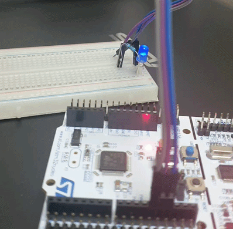
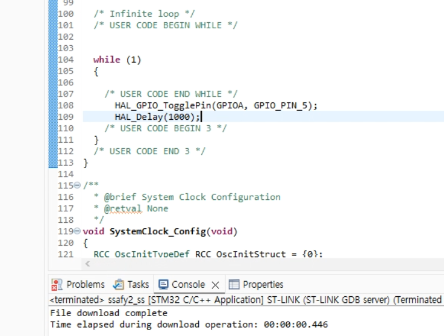
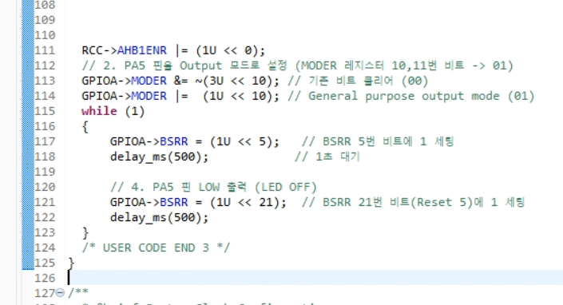
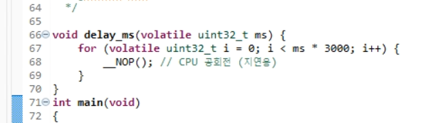
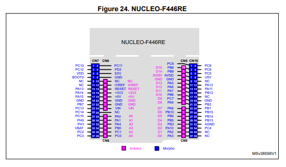

# 야르~








# 회로
[stm32](./source/pdf/dm00105823-stm32-nucleo-64-boards-mb1136-stmicroelectronics.pdf) 36p




PA5는 GPIO POPT A그룹의 5번핀이고 기판은 D13으로 확인 할 수 있다 !

이 핀 PA5를 사용해서 LED를 제어한다.


# Bare-metal (레지스터 직접 제어) 방식

고수준 라이브러리 없이 STM32F446RE의 레지스터 메모리 주소에 직접 접근하여 제어하는 방식입니다.

## 작성 메커니즘

1. RCC AHB1 클록 활성화: GPIOA에 전원을 공급하기 위해 RCC->AHB1ENR 레지스터의 0번 비트를 1로 설정합니다.
1. GPIO 출력 모드 설정: PA5 핀의 MODER 레지스터(10, 11번 비트)를 01(General Purpose Output)로 설정합니다.
1. BSRR 레지스터 조작: BSRR 레지스터의 비트를 조작하여 PA5 핀을 High(켜짐) / Low(꺼짐) 상태로 변경하고, 소프트웨어 딜레이 루프를 1초간 실행합니다.

```c
#include "stm32f4xx.h"

// 약 1초 동안 CPU 지연을 발생시키는 소프트웨어 딜레이 함수
void delay_ms(volatile uint32_t ms) {
    for (volatile uint32_t i = 0; i < ms * 3000; i++) {
        __NOP(); // CPU 공회전 (지연용)
    }
}

int main(void) {
    // 1. GPIOA 클록 공급 (RCC AHB1ENR 레지스터 0번 비트 GPIOAEN = 1)
    RCC->AHB1ENR |= (1U << 0);

    // 2. PA5 핀을 Output 모드로 설정 (MODER 레지스터 10,11번 비트 -> 01)
    GPIOA->MODER &= ~(3U << 10); // 기존 비트 클리어 (00)
    GPIOA->MODER |=  (1U << 10); // General purpose output mode (01)

    while (1) {
        // 3. PA5 핀 HIGH 출력 (LED ON)
        GPIOA->BSRR = (1U << 5);   // BSRR 5번 비트에 1 세팅
        delay_ms(1000);            // 1초 대기

        // 4. PA5 핀 LOW 출력 (LED OFF)
        GPIOA->BSRR = (1U << 21);  // BSRR 21번 비트(Reset 5)에 1 세팅
        delay_ms(1000);            // 1초 대기
    }
}
```

# HAL Library 방식
ST사에서 제공하는 기본 API 함수를 사용해 간결하고 직관적으로 제어하는 방식입니다.

## 작성 메커니즘
1. STM32CubeMX (.ioc) 파일에서 PA5 핀을 GPIO_Output으로 지정하고 코드를 자동 생성합니다.
1. main.c 파일 내부의 while(1) 루프 안에서 HAL_GPIO_TogglePin()과 HAL_Delay() 함수를 사용합니다.

```c
int main(void)
{
  /* MCU 및 시스템 클록, GPIO 초기화 (CubeMX가 자동 생성) */
  HAL_Init();
  SystemClock_Config();
  MX_GPIO_Init();

  /* 무한 루프 */
  while (1)
  {
    /* USER CODE BEGIN WHILE */
    
    // PA5 핀 상태 반전 (1초마다 ON <-> OFF)
    HAL_GPIO_TogglePin(GPIOA, GPIO_PIN_5);
    
    // 1000ms (1초) 지연
    HAL_Delay(1000);
    
    /* USER CODE END WHILE */
  }
}
```