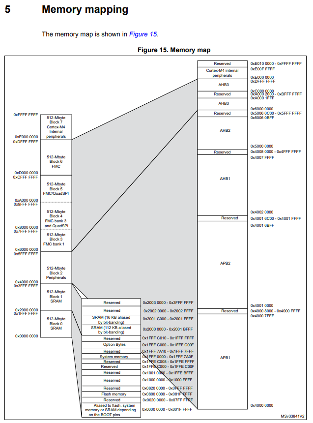
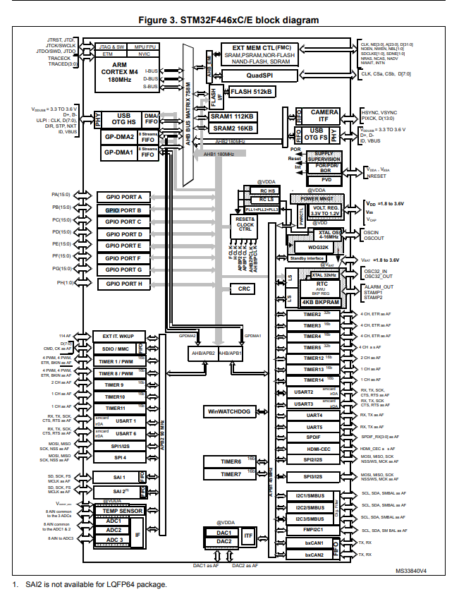
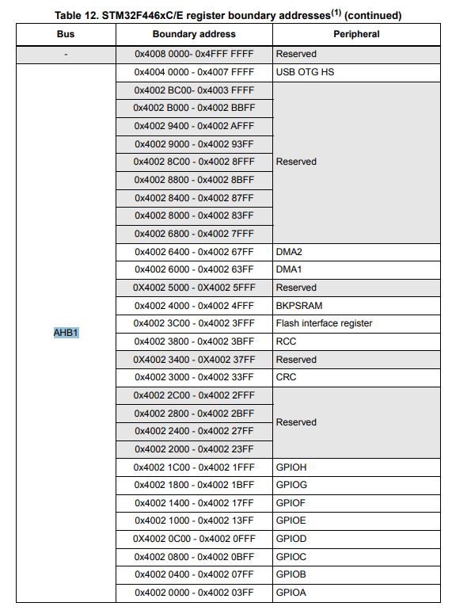

# contents
1. 용어
1. 메모리 맵 구조
1. GPIO 정리
1. GPIO 레지스터 정리

## 1. 용어
* NUCLEO-F446RE
    * 상업용 제품명
    * 기판은 MB1136이고 안에 내용물은(MCU) 좀 다른 자매 제품들이 잇음.
* MB1136
    * 판(PCB) 레퍼런스 번호
    * 여러 버전이 있을 수도 잇음.
* 메모리 맵 (Memory Map)
    * MCU 안의 수많은 기능과 스위치(레지스터)들이 가상 주소 공간 어디에 배치되어 있는지 정리해 둔 32비트 
    주소록
    * 4gb의 가상 주소 공간
    * ? : 4gb나 필요할 일인가? : 
        * 그냥 최대 이 정도고 실제 사용은 ㅇㅇ..
* GPIO (General Purpose Input/Output)
    * 칩 외부의 핀들을 자유롭게 설정할 수 있는 다목적 입출력 핀

* link : [stm32f446mc.pdf](https://www.st.com/en/microcontrollers-microprocessors/stm32f446/documentation.html)
* source : 
    * [stm32f446mc.pdf](./source/pdf/stm32f446mc.pdf)
    * [rm0390-stm32f446xx-advanced-armbased-32bit-mcus-stmicroelectronics.pdf](./source/pdf/rm0390-stm32f446xx-advanced-armbased-32bit-mcus-stmicroelectronics.pdf)
    * [dm00105823-stm32-nucleo-64-boards-mb1136-stmicroelectronics.pdf](./source/pdf/dm00105823-stm32-nucleo-64-boards-mb1136-stmicroelectronics.pdf)

---
## 2. 메모리 맵 (Memory Map) 구조
4gb나 되는 가상 주소 공간을 시각화

```
[주소 범위]                  [구역 명칭]                  [실제 역할 / 비유]
0xFFFF FFFF +----------------------------------+
            | System Control & Private Periph  | 코어 내부 제어 (SysTick, NVIC 등)
0xE000 0000 +----------------------------------+
            | External Memory / Devices        | 외부 메모리 확장 영역 (FMC)
0x6000 0000 +----------------------------------+
            | Peripherals (APB1 / APB2 / AHB)  | [주변장치 영역] GPIO, Timer, UART 등 제어 스위치
0x4000 0000 +----------------------------------+
            | SRAM (128 KB)                    | [작업대 RAM] 변수, 스택, 힙 (전원 꺼지면 날아감)
0x2000 0000 +----------------------------------+
            | Reserved / Flash Memory          | [보관함 Flash] 우리가 만든 C코드 바이너리 저장
0x0800 0000 +----------------------------------+
            | Boot / Aliased Space             | 부팅 전용 영역 (부트모드 핀 설정에 따라 매핑)
0x0000 0000 +----------------------------------+
```
[stm32f446mc.pdf]1p, 65p~67p
* 메모리
    * 512KB 플래시 메모리
    * 128KB SRAM
    * 최대 16비트 데이터 버스를 지원하는 유연한 외부 메모리 컨트롤러: SRAM, PSRAM, SDRAM/LPSDR DRAM, NOR/NAND 플래시 메모리
    * 듀얼 모드 QuadSPI 인터페이스


1. **Main Flash Memory (`0x0800 0000` 시작):**
   * **비유:** 영구 보관용 하드디스크
   * **역할:** 우리가 만든 프로그램 코드(바이너리)가 저장되는 공간입니다. 전원을 꺼도 데이터가 사라지지 않습니다. (F446RE는 512KB 보유)

2. **SRAM (`0x2000 0000` 시작):**
   * **비유:** 책상 위 작업 공간 (RAM)
   * **역할:** C 언어의 변수(`int a;`), 함수 호출 스택 등이 저장되는 빠른 메모리입니다. 전원이 꺼지면 내용이 싹 날아갑니다. (128KB 보유)

3. **Peripherals 영역 (`0x4000 0000` 시작):**
   * **비유:** 기계 조종실의 레버 및 스위치 판넬
   * **역할:** GPIO, 타이머, 통신 모듈(UART, SPI) 등을 제어하는 **레지스터들이 모여있는 주소**입니다.
   * **GPIO 제어 주소 예시 (AHB1 버스 연결):**
     * **GPIOA:** `0x4002 0000`
     * **GPIOB:** `0x4002 0400`
     * **GPIOC:** `0x4002 0800`

---
## 3. GPIO 구조
[stm32f446mc.pdf]17p
General-purpose input/outputs (GPIOs)

각 GPIO 핀은 소프트웨어를 통해 출력(푸시풀 또는 오픈드레인, 풀업/풀다운 유무 선택 가능), 입력(플로팅, 풀업/풀다운 유무 선택 가능) 또는 페리페럴 얼터네이트 기능(Peripheral Alternate Function)으로 설정할 수 있습니다. 

대부분의 GPIO 핀은 디지털 또는 아날로그 얼터네이트 기능과 공유됩니다. 모든 GPIO는 고전류를 감당할 수 있으며(high-current-capable), 내부 노이즈, 소비 전력 및 전자기 방출(EMI)을 효과적으로 관리하기 위한 속도 선택 기능을 지원합니다.

I/O 레지스터에 의도치 않은 쓰기 동작이 발생하는 것을 방지하기 위해, 특정 시퀀스를 따라 I/O 설정을 잠금(Lock) 상태로 전환할 수 있습니다.

빠른 I/O 처리를 지원하여 최대 90MHz까지 I/O 토글링(Toggling)이 가능합니다.


* 제가 세어 봤을 때 A~H까지 8개 있는 것 같음..


* AHB1 이라는 BUS에 할당 되어 있음.


### 1. STM32F446xx GPIO 레지스터 정리
[stm32f446xxregister](./source/pdf/rm0390-stm32f446xx-advanced-armbased-32bit-mcus-stmicroelectronics.pdf)

STM32F446xx 참조 설명서(RM0390) 7.4절(p.185~p.191)에 규정된 GPIO 레지스터의 주요 구성 및 역할입니다.

---

#### 1. GPIO 레지스터 개요

| 레지스터 명칭 | 페이지 | 주요 기능 및 역할 |
| :--- | :---: | :--- |
| **GPIOx_MODER** | p.185 | 포트 핀의 동작 모드(Input, Output, Alternate Function, Analog) 설정 |
| **GPIOx_OTYPER** | p.185 | 출력 모드일 때 출력 구조 선택 (Push-pull / Open-drain) |
| **GPIOx_OSPEEDR** | p.186 | 출력 신호의 슬루 레이트 및 구동 속도(Low, Medium, Fast, High) 설정 |
| **GPIOx_PUPDR** | p.186 | 내부 풀업/풀다운 저항 선택 (No Pull, Pull-up, Pull-down) |
| **GPIOx_IDR** | p.187 | 해당 포트 핀들의 입력 데이터 값을 읽기 (Read-only) |
| **GPIOx_ODR** | p.187 | 해당 포트 핀들의 출력 데이터 값 저장 및 조회 |
| **GPIOx_BSRR** | p.187 | 원자적(Atomic) 비트 제어를 통해 특정 핀을 Set(1) 또는 Reset(0) |
| **GPIOx_LCKR** | p.188 | 포트 제어 레지스터 설정을 고정하는 잠금 메커니즘 (Lock) |
| **GPIOx_AFRL** | p.189 | 하위 핀(Pin 0 ~ Pin 7)에 적용할 대체 기능(AF0 ~ AF15) 지정 |
| **GPIOx_AFRH** | p.189 | 상위 핀(Pin 8 ~ Pin 15)에 적용할 대체 기능(AF0 ~ AF15) 지정 |
| **GPIO Register Map** | p.191 | GPIO 레지스터들의 오프셋 주소, 접근 권한 및 리셋 값 종합 목록 |

---

#### 2. 레지스터별 세부 특징

* **GPIOx_MODER (GPIO port mode register)**  
  핀당 2비트를 할당하여 입력 모드(`00`), 일반 출력 모드(`01`), 대체 기능 모드(`10`), 아날로그 모드(`11`) 중 하나를 지정합니다.

* **GPIOx_OTYPER (GPIO port output type register)**  
  핀당 1비트를 사용하며, Output 출력 시 Push-pull(`0`)과 Open-drain(`1`)을 선택합니다.

* **GPIOx_OSPEEDR (GPIO port output speed register)**  
  핀당 2비트로 출력 드라이버의 스위칭 속도를 설정하여 EMI 노이즈와 전력 소비를 제어합니다.

* **GPIOx_PUPDR (GPIO port pull-up/pull-down register)**  
  핀당 2비트를 이용해 내부 상향/하향 저항 연결 상태를 설정합니다.

* **GPIOx_IDR (GPIO port input data register)**  
  I/O 핀의 현재 논리 상태를 읽어오는 레지스터로, 비트 단위로 접근합니다.

* **GPIOx_ODR (GPIO port output data register)**  
  핀으로 출력되는 논리 레벨을 보유하는 레지스터입니다.

* **GPIOx_BSRR (GPIO port bit set/reset register)**  
  하위 16비트는 Set(1), 상위 16비트는 Reset(0)을 수행하며, Read-Modify-Write 동작 시 인터럽트에 의한 레이스 조건을 방지합니다.

* **GPIOx_LCKR (GPIO port configuration lock register)**  
  정해진 키 쓰기 시퀀스를 통과하면 다음 MCU 리셋 전까지 해당 포트의 설정 레지스터 수정이 금지됩니다.

* **GPIOx_AFRL & GPIOx_AFRH (GPIO alternate function registers)**  
  핀당 4비트씩 할당되어 타이머, USART, SPI, I2C 등 외장 주변장치 신호선(AF0~AF15)을 핀에 매핑합니다.


---
## 3. STM32F446RE 및 개발 방식 정리

STM32F446RE 마이크로컨트롤러와 이를 제어하는 대표적인 두 가지 소프트웨어 개발 방식

HAL Library 방식과 Bare-metal 방식

---


### 1. HAL Library (Hardware Abstraction Layer) 방식
HAL Library 방식은 ST사에서 공식으로 제공하는 하드웨어 추상화 라이브러리를 이용하여 펌웨어를 작성하는 개발 방식입니다.

### 주요 특징
* **고수준 API 제공:** 레지스터의 세부 비트 제어를 알지 못해도 `HAL_GPIO_WritePin()`, `HAL_UART_Transmit()`과 같은 직관적인 함수 호출을 통해 하드웨어를 제어할 수 있습니다.
* **STM32CubeMX 연동:** GUI 기반 설정 도구인 STM32CubeMX를 사용하면 핀 배치, 클록 설정, 인터럽트 설정 등을 클릭 몇 번으로 자동 코드 생성할 수 있습니다.
* **높은 이식성(Portability):** 동일한 HAL API 구조를 공유하므로 STM32F4 시리즈에서 작성한 코드를 STM32F1, F7, H7 등 다른 칩셋 계열로 이식하기 쉽습니다.

### 장점
* **빠른 개발 속도:** 하드웨어 세부 설정을 일일이 구현하지 않아도 되므로 프로토타이핑과 제품 출시 기간을 대폭 단축할 수 있습니다.
* **낮은 진입장벽:** 데이터시트 전체를 완벽하게 파악하지 않고도 쉽게 제어가 가능합니다.
* **유지보수 용이:** 코드가 읽기 쉽고 표준화되어 있어 팀 단위 개발에 유리합니다.

### 단점
* **코드 오버헤드:** 추상화 레이어가 겹쳐 있어 컴파일 후 생성되는 바이너리 용량이 커집니다.
* **실행 속도 손실:** 함수 호출 및 내부에 포함된 예외 처리 로직으로 인해 직접 레지스터를 건드리는 것보다 느릴 수 있습니다.
* **원리 파악의 한계:** 하드웨어의 정밀한 내부 작동 동작(레지스터 제어)을 놓치기 쉽습니다.

---

### 2. Bare-metal (베어메탈 / Register-level) 방식
Bare-metal 방식은 OS(RTOS 등)나 고수준 추상화 라이브러리(HAL)의 도움을 받지 않고, 하드웨어 레지스터(Register)에 직접 접근하여 제어하는 개발 방식입니다. (넓은 의미로는 OS 없이 무한 루프 내에서 칩 전체를 직접 구동하는 펌웨어 자체를 의미하기도 합니다.)

#### 주요 특징
* **레지스터 직접 제어:** `RCC->AHB1ENR |= (1 << 0);`, `GPIOA->MODER |= (1 << 0);`처럼 매뉴얼(Reference Manual)을 참고하여 해당 메모리 주소의 비트를 직접 조작합니다.
* **CMSIS 사용:** Arm 공식 하위 헤더 파일만 사용하여 최소한의 레지스터 구조체 이름 정도만 매핑해 작성합니다.

#### 장점
* **최적의 성능과 적은 메모리 사용:** 불필요한 코드 없이 필요한 명령만 실행하므로 실행 속도가 가장 빠르고 Flash/RAM 메모리를 최소한으로 차지합니다.
* **정밀한 제어:** 클록, 타이머, 데이터 전송 시점을 비트 단위로 완벽하게 제어할 수 있습니다.
* **깊은 이해도 제공:** MCU 내부 버스 구조, 클록 셋업, 주변장치 동작 방식을 완벽히 이해할 수 있습니다.

#### 단점
* **높은 개발 난이도:** 데이터시트와 Reference Manual의 수백~수천 페이지를 정독하고 비트 연산을 직접 계산해야 합니다.
* **낮은 생산성 및 이식성:** 오타나 실수로 인한 디버깅이 까다롭고, MCU 모델이 바뀌면 레지스터 주소와 비트 설정이 달라져 코드를 재작성해야 할 수 있습니다.

---

### 4. 비교 요약

| 구분 | HAL Library 방식 | Bare-metal (Register) 방식 |
| :--- | :--- | :--- |
| **제어 수준** | 고수준 API (`HAL_...`) | 저수준 (레지스터 비트 직접 조작) |
| **개발 속도** | 매우 빠름 (CubeMX 사용) | 상대적으로 느림 (수동 설정 필요) |
| **코드 가독성** | 높음 | 비트 연산 위주로 다소 낮음 |
| **실행 속도/최적화** | 오버헤드 존재 | 극도로 최적화됨 (가장 빠름) |
| **메모리(Flash/RAM) 사용** | 상대적으로 큼 | 매우 적음 |
| **이식성** | STM32 전 계열 간 매우 높음 | 칩 변경 시 재작성 필요 |

#### 추천 활용 분야
* **HAL Library 추천:** 신속한 프로토타이핑, 상용 제품 개발, USB/Ethernet/GUI 등 복잡한 스택을 올려야 하는 경우
* **Bare-metal 추천:** MCU 하드웨어의 동작 원리를 기초부터 학습할 때, 시리얼 통신이나 타이머 제어 시 microseconds 단위 이하의 반응속도가 요구되는 초고속 제어 환경