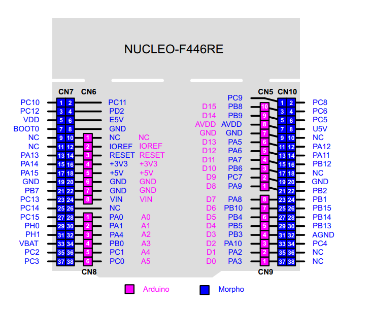
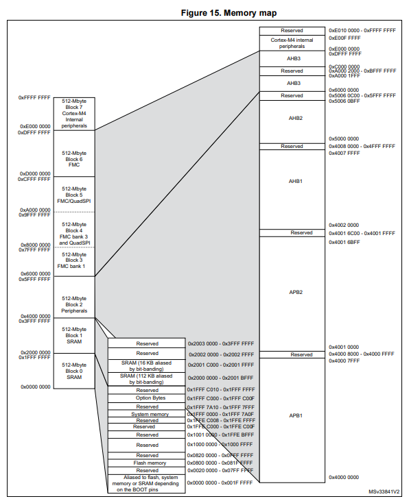

# Memory Map과 GPIO정리

### 들어가기에 앞서 PINMAP소개

보드에 연결할때 해당 PiINMAP을 참고하도록 하자

### Memory Map
STM32F446RE는 ARM Cortex-M4 기반의 고성능 MCU이다.
32비트 아키텍쳐를 가지므로 총 4GB의 메모리 주소 공간을 할당할 수 있다.

*다만, CPU가 부여할 수 있는 주소의 개수가 4GB라는 것이지 f446re보드가 4gb의 메모리 주소를 갖는다는 의미가 아니라, 메모리를 4gb짜리로 교체해도 한번에 컨트롤 가능하다는 의미이다.*

다음은 메모리맵이다.

앞서 설명한 것 처럼 대부분의 공간은 Reserved로 사용하지 않는 것을 볼 수 있다.

#### 메모리 맵 구조
|블록|주소 범위|용도|세부내용|
|---|---|---|---|
|Block 0|0x0000 0000 ~ 0x1FFF FFFF|Code (코드/플래시)|0x0800 0000: Main Flash Memory 시작(최대 512KB)   0x1FFF 0000: System Memory (내장 부트로더 탑재)|
|Block 1|0x2000 0000 ~ 0x3FFF FFFF|SRAM (데이터 메모리)|0x2000 0000: SRAM1 (112KB)   0x2001 C000: SRAM2 (16KB)   총 128KB의 내부 램.|
|Block 2|0x4000 0000 ~ 0x5FFF FFFF|Peripherals (주변장치)|하드웨어 제어 레지스터들이 모여있는 곳|
|Block 3~5|0x6000 0000 ~ 0xDFFF FFFF|FMC (외부 메모리)|외부 SRAM, SDRAM, NOR/NAND Flash 등을 연결할 때 사용|
|Block 6|0xE000 0000 ~ 0xE003 FFFF|Cortex-M4 Internal|ARM 코어 내부 레지스터|
|Block 7|0xE004 0000 ~ 0xFFFF FFFF|System / NVIC|인터럽트 컨트롤러(NVIC), SysTick 타이머, 시스템 컨트롤 블록|

#### GPIO 구조 및 레지스터 정리
STM32F446RE의 GPIO는 가장 빠른 버스인 AHB1에 연결되어 최대 180MHz의 속도로 매우 빠르게 핀 상태를 토글할 수 있다.
포트는 GPIOA 부터 GPIOH까지 존재하며, 각 포트는 최대 16개의 핀(PIN0~PIN15)를 제어한다.
포트를 제어하기 위해 32비트로 구성된 여러 컨트롤 레지스터가 사용된다.

|레지스터 이름|기능|설정 값 및 설명|비트 수 / 핀|
|---|---|---|---|
MODER(Mode)|핀의 동작 모드 설정|"00: Input (입력) 01: Output (출력) 10: Alternate Function (대체 기능 - UART, SPI 등) 11: Analog (아날로그 - ADC/DAC용)"|2 비트|
OTYPER(Output Type)|출력 타입 설정|0: Push-Pull (가장 일반적인 High/Low 출력) 1: Open-Drain (I2C 등에서 주로 사용)|1 비트|
OSPEEDR(Output Speed)|출력 속도 설정|00: Low01: Medium 10: Fast 11: High speed (전력 소모와 노이즈를 고려해 선택)|2 비트|
PUPDR(Pull-Up/Down)|내부 풀업/풀다운 저항|"00: No Pull-up, No Pull-down 01: Pull-up10: Pull-down"|2 비트|
IDR(Input Data)|핀의 입력 상태 읽기|읽기 전용 레지스터. 현재 핀의 High(1) / Low(0) 상태를 읽어옵니다.|1 비트|
ODR(Output Data)|핀에 출력할 값 쓰기| "읽기/쓰기 가능. 해당 비트에 1을 쓰면 High, 0을 쓰면 Low가 출력됩니다."|1 비트|
BSRR(Bit Set/Reset)|특정 핀만 원자적으로Set/Reset 할 때 사용| 하위 16비트 (Set): 1을 쓰면 핀이 High가 됨.상위 16비트 (Reset): 1을 쓰면 핀이 Low가 됨.(ODR과 달리 다른 핀에 영향을 주지 않고 안전하게 제어 가능)|2 비트|
AFR(Alternate Func)|핀의 특수 기능 선택|"핀을 UART TX, PWM 출력 등으로 쓸 때 어떤 기능을 연결할지 먹스(Mux)를 설정합니다. (AFRL: 핀 0~7 / AFRH: 핀 8~15)"|4 비트|

이 중 MODER, OTYPER, OSPEEDR, PUPDR, BSRR에 대한 내용은 [해당 Readme](./HalVsBaremetal.md)의 Bare-Metal부분을 통해 더 자세히 알 수 있다.