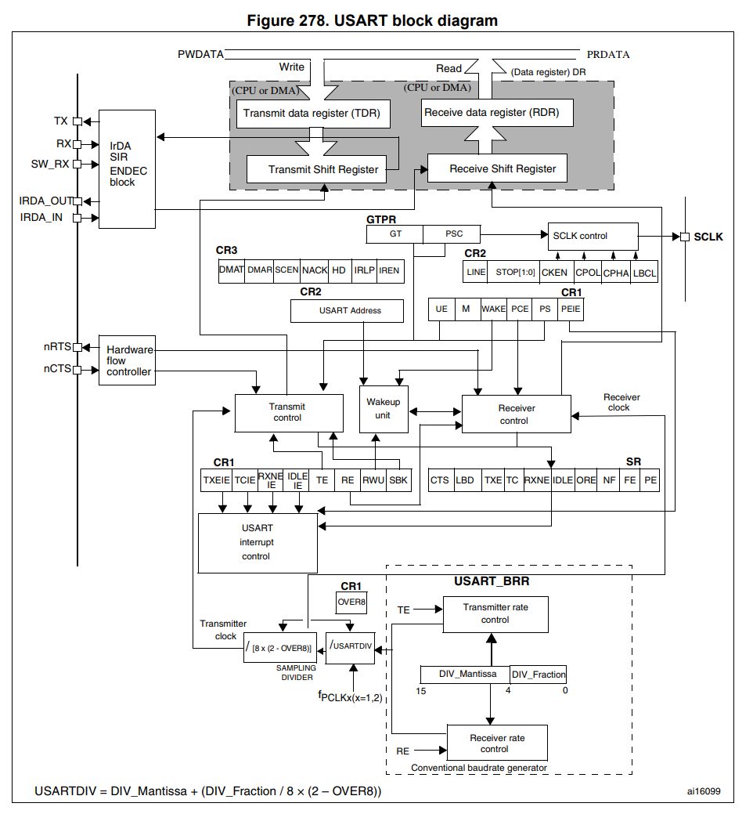
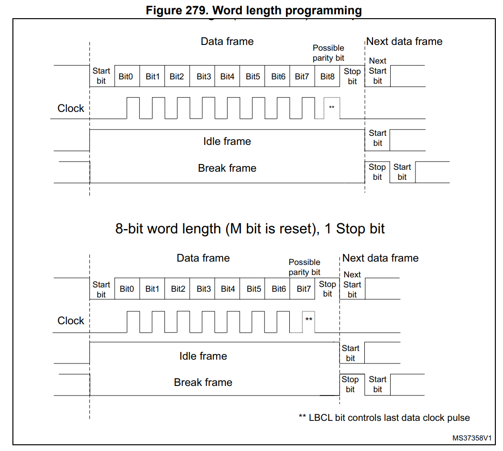
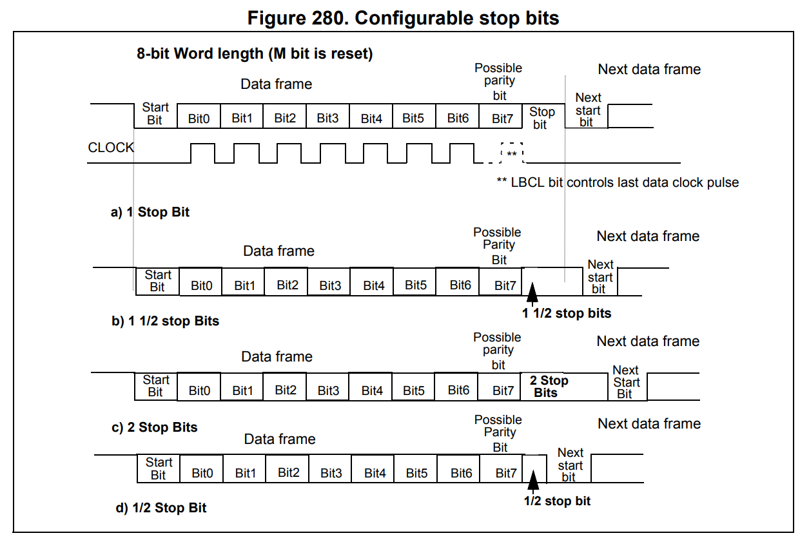
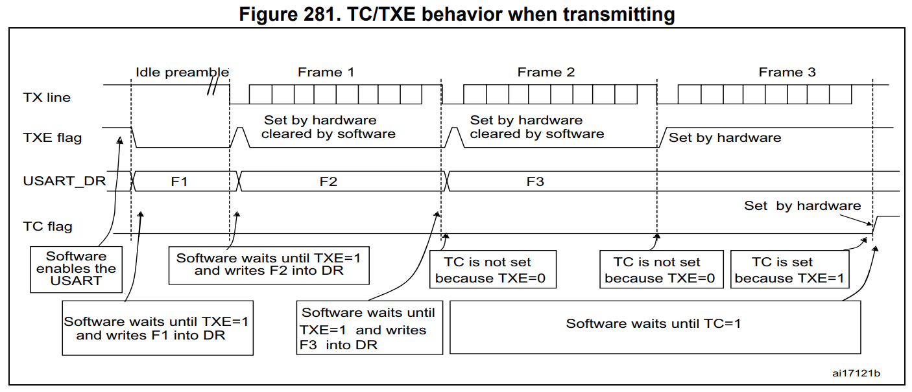

# 4week
* UART 인터페이스 정리
* STM32 F446RE에서의 USART 동작 과정 정리
* STM32F446RE-Host PC Uart 디버깅 환경 구현
    > 웹 검색 활용! 모르면 mm 통해서 편하게 질문하셔도 되고, PC 환경 따라 설치법이 다를 수 있으니 하다가 정 안되면 그냥 오셔도 됩니다...ㅎㅎ
* 도전 과제 : Uart Echo 구현
---
**[참고 하기 좋은 사이트](https://wikidocs.net/223412)**

# UART를 정의하기 전에

## 통신 방식 비교

### 병렬/직렬 통신 방식

#### 1. 패러랠(Parallel, 병렬) 통신
데이터를 구성하는 여러 비트(Bit)를 여러 개의 선으로 동시에(병렬로) 보내는 방식입니다.

* **원리**: 예를 들어 8비트(1바이트) 데이터를 보낼 때, 8개의 데이터 선을 이용해 8개 비트를 한 번에 짠! 하고 전송합니다.
* **장점**: 한 번에 여러 비트를 동시에 보내므로 단거리에서는 전송 속도가 빠릅니다.
* **단점**:
  * **선이 많고 두꺼워짐**: 비트 수가 늘어날수록 통신선이 많아져 기기가 크고 복잡해집니다.
  * **신호 간섭(Noise) 및 신호 어긋남(Skew)**: 선이 길어지면 선과 선 사이의 전기적 간섭이 생기고, 도착하는 시간 차이가 발생해 먼 거리 전송이 불가능합니다.
* **사용 예시**: 과거 프린터 포트(LPT), 컴퓨터 내부 메인보드 버스(Bus) 등

---

#### 2. 시리얼(Serial, 직렬) 통신
데이터를 구성하는 비트들을 1개의 데이터 선을 통해 한 비트씩 순서대로(직렬로) 보내는 방식입니다.

* **원리**: 8비트 데이터를 보낼 때, 한 줄로 줄을 세워 1비트씩 차례대로 보내게 됩니다.
* **장점**:
  * **선이 적고 단순함**: 최소 1~2개의 선만 있으면 되므로 회로와 케이블이 매우 단순해지고 비용이 적게 듭니다.
  * **원거리 전송 가능**: 선이 적어 신호 간섭 문제에서 자유롭고, 먼 거리에 전송하기 훨씬 유리합니다.
* **단점**: 한 번에 1비트씩만 보내기 때문에 같은 클록 속도라면 병렬보다 속도가 느릴 수 있습니다. (하지만 기술 발전으로 현재는 매우 빠른 시리얼 통신이 가능합니다.)
* **사용 예시**: 우리가 지금까지 다룬 UART/USART, SPI, I2C, USB(Universal Serial Bus) 등 대부분의 현대 통신 방식

> 패러랠 통신은 하드웨어 구성은 복잡하지만 속도가 빠른 반면, 시리얼 통신은 하드웨어 구성은 간단한 대신 속도가 느리다는 것이 일반적인 상식이었다. 그러나 최근의 통신 기술은 그렇지 않다.   
최근의 고속 통신 기술은 대부분 시리얼 통신이다.

---

### 동기식/비동기식 통신 방식

#### 1. 동기식 통신 
* 하나의 장치에서 하나의 비트마다 클록 펄스를 생성하고 그 신호를 다른 장치에 함께 전송하는 방법
* 클록에 의해 시간 동기를 맞춤
* 오류가 적고 전송 속도가 매우 빠릅니다.
* 비동기식과 달리 시작/정지 비트(Start/Stop bit) 같은 부가 데이터를 붙일 필요가 없어 전송 효율이 높습니다.  
* 대신 클록을 전달하기 위한 신호선이 1개 더 필요합니다.  
#### 2. 비동기식 통신
* 장치 간에 타이밍 길이를 서로 약속한 상태에서 근사적으로 비트를 전송하는 방법이다. 
* 보레이트(Baud Rate, 통신 속도)를 미리 약속해 둡니다. 
* 데이터 앞에 Start Bit, 뒤에 Stop Bit를 붙입니다.
* 클록 선이 필요 없어서 선 개수가 적고(최소 2개: TX, RX) 구현이 단순합니다.  
* 데이터 프레임마다 시작/정지 비트 등의 낭비되는 데이터가 추가되므로 동기식에 비해 속도가 상대적으로 느립니다.  
* 속도 약속(보레이트)이 서로 조금이라도 어긋나면 데이터가 깨질 위험이 있습니다. 

> 우리가 쓰는 STM32 F446RE MCU는 동기식 통신과 비동기식 통신을 모두 지원한다.  
USART동기식 통신, UART비동기식 통신 : 통신 방식을 정할 수 있다는 거.

**헷갈리지 말기**
> 병렬/직렬 통신 방식은 데이터를 몇개를 보낼지 결정하고  
동기식/비동기식 통신 방식은 수신받은 데이터를 어떤 규칙으로 읽을지 정의

# UART 인터페이스
## UART?
UART(범용 비동기화 송수신기: Universal asynchronous receiver/transmitter)는 병렬 데이터의 형태를 직렬 방식으로 전환하여 데이터를 전송하는 컴퓨터 하드웨어의 일종이다.
> UART는 직렬 데이터 방식으로 보낸다!

**reference menual 744p Universal synchronous receiver transmitter (USART)
/universal asynchronous receiver transmitter (UART)**

* USART는 업계 표준인 NRZ 방식의 **비동기** 시리얼 데이터 포맷을 사용하는 외부 기기와 동시에 양방향으로 데이터를 주고받을 수 있는(**전두쌍**) 유연한 통신 기능을 제공합니다.
* 소수점 단위까지 정밀하게 통신 속도를 만들어내는 장치를 내장하고 있어, 아주 넓고 다양한 범위의 통신 속도(Baud rate)를 맞춰줄 수 있습니다.
* 한쪽으로만 보내는 **동기식** **단방향 통신**과, 선 하나만으로 번갈아 주고받는 **반두쌍 통신**도 지원합니다.
* 자동차 규격인 LIN, 교통카드/IC카드 규격(Smartcard), 적외선 통신(IrDA), 그리고 데이터를 정체 없이 안전하게 제어하는 모뎀 통신(CTS/RTS) 기능도 지원합니다.
* 여러 개의 칩(마이크로프로세서)이 한 네트워크에 연결되어 서로 통신할 수 있습니다.
* DMA(CPU를 거치지 않고 메모리로 바로 데이터를 보내는 장치)를 연결해 쓰면, CPU 부담 없이 엄청나게 빠른 고속 데이터 통신이 가능합니다.
  
 

    **전두쌍**: 송신과 수신을 동시에 처리 가능함. (전화 처럼)  
    **Baud rate**: 속도 조절  
    다양한 통신 모드 지원 (만능 키)  
    신호등 역할 (CTS/RTS): "잠시 멈춰(CTS)", "나 준비됐어(RTS)"  
    DMA 지원으로 고속 처리 가능

## 주요 기능 요약

### 1. 기본 통신 포맷 및 속도 설정
* 전두쌍 비동기 통신 지원: 데이터를 보내는 선과 받는 선이 따로 있어, 동시에 주고받는 전두쌍 비동기 통신을 기본 지원합니다.
* 표준 방식 지원: 업계 표준인 방식으로 신호를 전송합니다 (1은 High/Mark, 0은 Low/Space).
* 오버샘플링 방식 선택 가능: 데이터를 읽어 들일 때 신호를 8번 쪼개서 읽을지(속도 우선), 16번 쪼개서 읽을지(클록 오차/노이즈 견딤 우선) 선택할 수 있습니다.
* 소수점 통신 속도 생성기: 소수점 단위 계산이 가능한 속도 생성기가 들어있어 통신 속도를 매우 세밀하고 정밀하게 설정할 수 있습니다.
* 가변 데이터 크기 선택: 데이터 한 번에 보낼 크기를 8비트 또는 9비트로 선택할 수 있습니다.
* 정지 비트 길이 설정: 데이터 전송이 끝났음을 알리는 정지 비트 길이를 1개 또는 2개로 설정 가능합니다.

### 2. 다양한 특수 통신 모드 지원
* 마스터/슬레이브 동작 지원: 자동차 내부 통신 규격인 네트워크의 마스터/슬레이브 동작(신호 송수신)을 지원합니다.
* 동기 전송용 클록 출력: 동기 통신을 위해 클록 신호를 외부로 출력해 줄 수 있습니다.
* 적외선 인코더/디코더 내장: 적외선 통신(리모컨 등) 규격인 인코더/디코더를 내장하고 있습니다.
* 스마트카드 에뮬레이션 기능: 교통카드/IC카드 표준 규격에 맞춰 0.5비트, 1.5비트 정지 비트 등을 지원합니다.
* 단선 반두쌍 통신: 선 2개가 아니라 선 1개만 사용해서 주고받는 반두쌍 통신 모드도 가능합니다.

### 3. 고속 데이터 처리 및 전원/제어 기능
* 직접 메모리 접근 방식의 멀티버퍼 통신: 직접 메모리 접근 장치를 사용해 중앙처리장치의 개입 없이 메모리와 데이터를 고속으로 직송할 수 있습니다.
* 송신기 및 수신기 개별 활성화: 송신기와 수신기의 전원을 각각 따로 켜고 끌 수 있습니다.
* 오류 검출 비트 제어: 데이터 오류를 검출하기 위한 오류 검출 비트를 자동으로 생성해서 붙여주거나 검사합니다.

### 4. 상태 확인 및 에러 감지 기능 (상태 표시 및 인터럽트)
* 전송 상태 확인 플래그: 수신 버퍼가 찼는지, 송신 버퍼가 비었는지, 전송이 완료되었는지 상태를 확인할 수 있습니다.
* 4가지 에러 감지 기능:
  * 과부하 에러: 데이터를 채 읽기도 전에 다음 데이터가 쏟아져 들어와 덮어씌워진 에러
  * 노이즈 감지: 신호에 전기적 노이즈가 섞여 들어온 것을 감지
  * 프레임 에러: 정지 비트가 들어와야 할 타이밍에 안 들어오는 등 프레임 규격이 깨진 에러
  * 오류 검출 비트 에러: 오류 검출 비트 검사 결과 데이터가 손상된 에러
* 10가지 인터럽트 소스: 위에서 설명한 다양한 전송 완료/에러/상태 변화 등 총 10가지 상황에서 중앙처리장치에게 즉시 인터럽트(알림 신호)를 보낼 수 있습니다.

### 5. 다중 마이크로프로세서 통신
* 다중 마이크로프로세서 통신: 여러 개의 칩(중앙처리장치)이 한 통신선에 묶여 있을 때, 내 주소로 온 데이터가 아니면 소리를 듣지 않는 음소거 모드로 진입할 수 있습니다.
* 음소거 모드 해제: 통신선이 비어있거나, 내 주소 비트가 전송되어 오면 음소거 모드에서 다시 깨어납니다.

 

## STM32 F446RE에서의 USART 동작 과정 
### 1. 기본 프레임 구조 및 주요 특징

* **보라트(Baud Rate) 설정**: 분수 형태의 Baud Rate Generator (12비트 Mantissa + 4비트 Fraction)를 사용하여 정밀하게 속도를 설정합니다.
* **프레임 구성**:
  * **Start Bit**: 1비트 (Low 상태)
  * **Data Bit**: 8비트 또는 9비트 (CR1의 M 비트로 설정)
  * **Parity Bit**: PCE 비트로 제어하며, 패리티 사용 시 데이터의 MSB 자리를 대체합니다.
  * **Stop Bit**: 0.5, 1, 1.5, 2비트 선택 가능 (CR2의 STOP[1:0] 비트로 설정).
* 데이터는 LSB(최하위 비트)부터 시프트 전송/수신됩니다.

### 2. 내부 데이터 버퍼 구조 (Double Buffering)

USART 데이터 레지스터인 USART_DR은 단순 단일 레지스터가 아니라, 내부적으로 이중 버퍼(Double Buffer) 구조로 되어 있습니다.

* **송신부**: TDR (Transmit Data Register) + Transmit Shift Register
* **수신부**: RDR (Receive Data Register) + Receive Shift Register
* **동작**: CPU/DMA가 USART_DR에 접근할 때 쓰기는 TDR로, 읽기는 RDR로부터 데이터를 가져옵니다.

### 3. 송신(Transmission) 동작 과정

1. **USART 및 송신부 활성화**: USART_CR1 레지스터의 UE (USART Enable) 비트와 TE (Transmitter Enable) 비트를 1로 설정합니다.
2. **Idle Frame 전송**: TE 비트 설정 직후, 첫 전송으로 Idle Frame이 전송됩니다.
3. **데이터 쓰기**:
   * CPU 또는 DMA가 USART_DR 레지스터에 데이터를 쓰면, TXE (Transmit Data Register Empty) 플래그가 클리어됩니다.
   * 이 데이터는 TDR 버퍼로 들어가며, Shift Register가 비어 있을 경우 시프트 레지스터로 복사됩니다.
   * 복사가 완료되면 TXE 플래그가 다시 1이 되어, 다음 전송할 데이터를 USART_DR에 미리 채워 둘 수 있습니다.
4. **전송 완료**:
   * 데이터가 TX 핀을 통해 LSB부터 순차적으로 시프트 아웃(Shift-out)됩니다.
   * 시프트 레지스터의 데이터가 모두 전송되고, TDR에 더 이상 쓸 데이터가 없으며 TXE=1인 상태이면 TC (Transmission Complete) 플래그가 High로 설정됩니다.
   * TXEIE 및 TCIE 비트를 이용해 각 시점에 인터럽트를 발생시킬 수 있습니다.

### 4. 수신(Reception) 동작 과정

1. **수신부 활성화**: USART_CR1 레지스터의 UE 비트와 RE (Receiver Enable) 비트를 1로 설정합니다.
2. **Start Bit 감지 및 샘플링**:
   * RX 핀에서 하강 에지(Falling Edge)를 감지하여 Start bit 확인 절차를 시작합니다.
   * 노이즈 방지를 위해 1비트 구간 동안 여러 번 오버샘플링(8회 또는 16회)을 수행하여 비트 값을 판별합니다.
3. **데이터 수신 및 이동**:
   * RX 핀을 통해 LSB부터 데이터 비트가 Receive Shift Register로 순차 입력됩니다.
   * 프레임 수신이 완료되면 Shift Register의 데이터가 RDR (USART_DR) 레지스터로 이동합니다.
4. **수신 플래그 및 인터럽트**:
   * 데이터가 RDR로 이동함과 동시에 RXNE (Read Data Register Not Empty) 플래그가 1로 설정됩니다.
   * RXNEIE 비트가 1로 설정되어 있다면 수신 인터럽트가 발생합니다.
   * 소프트웨어가 USART_DR을 읽으면 RXNE 플래그는 자동으로 클리어됩니다.
   * 다음 프레임 수신 완료 전까지 USART_DR을 읽지 않아 기존 데이터가 덮어씌워지는 경우 ORE (Overrun Error) 플래그가 발생합니다.

### 5. DMA 기반 통신

고속 데이터 처리를 위해 CPU 개입 없이 DMA Controller를 이용할 수 있습니다.

* **DMA 송신 (DMAT 비트 설정)**: TXE 플래그가 1이 될 때마다 DMA 요청을 발송하여 메모리(SRAM)의 데이터를 USART_DR로 자동으로 복사합니다.
* **DMA 수신 (DMAR 비트 설정)**: RXNE 플래그가 1이 될 때마다 DMA 요청을 발송하여 USART_DR의 데이터를 지정된 SRAM 메모리 영역으로 즉시 이전합니다.

---
---
---

## USART 구현

이 매뉴얼 섹션에 적힌 모든 기능 설명은 모든 기능이 풀옵션으로 다 들어있는 USART1을 기준으로 설명합니다.

장치 번호(USART1, USART2, UART4 등)에 따라 지원하는 기능에 차이가 있으니, 자세한 차이점은 [Table 148] 표를 참고하세요.

Table 148. USART features

| USART modes/features | USART1, USART2, USART3, USART6 | UART4, UART5 |
| :--- | :---: | :---: |
| Hardware flow control for modem | O | O |
| Continuous communication using DMA | O | O |
| Multiprocessor communication | O | O |
| Synchronous mode | O | - |
| Smartcard mode | O | - |
| Single-wire half-duplex communication | O | O |
| IrDA SIR ENDEC block | O | O |
| LIN mode | O | O |
| USART data length | 8 or 9 bits | 8 or 9 bits |

## USART 기능 설명

#### 기본 핀 구성 및 작동 방식

이 인터페이스는 외부에서 3개의 핀으로 다른 장치와 연결됩니다 (그림 278 참조). USART의 양방향 통신에는 최소 2개의 핀, 즉 수신(RX)과 송신(TX) 핀이 필요합니다:

* RX (수신 핀): 직렬 데이터를 입력받는 핀입니다. 들어오는 신호에서 유효한 데이터와 노이즈를 구별하여 복원하기 위해 오버샘플링(Oversampling) 기법을 사용합니다.
* TX (송신 핀): 직렬 데이터를 출력하는 핀입니다. 송신기가 비활성화되면 일반 I/O 핀 설정으로 돌아가고, 송신기가 활성화된 상태에서 보낼 데이터가 없으면 TX 핀은 High(1) 상태를 유지합니다. 단선(Single-wire) 및 스마트카드 모드에서는 이 TX 핀 하나로 데이터를 송수신합니다.

> 기본 2선 방식: 데이터를 보낼 때는 TX, 받을 때는 RX 핀을 사용해 동시 전송(전두쌍)이 가능합니다.    
노이즈에 강함: 수신(RX) 시 오버샘플링(Oversampling) 기술을 이용해 신호의 노이즈를 걸러내어 정확한 값(0 또는 1)을 복원해냅니다.

#### 데이터 프레임 구조 및 내부 레지스터

일반 USART 모드에서 직렬 데이터는 이 핀들을 통해 다음과 같은 프레임(Frame) 단위로 송수신됩니다:

* 송수신 전의 유휴 라인 (High 상태)
* 시작 비트
* 데이터 워드 (8비트 또는 9비트, LSB인 최하위 비트부터 전송)
* 프레임이 끝났음을 알리는 정지 비트 (0.5 / 1 / 1.5 / 2비트 지원)

이 인터페이스는 12비트 정수부와 4비트 소수부로 구성된 소수점 보레이트 생성기를 사용합니다.

* 상태 레지스터 (USART_SR)
* 데이터 레지스터 (USART_DR)
* 보레이트(속도) 설정 레지스터 (USART_BRR) - 12비트 정수부 및 4비트 소수부
* 스마트카드 모드용 가드타임 레지스터 (USART_GTPR)

> 프레임 단위 데이터: 1바이트를 보낼 때 [시작 비트 ➔ 실제 데이터 (8~9비트) ➔ 정지 비트] 순서로 포맷을 맞춰 주고받습니다.  
소수점 보레이트 제어 (USART_BRR): 속도를 조절하는 계산기에 4비트 소수점 기능이 있어, MCU 전원 환경에 따라 통신 속도 오차를 극소화할 수 있습니다. 

#### 추가 기능 핀 (동기 모드 및 흐름 제어)

동기(Synchronous) 모드 통신을 위해서는 다음 핀이 추가로 필요합니다:

* SCLK (송신기 클록 출력): 송신기 클록 출력 핀입니다. SPI 마스터 모드에 맞춰 동기 전송을 위한 클록을 출력하며 (시작/정지 비트에서는 클록을 내보내지 않음), 동시에 RX를 통해 동기 수신을 할 수 있어 시프트 레지스터 기기(예: LCD 드라이버) 제어 등에 쓰입니다.

> 비동기(UART) 모드와 달리 SCLK 클록 핀을 추가로 출력하여 SPI 마스터처럼 작동할 수 있습니다.  
클록 박자에 맞춰 정확하고 빠른 데이터 전송이 필요할 때(예: LCD 화면 제어 등) 활용됩니다.  

하드웨어 흐름 제어(Hardware flow control) 모드를 사용할 때는 다음 핀들이 필요합니다:

* nCTS (Clear To Send): 이 신호가 High가 되면, 상대방이 준비가 안 된 것이므로 현재 전송이 끝난 후 데이터 송신을 차단(대기)합니다.
* nRTS (Request To Send): 이 신호가 Low일 때, "내 USART 수신 준비가 완료되었다"는 것을 상대방에게 알려줍니다.

> 신호등 역할: 데이터가 너무 빨리 쏟아져 들어와 버퍼가 넘치는 현상을 방지합니다.
> * nCTS: "상대방이 바쁘니까 잠시 송신 중단!" (High 신호)
> * nRTS: "나 받을 준비 됐어! 보내도 돼!" (Low 신호)  

### USART character 설명

#### 1) 데이터 길이 (Word length: M 비트)
USART_CR1 레지스터의 M 비트를 0으로 두면 8비트, 1로 두면 9비트 데이터를 다룹니다.  
보통 8비트 데이터 전송 시 [시작 비트(1) + 데이터(8) + 정지 비트(1)] 형식으로 총 10비트 분량의 프레임이 만들어집니다. (패리티 비트를 쓴다면 데이터 비트 중 마지막 비트 자리에 패리티가 들어갑니다.)

#### 2) 시작/정지 비트 (Start & Stop bit)
* **Start Bit**: 평소에 1(High) 상태로 놀고 있던 TX 라인을 0(Low)으로 뚝 떨어뜨려 "이제 데이터 들어간다!" 하고 수신 측에 알려줍니다.
* **Stop Bit**: 데이터 전송이 끝나면 다시 1(High) 상태로 올려서 "이번 전송 끝났다!"를 표시합니다.

#### 3) 아이들 프레임 (Idle character) vs 브레이크 프레임 (Break character)
통신선 상에서 데이터 외에 특정 상태를 나타내기 위해 사용하는 특별한 신호 형태입니다.

* **Idle (유휴) 프레임**:  
  한 프레임 전체 시간 동안 신호선이 계속 1(High) 상태를 유지하는 것입니다.  
  "통신선은 연결되어 있지만, 지금 당장 보낼 데이터가 없다"는 대기 상태를 나타낼 때 쓰입니다.
* **Break (브레이크) 프레임**:  
  한 프레임 전체 시간 동안 신호선이 강제로 계속 0(Low) 상태로 유지되는 것입니다.  
  통신을 강제로 리셋하거나, LIN 통신 등에서 새로운 헤더의 시작을 알리는 강제 중단/주의 환기 신호로 활용됩니다. 브레이크가 끝나면 정지 비트(1)를 보내 라인을 다시 High로 복구합니다.

#### 4) 클록 공유 (Common Baud Rate Generator)
송신(TX)과 수신(RX) 모듈은 내부에 있는 하나의 속도 계산기(Baud Rate Generator)를 공유합니다.  
송신기 활성화 비트(TE)와 수신기 활성화 비트(RE)를 각각 켜주면, 공통 계산기에서 나오는 속도 박자에 맞춰 데이터를 내보내거나 읽어 들이기 시작합니다.

---

### Transmitter

송신기는 M 비트 설정 상태에 따라 8비트 또는 9비트 데이터 워드를 전송할 수 있습니다.  
송신 활성화 비트(TE)가 설정되면, 송신 시프트 레지스터에 있는 데이터가 TX 핀으로 출력되며, 동기 모드인 경우 대응하는 클록 파동이 SCLK 핀으로 출력됩니다.  

#### 문자 전송
USART 전송 중에는 데이터가 TX 핀을 통해 최하위 비트(LSB, Bit 0)부터 순서대로 밀려 나가며 전송됩니다. 이 모드에서 USART_DR 레지스터는 내부 버스와 송신 시프트 레지스터 사이에 있는 버퍼(TDR) 역할을 합니다.  
모든 문자는 1비트 시간 동안 논리 Low(0)를 유지하는 시작 비트로 시작합니다. 문자의 끝은 설정된 개수의 정지 비트로 마무리됩니다.  
USART는 0.5, 1, 1.5, 2비트의 정지 비트를 지원합니다.  
주의: 데이터 전송 중에 TE 비트를 끄지(0으로 리셋) 마십시오. 전송 중 TE 비트를 끄면 보레이트 카운터가 멈춰서 TX 핀의 데이터가 손상되고, 현재 전송 중인 데이터가 손실됩니다.  
TE 비트가 활성화(1)되면 첫 데이터 전송 전에 유휴 프레임(High 신호)이 먼저 전송됩니다.  

#### 설정 가능한 정지 비트
각 문자마다 전송할 정지 비트의 개수는 제어 레지스터 2 (USART_CR2)의 13, 12번 비트에서 설정합니다.  
* 1 Stop bit: 기본값입니다.  
* 2 Stop bits: 일반 USART, 단선 및 모뎀 모드에서 지원됩니다.  
* 0.5 Stop bit: 스마트카드 모드에서 데이터를 수신할 때 사용됩니다.  
* 1.5 Stop bits: 스마트카드 모드에서 데이터를 송수신할 때 사용됩니다.  

유휴 프레임 전송 시에도 정지 비트가 포함됩니다.  
브레이크 전송은 M=0일 때 10개의 Low 비트 + 설정된 정지 비트, M=1일 때 11개의 Low 비트 + 설정된 정지 비트로 구성됩니다. (10/11비트를 초과하는 장기 브레이크는 전송할 수 없습니다.)

> 1. 데이터가 나가는 2단계 과정 (이중 버퍼)  
    * **USART_DR (TDR, Transmit Data Register)**: CPU가 보낼 데이터를 적재하는 대기실입니다.  
    * **Transmit Shift Register (송신 시프트 레지스터)**: 실제 TX 핀으로 비트를 한 개씩 쪼개서 밀어내는 출구입니다.  
    * **작동**: CPU가 USART_DR에 값을 쓰면, 대기하고 있던 데이터가 시프트 레지스터로 옮겨진 뒤 최하위 비트(LSB)부터 순서대로 밖으로 내보내집니다. 이 덕분에 시프트 레지스터가 데이터를 내보내는 동안 CPU는 바로 다음 데이터를 USART_DR에 미리 채워 넣어 쉬지 않고 계속 데이터를 전송할 수 있습니다.  

> 2.  TE (Transmitter Enable) 비트 주의사항  
    * 통신을 시작할 때 TE=1로 만들면, 수신 측에 "나 이제 준비됨!"을 알리는 Idle Frame(모두 1인 신호)을 보냅니다.  
    * 절대 전송 중간에 TE=0으로 끄면 안 됩니다! 보레이트 카운터가 그대로 얼어붙어서 현재 나가던 데이터 비트가 뭉개지며 상대방에게 깨진 값이 전달됩니다.  

> 3. 용도별 Stop Bit 차이  
    * **1개 (기본값)**: 일반적인 시리얼 통신에 주로 사용됩니다.  
    * **2개**: 신호가 불안정하거나, 수신 장치가 데이터를 처리할 여유 시간(Margin)을 조금 더 주고 싶을 때 사용합니다.  
    * **0.5개 / 1.5개**: 카드 단말기 등 스마트카드(ISO 7816-3 표준)에서 에러 감지 및 응답 신호(NACK)를 주고받는 정밀한 타임슬롯 규격을 맞추기 위해 쓰입니다.

**Procedure (절차)**

1. USART_CR1 레지스터의 UE 비트를 1로 설정하여 USART를 활성화합니다.
2. USART_CR1의 M 비트를 설정하여 워드 길이를 정의합니다.
3. USART_CR2에서 스톱 비트 수(number of stop bits)를 설정합니다.
4. 다중 버퍼 통신(Multi buffer Communication)을 수행하려는 경우 USART_CR3에서 DMA 활성화(DMAT)를 선택합니다. 다중 버퍼 통신에 설명된 대로 DMA 레지스터를 설정합니다.
5. USART_BRR 레지스터를 사용하여 원하는 보레이트(baud rate)를 선택합니다.
6. 첫 번째 전송으로 유휴 프레임(idle frame)을 전송하기 위해 USART_CR1의 TE 비트를 설정합니다.
7. 전송할 데이터를 USART_DR 레지스터에 씁니다 (이렇게 하면 TXE 비트가 지워집니다). 단일 버퍼의 경우 전송할 각 데이터에 대해 이를 반복합니다.
8. 마지막 데이터를 USART_DR 레지스터에 쓴 후, TC=1이 될 때까지 기다립니다. 이는 마지막 프레임의 전송이 완료되었음을 나타냅니다. 이는 예를 들어 마지막 전송이 손상되는 것을 방지하기 위해 USART가 비활성화되거나 Halt 모드로 들어갈 때 필요합니다.

---
#### Single byte communication

**TXE (Transmit Data Register Empty) 플래그 동작**

* TXE 비트를 0으로 해제(Clear)하는 작업은 항상 데이터 레지스터(USART_DR)에 값을 쓸 때 자동으로 수행됩니다[cite: 1].
* TXE 비트는 하드웨어에 의해 1로 설정(Set)되며, 다음 상황을 나타냅니다[cite: 1]:
  * 데이터가 TDR(송신 버퍼)에서 시프트 레지스터로 이동하여 데이터 전송이 시작되었습니다[cite: 1].
  * TDR 레지스터가 비어 있습니다[cite: 1].
  * 이전 데이터를 덮어쓸 염려 없이 USART_DR 레지스터에 다음 데이터를 쓸 수 있습니다[cite: 1].
  * TXEIE 비트가 켜져 있다면 이 플래그는 인터럽트를 발생시킵니다[cite: 1].

**전송 중/비전송 중 데이터 기록 방식**

* 이미 전송이 진행 중일 때 USART_DR에 쓰기 명령을 내리면, 데이터는 일단 TDR(버퍼)에 저장되었다가 현재 전송이 끝나는 시점에 시프트 레지스터로 복사됩니다[cite: 1].
* 아무런 전송도 일어나지 않을 때 USART_DR에 데이터를 쓰면, 데이터가 시프트 레지스터로 즉시 전달되어 전송이 시작되고 TXE 비트가 곧바로 1로 설정됩니다[cite: 1].

**TC (Transmission Complete) 플래그 동작 및 클리어 방법**

* (Stop bit까지 전송되어) 1개 프레임 전송이 끝나고 TXE 비트가 1인 상태라면, TC 비트가 High(1)로 올라갑니다[cite: 1]. USART_CR1 레지스터의 TCIE 비트가 설정되어 있다면 인터럽트가 발생합니다[cite: 1].
* 마지막 데이터를 USART_DR에 쓴 후, USART 통신을 끄거나 MCU를 저전력 모드로 전환하기 전에는 반드시 TC=1이 될 때까지 기다려야 합니다 (그림 281 참조)[cite: 1].

TC 비트는 다음 소프트웨어 순서를 통해 0으로 해제(Clear)됩니다[cite: 1]:
1. USART_SR (상태 레지스터) 읽기[cite: 1]
2. USART_DR (데이터 레지스터) 쓰기[cite: 1]

> **참고:** TC 비트에 직접 '0'을 써서 끌 수도 있습니다[cite: 1]. 이 방법은 멀티버퍼(DMA) 통신 시에만 권장됩니다[cite: 1].

##### 1. TXE (Transmit Data Register Empty): "대기실이 비었음"
* 의미: TDR(대기실)에 있던 데이터가 시프트 레지스터(출구)로 넘어갔으므로, "다음 보낼 데이터를 레지스터에 써도 된다"는 신호입니다[cite: 1].
* 활용: 여러 바이트를 연속으로 보낼 때, TXE=1이 될 때마다 다음 데이터를 USART_DR에 채워 넣는 용도로 씁니다[cite: 1]. (아직 TX 핀 밖으로 완전히 다 나간 상태는 아닙니다[cite: 1].)

##### 2. TC (Transmission Complete): "핀 밖으로 완벽히 다 나감"
* 의미: 마지막 비트(Stop bit)까지 TX 핀 밖으로 완전히 전송 완료되었음을 나타냅니다[cite: 1].
* 주의사항 (매우 중요): 마지막 바이트를 쓴 직후 TXE=1만 확인하고 곧바로 USART를 끄거나 MCU를 슬립(Sleep) 모드로 넣으면, 시프트 레지스터에서 전송 중이던 마지막 데이터가 파손됩니다[cite: 1]. 따라서 마지막 데이터를 보낸 뒤에는 반드시 TC=1을 확인해야 안전하게 칩을 끌 수 있습니다[cite: 1].

---
#### Break characters (브레이크 문자/신호)
* SBK 비트를 1로 설정(Set)하면 브레이크 문자가 전송됩니다. 브레이크 프레임의 길이는 M 비트(데이터 길이 설정)의 상태에 따라 달라집니다 (그림 279 참조).
* SBK 비트가 1로 설정되면, 현재 전송 중이던 문자의 전송이 완전히 끝난 직후 TX 라인으로 브레이크 문자가 보내집니다.
* 이 SBK 비트는 브레이크 문자의 전송이 완료될 때(브레이크 문자의 Stop bit 구간 동안) 하드웨어에 의해 자동으로 0으로 리셋됩니다.
* USART는 다음 프레임의 시작 비트(Start bit, 0)를 확실하게 감지할 수 있도록, 마지막 브레이크 프레임의 끝에 논리 1 (High) 비트를 삽입합니다.
* 참고: 브레이크 전송이 시작되기 전에 소프트웨어가 SBK 비트를 0으로 해제하면, 브레이크 문자가 전송되지 않습니다.
* 두 번 연속으로 브레이크 신호를 보내려면, 이전 브레이크 신호의 Stop bit가 끝난 이후에 SBK 비트를 다시 1로 설정해야 합니다.

##### Break Signal(브레이크 신호)이란?
데이터(예: 0x55, 0x41 등)를 보낼 때 1과 0이 섞여 나가는 것과 달리, 한 프레임 동안 TX 라인을 강제로 계속 Low(0) 상태로 유지시키는 특수 신호입니다. 보통 통신 회선을 초기화(Reset)하거나, LIN 네트워크 통신에서 "새로운 헤더/데이터 묶음이 시작된다"고 상대방에게 주의를 줄 때 사용됩니다.
* M = 0 (8비트 모드): 10개의 Low 비트 + Stop 비트
* M = 1 (9비트 모드): 11개의 Low 비트 + Stop 비트

##### SBK 비트의 자동 관리 (Hardware Auto-reset)
개발자가 소프트웨어로 USART_CR1 레지스터의 SBK 비트에 1을 쓰는 순간(Send Break) 하드웨어가 이를 감지합니다.  
만약 지금 데이터를 내보내는 중이라면, 그 전송이 끝날 때까지 기다렸다가 브레이크 신호를 만듭니다.  
브레이크 전송이 끝나면 개발자가 코드로 비트를 꺼주지 않아도 하드웨어가 알아서 SBK = 0으로 복구시킵니다.

##### 끝에 논리 1(Stop Bit)을 넣어주는 이유
시작 비트(Start Bit)는 High(1)에서 Low(0)로 떨어지는 순간을 통해 인식됩니다.  
만약 브레이크 신호(Low)가 끝난 뒤 곧바로 다음 일반 데이터의 시작 비트(Low)가 들어오면 수신 측은 구분할 수 없습니다.   
따라서 USART 하드웨어가 브레이크 신호 끝에 강제로 High(1) 신호(Stop bit)를 1개 이상 덧붙여 주어, 다음 통신이 들어올 때 시작 비트를 명확히 감지할 수 있도록 보장합니다.

---

