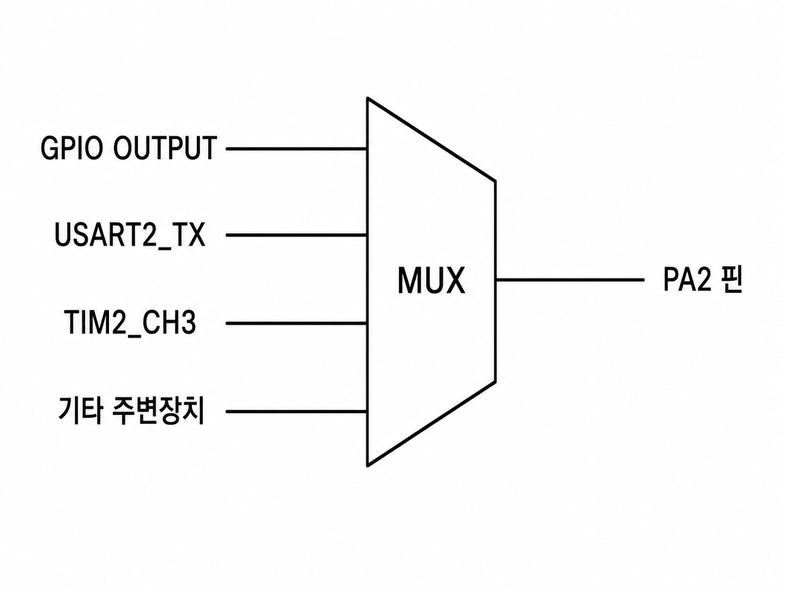

# STM32 스터디 4주차

A = 01000001

stm스터디4주차_내용정리

# 1. UART 인터페이스란?

Universal Asynchronous Receiver/Transmitter 줄임말.
즉, 범용 비동기 송수신기

쉽게말하면 MCU와 다른 장치가 0과 1을 한 주롤 차례차례 보내면서 통신하는 방식

# 2. UART 기본 배선

STM32 상대 장치

TX  ----------------> RX
RX  <---------------- TX
GND ----------------- GND

두 장치가 전압의 기준을 동일하게 봐야 하므로 GND도 연결해야 함.

# 3. UART가 비동기인 이유

SPI같은 통신에는 Clock선이 있지만
UART는 보통 Tx, Rx, GND 뿐이다..
Clock 대신에 Baud Rate를 쓰기때문.
예를들어, 115200 baud 라면
초당 115200 개 비트를 전송 (즉 한 비트당 시간은 약 8.68us)한다.

# 4. 실제 전송 예시

만약 문자 'A'를 보냈을때를 가정.

### 1) A의 아스키코드를 이진수로 치환

<aside>
💡

A = 01000001

</aside>

### 2) UART가 전송하는 방식

<aside>
💡

Start
↓
0 | 1 0 0 0 0 0 1 0 | 1
└── Data bits ──┘
Stop

</aside>

즉, Start, Stop알림이 따로 있는데, LSB부터 전송하므로 A의 가장 작은 비트인(가장 오른쪽) 1 부터 순서대로 전송을 한다.

**여기서 중요한건 데이터 전송을 LSB(최하위 비트)로 한다는것.**

### 3) 일반적인 설정

<aside>
💡

115200
8 Data bits
No Parity
1 Stop bit

</aside>

### 4) 실제 데이터 전송량

<aside>
💡

대략

115200 / 10
= 11520 Byte/s

한 바이트를 보내는데 총 10bit

Start bit 1개
Data bit 8개
Stop bit 1개

가 필요하기 때문.

</aside>

# 5. UART와 USART의 차이

USART : Universal Synchronous/Asynchronous Receiver/Transmitter 줄임말
즉,
UART
→ 비동기 통신 가능

USART
→ 비동기 + 동기 통신 가능

이렇게 구분된다.. 즉, UART에 동기 기능까지 추가한것.
USART에는 필요하면 Clock신호를 사용하는 동기식 통신 기능도 있지만,
STM32 개발에서 USART를 사용할 때 대부분은 비동기 모드만 사용하기때문에
사실상 USART를 UART처럼 취급한다.

# 6. USART/UART 하드웨어 동작순서

CPU가 직접 타이밍 맞춰 GPIO로 출력하는 것이 아니라,
CPU가 USART에게 데이터 전송 명령을 내리면
USART 하드웨어가 알아서 Baud Rate에 맞춰 비트를 하나씩 출력한다.
USART는 CPU 코어와 같은 MCU 칩 안에 들어 있는 별도의 하드웨어 주변장치(peripheral)라고 봐야한다.

CPU코어(Cortex-M4)와 내부 버스로 연결되어 있어서 cpu가 UART 하드웨어에 명령을 내리는 방식이다.

### 1) 실제 송신 코드

```c
char data = 'A';

HAL_UART_Transmit(&huart2,
(uint8_t *)&data,
1,
HAL_MAX_DELAY);
```

이 코드 한줄은 내부적으로 다음 흐름과 같다.

```c
CPU
↓
'A'
↓
USART2 DR 레지스터
↓
송신 시프트 레지스터
↓
Start bit 추가
↓
데이터 비트 전송
↓
Stop bit 추가
↓
TX 핀
↓
USB-UART / PC
↓
터미널
↓
A 출력
```

즉, USART에는 다음과 같은 별도의 레지스터가 있다. (STM32F4계열 기준)

```c
USART_SR
USART_DR
USART_BRR
USART_CR1
USART_CR2
USART_CR3
```

각 역할은 다음과 같다.

| 레지스터 | 역할 |
| --- | --- |
| SR | 현재 USART 상태 |
| DR | 송수신 데이터 |
| BRR | Baud Rate 설정 |
| CR1 | USART 주요 설정 |
| CR2 | Stop bit 등 설정 |
| CR3 | DMA, 흐름 제어 등 |

### 2) DR에 넣은 데이터가 TX로 나가는 순서도 (송신 흐름)

```c
CPU
│
│ 'A'
↓
┌───────────────────┐
│ Data Register DR │
└─────────┬─────────┘
│
↓
┌───────────────────┐
│ Shift Register │
└─────────┬─────────┘
│
↓
bit 하나씩 출력
│
↓
TX
```

CPU가 USART하드웨어의 DR에 데이터를 넣는데,
실제로 핀에 하나씩 보내는 것은 Shift Register임.
만약
A = 01000001
이게 DR레지스터에 있다면
한 비트씩 순차적으로 시프트 레지스터하여 TX 핀의 전압을 순차적으로 바꿈.

### 3) USART 수신 과정은 반대이다.

UART 선은 평소에 HIGH 상태였다가,
LOW로 바뀌면 Start bit가 들어왔다고 판단함.
그리고 설정된 Baud에 따라서 정해진 순간마다 RX 핀을 읽는데, 주요 플래그는 크게 2가지, 작게는 3가지로 구분된다.

#### 3-1) RXNE (수신 플래그)

데이터가 수신되면 USART 상태 레지스터의
RXNE 플래그가 활성화 됨.
정확한 뜻은 다음과 같다.
RXNE
Receive Data Register Not Empty

쉽게 얘기하면 cpu에게 데이터가 들어왔다는 신호를 보내는데,

RXNE Interrupt 를 쓰던, cpu interrupt 방식을 쓰던해서 이 플래그를 읽으면
data = USART2->DR;
cpu가 이렇게 읽어서 데이터를 가져온다.

#### 3-2) TXE와 TC (송신 플래그)

TXE : Transmit Data Register Empty
DR이 비었으니 다음 데이터를 넣어도 된다는 신호
TC : Transmission Complete
마지막 비트까지 TX핀으로 완전히 전송 완료됨.

둘은 미묘하게 다르다.
예를들어,

```c
DR             Shift Register

비어 있음      아직 A 전송 중
```

이 상태일때,
TXE = 1
TC  = 0
이렇게 된다.
즉, TXE와 TC가 항상 같지는 않음…
이 상황은
"다음 문자를 DR에 넣는 것은 가능하지만, 이전 문자의 실제 전송은 아직 안 끝난 상태"를 의미한다.

# 6. 궁금증

Q) Alternate Function은 무엇인가? 일반 GPIO INPUT, OUTPUT으로 처리하지 않는 이유가 있나? 그냥 송신은 GPIO OUTPUT으로, 수신은 GPIO INPUT 으로 처리하면 되지 않나?
A) 맞음. 이렇게 설정해서 CPU가 직접 제어해도 UART 통신을 구현할 수 있음.
이걸 흔히 Softwae UART, bit-banging 이라고 함.
그러나 이미 USART 전용 하드웨어가 있으므로, GPIO핀을 그 USART 하드웨어와 직접 연결해주는 모드가 필요한 것.. (이게 Alternate Function 임.)
STM32의 핀은 내부적으로 다음과 같다.



즉, MUX(멀티플렉서. 여러 신호 중 하나를 선택하는 스위치)로 연결되어 있는데, GPIO가 아닌, 다른 주변장치에 연결되는게 AF 모드이다.

다시 돌아와서,
GPIO OUPUT으로 UART를 만들면 되지 않느냐?에 대한 대답은:

”가능하다. 그런데 cpu가 매우 귀찮아진다.”

이 방식을 software로 구현하면 다음과 같다.

```c
HAL_GPIO_WritePin(GPIOA, GPIO_PIN_2, GPIO_PIN_RESET); // Start

delay_us(8.68);

HAL_GPIO_WritePin(...); // bit 0
delay_us(8.68);

HAL_GPIO_WritePin(...); // bit 1
delay_us(8.68);

...

HAL_GPIO_WritePin(GPIOA, GPIO_PIN_2, GPIO_PIN_SET); // Stop
```

이런식으로 코드를 작성하여 구현할 수는 있긴한데, cpu가 하기엔 그냥 쉬는 시간이 많기 때문에, 너무 비효율적인 작업이다.
USART 하드웨어를 쓰면 그냥

```c
HAL_UART_Transmit(&huart2, &data, 1, 100);
```

이 코드 한줄이면 끝난다.
그래서 이 방식은 수신은 더 문제가 터진다. CPU가 계속 수신된 데이터가 있는지 주기적으로 체크해야하기때문..

그래서 이 일은 그냥 

1. Baud Rate는 어떻게 만들어지는가?
사실 이것도 결국 MCU Clock을 이용..
내부적으로 다음과 같음.
System Clock
↓
APB Clock
↓
USART peripheral
↓
Baud Rate Generator
↓
115200 baud
2. 폴링, 인터럽트, DMA 세 가지 방식
3. 폴링
HAL_UART_Transmit(...)
HAL_UART_Receive(...)

이걸 while loop로 반복하면서 CPU가 USART 상태를 직접 확인하면서 기다림..

1. 인터럽트
HAL_UART_Receive_IT(...)
RX데이터가 도착하면 USART 인터럽트가 발생하기 때문에, RX 데이터가 도착할때까지 cpu는 다른 일을 할 수 있음.
2. DMA 방식
대량의 데이터를 송수신할때 사용
흐름도:
Memory
│
↓
DMA
│
↓
USART
│
↓
TX

즉, cpu가 일일이 1바이트 보내기 를 반복하지 않고, DMA에게
"이 메모리 1000바이트를 USART로 보내" 라고 시킨 뒤 다른 일을 함..
센서 데이터, GPS, 통신 모듈 등 데이터를 많이 받을 때 매우 유용하다.

1. NUCLEO 보드 기준, 별도의 USB-UART 모듈 없어도 PC와 시리얼 통신이 가능.
흐름은 다음과 같다.
STM32 F446RE

USART2 TX
│
↓
ST-LINK
│
↓ USB
PC
│
↓
Serial Terminal

1. 전체 동작 과정 정리
HAL_UART_Transmit(&huart2, data, len, timeout);
이 코드 한줄의 실제 흐름은 다음과 같다.

① STM32 Clock 생성
↓
② USART2에 Clock 공급
↓
③ GPIO 핀을 USART Alternate Function으로 설정
↓
④ Baud Rate / Data bit / Stop bit 설정
↓
⑤ USART 활성화
↓
⑥ CPU가 데이터를 USART DR에 기록
↓
⑦ USART Shift Register로 이동
↓
⑧ Start bit 생성
↓
⑨ Data bit를 한 비트씩 송신
↓
⑩ Stop bit 송신
↓
⑪ TX 핀에서 전압 변화 발생
↓
⑫ 상대 장치 RX가 신호 수신
↓
⑬ 상대 USART가 다시 byte로 복원

수신할때는 흐름도는 반대이다.

상대 TX
↓
STM32 RX
↓
Start bit 검출
↓
Baud Rate에 맞춰 sampling
↓
8bit 복원
↓
USART Shift Register
↓
DR
↓
RXNE = 1
↓
CPU가 DR 읽음

1. 전체 용어 정리
| 개념 | 핵심 |
| ---------- | --------------------------------------- |
| UART | 비동기 직렬 통신 |
| USART | 동기 + 비동기 직렬 통신 |
| TX | 송신 |
| RX | 수신 |
| Baud Rate | 초당 신호 전송 속도 |
| 115200 8N1 | 115200 baud, 8bit, parity 없음, stop 1bit |
| Start Bit | 데이터 시작 알림 |
| Stop Bit | 데이터 종료 알림 |
| DR | 송수신 데이터 레지스터 |
| TXE | 다음 송신 데이터를 넣을 수 있음 |
| TC | 실제 송신까지 완전히 끝남 |
| RXNE | 수신 데이터가 들어옴 |
| BRR | Baud Rate 설정 |
| Polling | CPU가 계속 확인 |
| Interrupt | 데이터가 오면 CPU에게 알림 |
| DMA | 메모리↔USART 대량 전송 자동화 |
