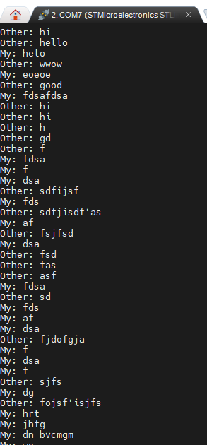

# UART통신이란?

Universal Asynchronous Receiver/Transmitter의 약자

두 장치가 데이터를 직렬(Serial)로 주고받기 위한 통신 방식

기본적인 연결은 2개

```
Device A                 Device B

TX --------------------> RX
RX <-------------------- TX
GND -------------------- GND
```

TX-RX교차한다는 점 확인할 것

UART는 clock 선이 없음. 그래서 비동기 통신이라고 불림

> 다만 F446RE 에서는 USART로 동기 통신도 지원함

## UART 한 글자가 전송되기 까지의 과정

예를 들어 문자 A를 전송한다고 할때

```
ASCII
'A' = 0x41 = 0100 0001
            bit 7 ~ bit 0
```

UART는 보통 다음 형태로 전송

```
Idle     Start      Data bits                 Stop
  1        0       D0 D1 D2 D3 D4 D5 D6 D7     1
-------+       +---------------------------+---------
       |_______|
```

받는쪽에서는

```
Start
  ↓
0 | 1 0 0 0 0 0 1 0 | 1
    └──── data ─────┘   ↑
                        Stop
```

이런느낌

## Baud Rate

115200 Baud (보통 115200 씀) 에서는 1초에 115200개의 bit를 전송함

일반적인 8N1 UART 프레임은

```
Start    1 bit
Data     8 bit
Stop     1 bit
----------------
총       10 bit
```

이므로 11520byte/s를 가짐

UART 양쪽 Baud Rate가 다르면 PC에서는 흔히 이런 식으로 보입니다.

```
Hello World

→

▒╞?x▒?
```

그래서 UART 디버깅이 안 될 때 가장 먼저 Baud Rate를 확인하면 됩니다.

## 그래서 실제 통신은 어떻게 됨?

송신의 경우

```
CPU
 │
 │ 데이터 작성
 ↓
USART_DR
Transmit Data Register
 │
 ↓
Transmit Shift Register
 │
 │ 1bit씩
 ↓
TX Pin
```

수신의 경우

```
RX Pin
 │
 │ 1bit씩
 ↓
Receive Shift Register
 │
 ↓
USART_DR
Receive Data Register
 │
 ↓
CPU
```

> 여기서 DR은 Data Register를 의미

## 송신 과정

```
uint8_t data = 'A';

HAL_UART_Transmit(&huart2, &data, 1, HAL_MAX_DELAY);
```

이런 코드가 있다고 할 때.

개념적으로는 다음 과정

```
CPU
 │
 │ 'A' = 0x41
 ↓
USART2 Data Register
 │
 ↓
Transmit Shift Register
 │
 ↓
Start bit
D0
D1
D2
...
D7
Stop bit
 │
 ↓
PA2 (USART2_TX)
```

## BareMetal로도 한번 작성해봄

BareMetal로 Uart 구현하기 위해서 진행할 단계

```
① GPIOA Clock ON
        ↓
② USART2 Clock ON
        ↓
③ PA2/PA3를 Alternate Function으로 설정
        ↓
④ PA2/PA3를 AF7(USART2)로 연결
        ↓
⑤ Baud Rate 설정
        ↓
⑥ USART 송신/수신 Enable
        ↓
⑦ USART Enable
```

즉 RCC를 줘서 GPIOA 켜주고, USART2(AHP1)을 켜주고, PA2/PA3(기본 통신 핀) 모드 설정 해주고, AF7을 USART2로 연결하고 Baud Rate 설정하고 송수신 확인하고 송수진 하는 과정이 필요 <br><br>
다음은 전체코드

```

#include "main.h"
#define GPIOA2 	2
#define GPIOA3	3


void SystemClock_Config(void);
static void MX_GPIO_Init(void);

void Init_Uart(void){
	RCC->AHB1ENR |= RCC_AHB1ENR_GPIOAEN;
	RCC->APB1ENR |= RCC_APB1ENR_USART2EN;

	GPIOA->MODER &= ~(3U << GPIOA2 * 2);
	GPIOA->MODER &= ~(3U << GPIOA3 * 2);
	GPIOA->MODER |= (2U << GPIOA2 * 2);
	GPIOA->MODER |= (2U << GPIOA3 * 2);

	GPIOA->AFR[0] &= ~((0xF << 8) | (0xF << 12));
	GPIOA->AFR[0] |=  ((7 << 8) | (7 << 12));


	USART2->CR1 = 0;
	USART2->CR2 = 0;
	USART2->CR3 = 0;


	/*
	 * Baud Rate = 115200
	 * UART Clock = 42MHz
	 */
	USART2->BRR = 0x16D;

	/*
	 * TE = Transmitter Enable
	 * RE = Receiver Enable
	 * UE = USART Enable
	 */
	USART2->CR1 |= USART_CR1_TE;
	USART2->CR1 |= USART_CR1_RE;
	USART2->CR1 |= USART_CR1_UE;
}

void UART2_Write(char c)
{
    while (!(USART2->SR & USART_SR_TXE))
    {
    }

    USART2->DR = c;
}

char UART2_Read(void)
{
    while (!(USART2->SR & USART_SR_RXNE))
    {
    }

    return (char)USART2->DR;
}

int main(void)
{


  HAL_Init();


  SystemClock_Config();


  MX_GPIO_Init();

  BSP_LED_Init(LED2);

  BSP_PB_Init(BUTTON_USER, BUTTON_MODE_EXTI);

  Init_Uart();

  while (1)
  {
	  char c = UART2_Read();
	  UART2_Write(c);
  }
}


void SystemClock_Config(void)
{
  RCC_OscInitTypeDef RCC_OscInitStruct = {0};
  RCC_ClkInitTypeDef RCC_ClkInitStruct = {0};

  /** Configure the main internal regulator output voltage
  */
  __HAL_RCC_PWR_CLK_ENABLE();
  __HAL_PWR_VOLTAGESCALING_CONFIG(PWR_REGULATOR_VOLTAGE_SCALE3);

  /** Initializes the RCC Oscillators according to the specified parameters
  * in the RCC_OscInitTypeDef structure.
  */
  RCC_OscInitStruct.OscillatorType = RCC_OSCILLATORTYPE_HSI;
  RCC_OscInitStruct.HSIState = RCC_HSI_ON;
  RCC_OscInitStruct.HSICalibrationValue = RCC_HSICALIBRATION_DEFAULT;
  RCC_OscInitStruct.PLL.PLLState = RCC_PLL_ON;
  RCC_OscInitStruct.PLL.PLLSource = RCC_PLLSOURCE_HSI;
  RCC_OscInitStruct.PLL.PLLM = 16;
  RCC_OscInitStruct.PLL.PLLN = 336;
  RCC_OscInitStruct.PLL.PLLP = RCC_PLLP_DIV4;
  RCC_OscInitStruct.PLL.PLLQ = 2;
  RCC_OscInitStruct.PLL.PLLR = 2;
  if (HAL_RCC_OscConfig(&RCC_OscInitStruct) != HAL_OK)
  {
    Error_Handler();
  }

  /** Initializes the CPU, AHB and APB buses clocks
  */
  RCC_ClkInitStruct.ClockType = RCC_CLOCKTYPE_HCLK|RCC_CLOCKTYPE_SYSCLK
                              |RCC_CLOCKTYPE_PCLK1|RCC_CLOCKTYPE_PCLK2;
  RCC_ClkInitStruct.SYSCLKSource = RCC_SYSCLKSOURCE_PLLCLK;
  RCC_ClkInitStruct.AHBCLKDivider = RCC_SYSCLK_DIV1;
  RCC_ClkInitStruct.APB1CLKDivider = RCC_HCLK_DIV2;
  RCC_ClkInitStruct.APB2CLKDivider = RCC_HCLK_DIV1;

  if (HAL_RCC_ClockConfig(&RCC_ClkInitStruct, FLASH_LATENCY_2) != HAL_OK)
  {
    Error_Handler();
  }
}

/**
  * @brief GPIO Initialization Function
  * @param None
  * @retval None
  */
static void MX_GPIO_Init(void)
{
  GPIO_InitTypeDef GPIO_InitStruct = {0};
  /* USER CODE BEGIN MX_GPIO_Init_1 */

  /* USER CODE END MX_GPIO_Init_1 */

  /* GPIO Ports Clock Enable */
  __HAL_RCC_GPIOC_CLK_ENABLE();
  __HAL_RCC_GPIOH_CLK_ENABLE();
  __HAL_RCC_GPIOA_CLK_ENABLE();
  __HAL_RCC_GPIOB_CLK_ENABLE();

  /*Configure GPIO pins : USART_TX_Pin USART_RX_Pin */
//  GPIO_InitStruct.Pin = USART_TX_Pin|USART_RX_Pin;
//  GPIO_InitStruct.Mode = GPIO_MODE_AF_PP;
//  GPIO_InitStruct.Pull = GPIO_NOPULL;
//  GPIO_InitStruct.Speed = GPIO_SPEED_FREQ_VERY_HIGH;
//  GPIO_InitStruct.Alternate = GPIO_AF7_USART2;
//  HAL_GPIO_Init(GPIOA, &GPIO_InitStruct);

  /* USER CODE BEGIN MX_GPIO_Init_2 */

  /* USER CODE END MX_GPIO_Init_2 */
}

/* USER CODE BEGIN 4 */

/* USER CODE END 4 */

/**
  * @brief  This function is executed in case of error occurrence.
  * @retval None
  */
void Error_Handler(void)
{
  /* USER CODE BEGIN Error_Handler_Debug */
  /* User can add his own implementation to report the HAL error return state */
  __disable_irq();
  while (1)
  {
  }
  /* USER CODE END Error_Handler_Debug */
}
#ifdef USE_FULL_ASSERT
/**
  * @brief  Reports the name of the source file and the source line number
  *         where the assert_param error has occurred.
  * @param  file: pointer to the source file name
  * @param  line: assert_param error line source number
  * @retval None
  */
void assert_failed(uint8_t *file, uint32_t line)
{
  /* USER CODE BEGIN 6 */
  /* User can add his own implementation to report the file name and line number,
     ex: printf("Wrong parameters value: file %s on line %d\r\n", file, line) */
  /* USER CODE END 6 */
}
#endif /* USE_FULL_ASSERT */
```

간단하게 뜯어보면 <br>
<br>
다음은 사용 하기 위한 초기화 과정

```
void Init_Uart(void){
	RCC->AHB1ENR |= RCC_AHB1ENR_GPIOAEN;    //GPIOA에 클럭 주기
	RCC->APB1ENR |= RCC_APB1ENR_USART2EN;   //USART2 사용하기 위해 클럭 주기

	GPIOA->MODER &= ~(3U << GPIOA2 * 2);
	GPIOA->MODER &= ~(3U << GPIOA3 * 2);    //모드 초기화 00으로 바꿈
	GPIOA->MODER |= (2U << GPIOA2 * 2);
	GPIOA->MODER |= (2U << GPIOA3 * 2);     //Alternate Funtion으로 설정

	GPIOA->AFR[0] &= ~((0xF << 8) | (0xF << 12)); //Alternate Function중 뭘 쓸건지 선택하기 위해 초기화
                                                  //AFR은 각 핀이 4bit씩 가지고 있어서 pinNum*4 씩 해줌
                                                  //AFR[0]은 GPIOA를 의미함 1은 B겠지
	GPIOA->AFR[0] |=  ((7 << 8) | (7 << 12));     //Alternate Function 중 USART 사용할거라고 알려줌


	USART2->CR1 = 0;    //CR1 — UART의 핵심 설정
	USART2->CR2 = 0;    //CR2 — 통신 "프레임/프로토콜" 쪽 추가 설정
	USART2->CR3 = 0;    //CR3 — 하드웨어 제어 / 특수 기능


	/*
	 * Baud Rate = 115200
	 * UART Clock = 42MHz //CubeMX에서 clock config 들어가 보면 ahp1은 42MHz 설정 된 걸 볼 수 있음
	 */
	USART2->BRR = 0x16D;  // 42,000,000 / 115,200 = 364.58 약 365 이므로 365값 줌
                          //이러면 budrate가 115,200 (정확히는 아니지만 아마 범위 오차내 통신 속도는 ㄱㅊ은걸로 앎)

	/*
	 * TE = Transmitter Enable
	 * RE = Receiver Enable
	 * UE = USART Enable
	 */
	USART2->CR1 |= USART_CR1_TE;  //전송 Transmitter Enable
	USART2->CR1 |= USART_CR1_RE;  //수신 Receiver Enable
	USART2->CR1 |= USART_CR1_UE;  //USART Enable
}
```

읽기 쓰기

```
void UART2_Write(char c)
{
    while (!(USART2->SR & USART_SR_TXE)) // TXE가 1이어야 송신 가능하다는 거임 그래서 대기한다는 의미
    {
    }

    USART2->DR = (uint8_t)c;  //char를 넣어줌
}

char UART2_Read(void)
{
    while (!(USART2->SR & USART_SR_RXNE)) // RXNE가 0이어야 수신가능 하니까 대기한다는 의미
    {
    }

    return (char)(USART2->DR & 0xFF);
}
```

이후 심화과제로 채팅 만들기 했음

폴링으로 구현 했을 때는 문제가 있었음

내가 보내는 채팅이랑 상대가 보내는 채팅이 서로 데이터 레지스터를 덮어 쓰거나 해서 문맥이 오염되고 데이터가 오염돼 제대로 보여지지 않았음

그래서 인터럽트 방식으로 바꿈



```
#include "main.h"

UART_HandleTypeDef huart1;
UART_HandleTypeDef huart2;

#define BUFFER_SIZE 100

uint8_t uart1RxByte;
uint8_t uart2RxByte;

uint8_t myBuffer[BUFFER_SIZE];
uint8_t otherBuffer[BUFFER_SIZE];

volatile uint16_t myIndex = 0;
volatile uint16_t otherIndex = 0;

volatile uint16_t myLength = 0;
volatile uint16_t otherLength = 0;

volatile uint8_t myMessageReady = 0;
volatile uint8_t otherMessageReady = 0;

void SystemClock_Config(void);
static void MX_GPIO_Init(void);
static void MX_USART1_UART_Init(void);
static void MX_USART2_UART_Init(void);

int main(void)
{
    HAL_Init();

    SystemClock_Config();

    MX_GPIO_Init();
    MX_USART2_UART_Init();
    MX_USART1_UART_Init();

    BSP_LED_Init(LED2);
    BSP_PB_Init(BUTTON_USER, BUTTON_MODE_EXTI);

    HAL_UART_Receive_IT(&huart1, &uart1RxByte, 1);
    HAL_UART_Receive_IT(&huart2, &uart2RxByte, 1);

    while (1)
    {
        if (myMessageReady)
        {
            uint16_t len = myLength;

            HAL_UART_Transmit(
                &huart2,
                (uint8_t *)"My: ",
                4,
                HAL_MAX_DELAY
            );

            HAL_UART_Transmit(
                &huart2,
                myBuffer,
                len,
                HAL_MAX_DELAY
            );

            HAL_UART_Transmit(
                &huart2,
                (uint8_t *)"\r\n",
                2,
                HAL_MAX_DELAY
            );

            HAL_UART_Transmit(
                &huart1,
                myBuffer,
                len,
                HAL_MAX_DELAY
            );

            HAL_UART_Transmit(
                &huart1,
                (uint8_t *)"\r\n",
                2,
                HAL_MAX_DELAY
            );

            myIndex = 0;
            myLength = 0;
            myMessageReady = 0;
        }

        if (otherMessageReady)
        {
            uint16_t len = otherLength;

            HAL_UART_Transmit(
                &huart2,
                (uint8_t *)"Other: ",
                7,
                HAL_MAX_DELAY
            );

            HAL_UART_Transmit(
                &huart2,
                otherBuffer,
                len,
                HAL_MAX_DELAY
            );

            HAL_UART_Transmit(
                &huart2,
                (uint8_t *)"\r\n",
                2,
                HAL_MAX_DELAY
            );

            otherIndex = 0;
            otherLength = 0;
            otherMessageReady = 0;
        }
    }
}

void HAL_UART_RxCpltCallback(UART_HandleTypeDef *huart)
{
    if (huart->Instance == USART1)
    {
        uint8_t ch = uart1RxByte;

        if (!otherMessageReady)
        {
            if (ch == '\r' || ch == '\n')
            {
                if (otherIndex > 0)
                {
                    otherLength = otherIndex;
                    otherMessageReady = 1;
                }
            }
            else
            {
                if (otherIndex < BUFFER_SIZE - 1)
                {
                    otherBuffer[otherIndex++] = ch;
                }
            }
        }

        HAL_UART_Receive_IT(
            &huart1,
            &uart1RxByte,
            1
        );
    }

    if (huart->Instance == USART2)
    {
        uint8_t ch = uart2RxByte;

        if (!myMessageReady)
        {
            if (ch == '\r' || ch == '\n')
            {
                if (myIndex > 0)
                {
                    myLength = myIndex;
                    myMessageReady = 1;
                }
            }
            else
            {
                if (myIndex < BUFFER_SIZE - 1)
                {
                    myBuffer[myIndex++] = ch;
                }
            }
        }

        HAL_UART_Receive_IT(
            &huart2,
            &uart2RxByte,
            1
        );
    }
}

void SystemClock_Config(void)
{
    RCC_OscInitTypeDef RCC_OscInitStruct = {0};
    RCC_ClkInitTypeDef RCC_ClkInitStruct = {0};

    __HAL_RCC_PWR_CLK_ENABLE();

    __HAL_PWR_VOLTAGESCALING_CONFIG(
        PWR_REGULATOR_VOLTAGE_SCALE3
    );

    RCC_OscInitStruct.OscillatorType =
        RCC_OSCILLATORTYPE_HSI;

    RCC_OscInitStruct.HSIState =
        RCC_HSI_ON;

    RCC_OscInitStruct.HSICalibrationValue =
        RCC_HSICALIBRATION_DEFAULT;

    RCC_OscInitStruct.PLL.PLLState =
        RCC_PLL_ON;

    RCC_OscInitStruct.PLL.PLLSource =
        RCC_PLLSOURCE_HSI;

    RCC_OscInitStruct.PLL.PLLM = 16;
    RCC_OscInitStruct.PLL.PLLN = 336;

    RCC_OscInitStruct.PLL.PLLP =
        RCC_PLLP_DIV4;

    RCC_OscInitStruct.PLL.PLLQ = 2;
    RCC_OscInitStruct.PLL.PLLR = 2;

    if (HAL_RCC_OscConfig(&RCC_OscInitStruct) != HAL_OK)
    {
        Error_Handler();
    }

    RCC_ClkInitStruct.ClockType =
        RCC_CLOCKTYPE_HCLK |
        RCC_CLOCKTYPE_SYSCLK |
        RCC_CLOCKTYPE_PCLK1 |
        RCC_CLOCKTYPE_PCLK2;

    RCC_ClkInitStruct.SYSCLKSource =
        RCC_SYSCLKSOURCE_PLLCLK;

    RCC_ClkInitStruct.AHBCLKDivider =
        RCC_SYSCLK_DIV1;

    RCC_ClkInitStruct.APB1CLKDivider =
        RCC_HCLK_DIV2;

    RCC_ClkInitStruct.APB2CLKDivider =
        RCC_HCLK_DIV1;

    if (HAL_RCC_ClockConfig(
            &RCC_ClkInitStruct,
            FLASH_LATENCY_2) != HAL_OK)
    {
        Error_Handler();
    }
}

static void MX_USART1_UART_Init(void)
{
    huart1.Instance = USART1;

    huart1.Init.BaudRate = 115200;
    huart1.Init.WordLength = UART_WORDLENGTH_8B;
    huart1.Init.StopBits = UART_STOPBITS_1;
    huart1.Init.Parity = UART_PARITY_NONE;
    huart1.Init.Mode = UART_MODE_TX_RX;
    huart1.Init.HwFlowCtl = UART_HWCONTROL_NONE;
    huart1.Init.OverSampling = UART_OVERSAMPLING_16;

    if (HAL_UART_Init(&huart1) != HAL_OK)
    {
        Error_Handler();
    }
}

static void MX_USART2_UART_Init(void)
{
    huart2.Instance = USART2;

    huart2.Init.BaudRate = 115200;
    huart2.Init.WordLength = UART_WORDLENGTH_8B;
    huart2.Init.StopBits = UART_STOPBITS_1;
    huart2.Init.Parity = UART_PARITY_NONE;
    huart2.Init.Mode = UART_MODE_TX_RX;
    huart2.Init.HwFlowCtl = UART_HWCONTROL_NONE;
    huart2.Init.OverSampling = UART_OVERSAMPLING_16;

    if (HAL_UART_Init(&huart2) != HAL_OK)
    {
        Error_Handler();
    }
}

static void MX_GPIO_Init(void)
{
    __HAL_RCC_GPIOC_CLK_ENABLE();
    __HAL_RCC_GPIOH_CLK_ENABLE();
    __HAL_RCC_GPIOA_CLK_ENABLE();
    __HAL_RCC_GPIOB_CLK_ENABLE();
}

void Error_Handler(void)
{
    __disable_irq();

    while (1)
    {
    }
}

#ifdef USE_FULL_ASSERT

void assert_failed(uint8_t *file, uint32_t line)
{
}

#endif

```

이게 인터럽트 방식 코드고
핵심 코드는

```
void HAL_UART_RxCpltCallback(UART_HandleTypeDef *huart)
{
    if (huart->Instance == USART1)
    {
        uint8_t ch = uart1RxByte;

        if (!otherMessageReady)
        {
            if (ch == '\r' || ch == '\n')
            {
                if (otherIndex > 0)
                {
                    otherLength = otherIndex;
                    otherMessageReady = 1;
                }
            }
            else
            {
                if (otherIndex < BUFFER_SIZE - 1)
                {
                    otherBuffer[otherIndex++] = ch;
                }
            }
        }

        HAL_UART_Receive_IT(
            &huart1,
            &uart1RxByte,
            1
        );
    }

    if (huart->Instance == USART2)
    {
        uint8_t ch = uart2RxByte;

        if (!myMessageReady)
        {
            if (ch == '\r' || ch == '\n')
            {
                if (myIndex > 0)
                {
                    myLength = myIndex;
                    myMessageReady = 1;
                }
            }
            else
            {
                if (myIndex < BUFFER_SIZE - 1)
                {
                    myBuffer[myIndex++] = ch;
                }
            }
        }

        HAL_UART_Receive_IT(
            &huart2,
            &uart2RxByte,
            1
        );
    }
}
```

이거임 Rx 인터럽트 발생하면 띄우는 과정을 인터럽트 서비스 루틴으로 설정하는 거임

여기서 뭐 led를 토글하거나 하면 rx가 오면 토글하고 이렇게 바꿀 수도 있겠지?

아니면 받은 데이터를 읽어서 뭐 ledon이라면 led 키고 ledoff면 끄고, 아니면 뭐 buzzeron 이나 뭐 이런식으로 다양하게 사용 가능할 듯
