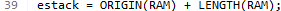
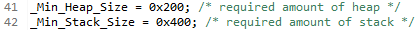
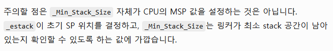
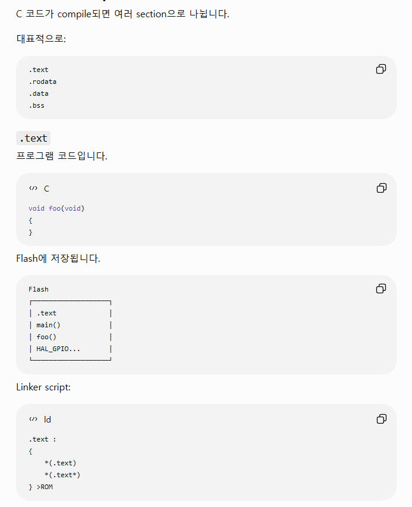
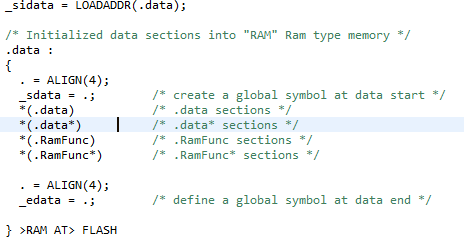

# NVIC?

Nested Vectored Interrupt Controller의 약자이다.

ARM Cortex-M 계열 MCU에서 여러 인터럽트의 우선 순위를 관리고 CPU가 어떤 ISR을 실행할 지 결정하는 하드웨어이다.

## 핵심 개념

NVIC의 역할은 크게 네가지이다.

1. Interrupt Enable/Disable <br>
특정 인터럽트를 받을 지 말지 결정한다

2. Pending 관리<br>
인터럽트가 발생했지만 아직 실행되지 않은 상태를 관리한다.
3. Priority 관리<br>
여러 인터럽트가 동시에 발생했을 때 어떤 인터럽트를 우선 처리할 지 결정한다
4. Nested Interrupt<br>
낮은 우선순위 ISR 실행 중 더 높은 우선순위 인터럽트가 발생하면 현재 ISR을 중단하고 높은 우선순위 ISR부터 실행한다.

## Nested Interrupt가 핵심
NVIC에서 특히 중요한 부분이다.

예를들어 
```
UART priority = 2
Timer priority = 1
```
위와 같은 인터럽트가 있을때
```
main()
 │
 │ UART interrupt
 ▼
UART ISR              priority 2
 │
 │ Timer interrupt 발생
 ▼
Timer ISR             priority 1
 │
 │ 종료
 ▼
UART ISR 계속 실행
 │
 │ 종료
 ▼
main() 계속 실행
```
이런 실행 흐름을 가질 수 있다.

이게 마치 

```
main
 → UART ISR
     → Timer ISR
     ←
   UART ISR
 ←
main
```
이렇게 중첩되는 모양을 가져 Nested Interrupt이다.

## Vectored라는 의미
인터럽트 종류마다 실행해야 하는 ISR 주소가 **Vector Table** 에 들어 있다.

대략 다음과 같은 구조
```
Vector Table

0x00000000  Initial Stack Pointer
0x00000004  Reset_Handler
0x00000008  NMI_Handler
0x0000000C  HardFault_Handler
...
            EXTI0_IRQHandler
            USART2_IRQHandler
            TIM2_IRQHandler
```

UART2 인터럽트가 발생했다고 하면 NVIC가

```
UART2 IRQ 번호
       ↓
Vector Table
       ↓
USART2_IRQHandler 주소
       ↓
CPU PC에 해당 주소 로드
       ↓
ISR 실행
```
을 수행한다.

인터럽트 번호에 대응하는 Handler 주소로 바로 이동하기 때문에 Vectored Interrupt라고 부릅니다.

## Preemption Priority와 Subpriority
다음과 같은 Hal코드가 있으면

```
HAL_NVIC_SetPriority(USART2_IRQn, 2, 1);
```
두 숫자의 의미는 
```
Preemption Priority
Subpriority
```
이다.
### Preemption Priority
이게 주 우선순위 라고 보면 된다.

해당 값이 작은 우선순위부터 실행되며 현재 실행되는 ISR의 해당 값이 더 크다면, 해당 루틴을 끊고 들어간다.

### Subpriority
Preemtion이 같을 때 Subpriority이 낮은걸 먼저 실행하게 된다. 

물론 그렇다고 preemtion이 같을때 sub가 낮은게 들어온다고 끊고 들어가진 못한다.

## NVIC와 Peripheral Interrupt를 구분해야 함

NVIC이 직접 인터럽트 발생시키는 게 아님

Peripheral이 인터럽트가 발생했다고 알리면 NVIC이 해당 인터럽트의 우선순위에 따라 CPU에게 언제 실행 시킬 지 결정하는 역할을 하는거임

# STM32 부팅과정
## 큰그림
```
[빌드]
main.c / stm32f4xx_it.c / HAL ...
        ↓ compile
      *.o
startup_stm32f446retx.s
        ↓ assemble
startup_stm32f446retx.o
        ↓
        ├──────── STM32F446RETX_FLASH.ld
        │              ↓ 메모리 배치 규칙
        └──────→ Linker
                    ↓
                  .elf
                ↙      ↘
             .hex      .bin
                        ↓
                    Flash 기록

------------------------------------------------

[부팅]
Power / Reset
    ↓
BOOT 설정에 따라 부팅 메모리 선택
    ↓
Vector Table
    ↓
MSP 초기화 + Reset_Handler 주소 획득
    ↓
Reset_Handler
    ↓
.data 복사 / .bss = 0
    ↓
SystemInit()
    ↓
C runtime 초기화
    ↓
main()
```

## 컴파일 과정
1. Processing
```
main.c
 ↓
전처리
 ↓
#include 확장
#define 치환
#if 처리
```

2. Compile
```
main.c
   ↓
ARM machine code 생성
   ↓
main.o
```

3. startup_stm32f446retx.s도 object가 된다
<br>
단 Startup 파일은 C가 아닌 ARM Assembly이다.<br>
그리고 이것도 다른 .o 파일과 함께 링크됩니다.<br>
즉 startup code는 특별한 외부 프로그램이 아니라 우리 firmware 안에 포함되는 실제 코드다.
```
startup_stm32f446retx.s
        ↓ Assembler
startup_stm32f446retx.o
```

4. Link단계
<br>
링커가 object 파일들을 합치는데 단순히 합치는 것이 아니다.<br>
MCU에는 정해진 메모리가 존재하기 때문이다.
<br>
따라서 <br>
코드는 어디 넣을 지, 전역변수는 어디 넣을 지, Vector Table은 어디 넣을지를 알려줘야한다.<br>
이 역할을 하는게 "STM32F446RETX_FLASH.ld"이다.

## STM32F446RETX_FLASH.ld
해당 파일을 까보면

위 사진처럼 정의 되어 있다

즉, STM32F446RETx application 관점에서
```
Flash : 0x08000000 ~
        512 KB

RAM   : 0x20000000 ~
        128 KB
```
를 사용한다. ST의 실제 STM32F446RETx linker script 역시 ROM 시작을 0x08000000, 크기를 512 KB, RAM 시작을 0x20000000, 크기를 128 KB로 정의한다.

따라서 RAM 마지막 주소는
```
0x20000000 + 128 KB
= 0x20020000
```
가 된다.

## Stack 초기 주소 _estack


따라서 _estack = 0x20020000 이다.

Cortex-M의 stack은 높은 주소에서 낮은 주소 방향으로 성장하므로:

```
0x20020000  ← 초기 MSP
     ↓
     ↓ Stack grows downward
     ↓
0x20000000
```

또한

이렇게 들어가 있는 것을 보면
```
Heap  : 0x200 = 512 Byte
Stack : 0x400 = 1024 Byte
```
를 확보하는 것을 알 수 있다.



그렇다고 한다.

## Linker script가 section을 배치한다



### .rodata
읽기 전용 상수이다.
```
const int value = 100;

printf("Hello");
```
이런 상수 데이터도 Flash에 저장 된다고한다.

### .data
```
int value = 10;
```
이렇게 value 라는 변수는 변경이 가능하기에 RAM에 존재해야한다.

그러나, 전원이 꺼진 상태에서는 RAM에 10을 저장 할 수 없다. 그렇기에 초기값 10은 flash에 존재한다.

이를 이어주기 위해서 linker script가 


이렇게 데이터를 연결해 주는 것을 볼 수 있다.
여기서 핵심은 > RAM 이다.

실제로 실행될 주소(VMA)는 RAM.

AT>ROM

초기값이 firmware image에 저장되는 위치(LMA)는 Flash 이다.

### _sigdata, _sdata, _edata
이 세 심볼이 startup code와 linker script를 연결한다

```
_sidata
   ↓
Flash에 저장된 .data 초기값 시작

_sdata
   ↓
RAM의 .data 시작

_edata
   ↓
RAM의 .data 끝
```

startup code가 개념적으로는 다음작업을 한다
```
src = &_sidata;
dst = &_sdata;

while (dst < &_edata)
{
    *dst++ = *src++;
}
```
```
FLASH                    RAM

_sidata                  _sdata
   │                         │
   │    value = 10 ────────→ │ value = 10
   │    foo   = 20 ────────→ │ foo   = 20
   │                         │
                         _edata
```

### .bss
```
int count;
static int error;
```
이렇게 초기값이 없는경우 C언어 규칙상 0으로 시작돼야한다.
<br>하지만 Flash에 굳이 0 0 0 0 ... 을 저장할 필요는 없음
<br>
그래서 linker는
```
.bss :
{
    _sbss = .;

    *(.bss)
    *(.bss*)

    _ebss = .;
} >RAM
```
로 두고 startup이 실행될 때
```
for (p = &_sbss; p < &_ebss; p++)
    *p = 0;
```
를 진행함
따라서
```
int a = 10;    → .data
int b;         → .bss
const int c=3; → .rodata
main()         → .text
```
이렇게 이해하면 됨

### Vector Table은 .isr_vector
```
.isr_vector :
{
    KEEP(*(.isr_vector))
} >ROM
```
그리고 이 section을 ROM의 가장 앞에 배치

따라서 Flash는 대략
```
0x08000000
┌────────────────────┐
│ .isr_vector        │
├────────────────────┤
│ .text              │
├────────────────────┤
│ .rodata            │
├────────────────────┤
│ .data 초기값        │
└────────────────────┘
```
이렇게 됨


## 인터럽트 실행 후 복귀
ISR이 끝난 뒤 원래 코드로 돌아가는 핵심은 Cortex-M 하드웨어가 인터럽트 진입 시 실행 상태를 자동으로 스택에 저장하고, ISR 종료 시 다시 복원하기 때문

다음과 같은 상황에서
```
while (1)
{
    a++;
    b = a + 10;   // ← 이 근처를 실행 중
    c++;
}
```
CPU 내부에는 현재 실행 상태가 있음
```
R0 ~ R12 : 연산에 사용하는 값
SP       : Stack Pointer
LR       : 복귀 주소 관련 값
PC       : 현재 실행 중인 명령어 주소
xPSR     : CPU 상태 정보
```

추가정보
```
R0  ~ R3   : 함수 인자, 계산용 임시 레지스터
R4  ~ R11  : 일반 연산용 레지스터
R12        : 임시 레지스터
R13 = SP   : Stack Pointer
R14 = LR   : Link Register
R15 = PC   : Program Counter
xPSR       : CPU 상태 레지스터
```


이때 usart 인터럽트 발생하면

Cortex-M이 자동으로 Context를 Stack에 저장

인터럽트가 받아들여지면 Cortex-M은 ISR로 바로 뛰기 전에 다음 레지스터들을 하드웨어가 자동으로 stack에 push함

이를 Exception Stack Frame이라고 함

아무튼 일반 함수호출에서는 LR에 일반적인 return address가 저장됨

하지만 exception 진입하면 Cortex-M은 LR에 특별한 값을 넣음

예를들어
```
0xFFFFFFF9
0xFFFFFFFD
0xFFFFFFF1
```
이와 같은 **EXC_RETURN**을 가짐

즉 ISR 안의 LR은 
**"Exception에서 어떻게 복귀해야 하는지"** 를 나타내는 특별한 값이다.

ISR 마지막에는 결국 BX LR인데

C언어에서 함수를 작성하면 마지막에 return(void 함수 기준)을 직접 쓰지 않아도 함수가 끝난다.

컴파일된 어셈블리 대략 마지막에

BX LR 과 같은 명령이 나타남.

근데 ISR 에서는 LR에 특별한 EXC_RETURN 값이 들어가 있어서 CPU가 실행을 하다 해당 라인을 만나면 "exception return"임을 알아차리고 하드웨어가 처리하게 됨

그렇게 되면 Cortex-M이 자동으로 Stack Frame을 꺼낸다.

진입할 때 저장했던

```
R0
R1
R2
R3
R12
LR
PC
xPSR
```
을 다시 복원함

특히 
```
PC ← Stack에 저장해 둔 PC
```
가 되어 CPU 인터럽트 발생 전 실행하던 코드로 자연스럽게 돌아감
