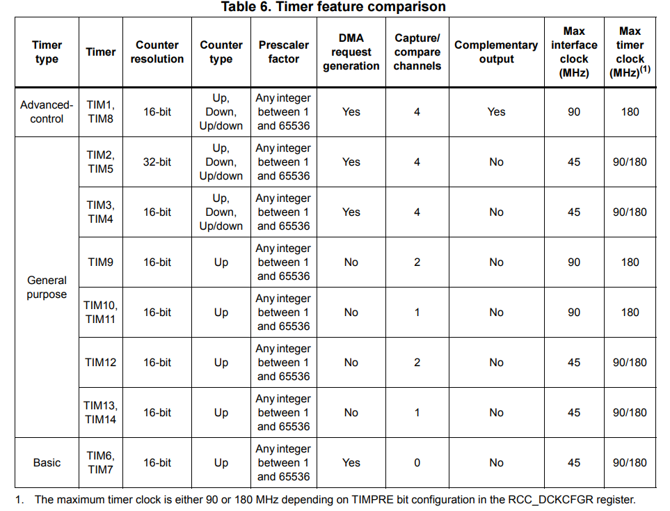
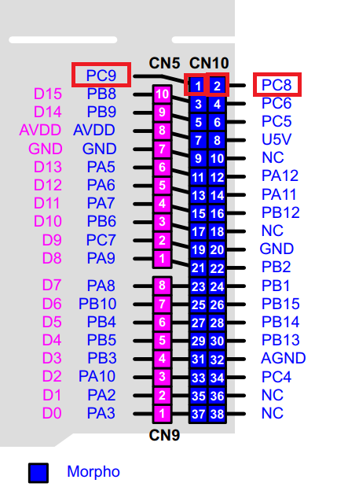
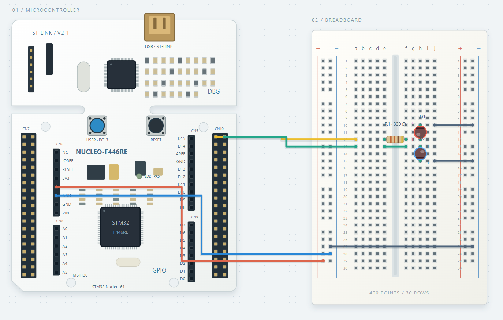
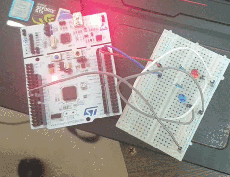

# WEEK 7
## TIMER
---
## 🛖 장소 : 서울 강남구 논현로 522 6층

## 📝 7주차 과제
- STM32F446RE TIMER의 개념과 동작원리
- SysTick과 TIM의 관계
- 실습 : 동시에 LED 다른 주기로 키기
    -  EX) 순차적이 아니라 동 주기에 Red는 1초, BLUE는 0.5초 주기로 깜빡이게 하기
    -  LED RED 1초 깜빡임 -> 그 후 LED BLUE 0.5초 깜빡임 이 아니라 LED RED가 1번 깜빡일 동안 LED BLUE는 2번 깜빡이기

---
<br><br><br><br><br><br>

[참?고](https://wikidocs.net/214815)
---

## 1. STM32F446RE 타이머 개요 및 특징 비교

STM32F446RE는 하드웨어 역할과 기능 수준에 따라 최대 17개의 타이머를 제공합니다.  
모든 타이머 카운터(CNT)는 클록 신호를 분할(Prescaler)하여 수신하며, 설정된 Auto-reload 값(ARR)에 도달하면 인터럽트나 DMA 요청을 발생시키는 Time-base unit을 기본 동작 구조로 가집니다.



| 타이머 종류 | 카운터 해상도 및 방향 | 특징 및 주요 기능 |
| :--- | :--- | :--- |
| **Advanced-control**<br>(TIM1, TIM8) | 16-bit<br>Up/Down/Center-aligned | • 6채널 PWM 출력 및 Dead-time 제어<br>• 모터 제어용 Break input 지원<br>• Repetition counter 포함 |
| **General-purpose**<br>(TIM2~TIM5) | 32-bit (TIM2/5)<br>16-bit (TIM3/4)<br>Up/Down/Center-aligned | • 4채널 Input Capture / Output Compare / PWM<br>• Quadrature Encoder(인코더) / Hall-sensor 인터페이스<br>• 타이머 간 동기화(Master/Slave) 지원 |
| **General-purpose**<br>(TIM9~TIM14) | 16-bit<br>Up-counting | • TIM9, TIM12: 2채널 Capture/Compare<br>• TIM10,11,13,14: 1채널 Capture/Compare |
| **Basic**<br>(TIM6, TIM7) | 16-bit<br>Up-counting | • DAC 변환 트리거 전용 타이머<br>• 단순 시간 지연 및 주기적 인터럽트 |
| **Watchdogs**<br>(IWDG, WWDG) | Independent / Window | • 시스템 오동작(프리즈) 감지 및 리셋 발생 |
| **SysTick timer** | 24-bit<br>Down-counting | • Cortex-M4 코어 내장 RTOS/시스텝 타임베이스 타이머 |

---

## 2. 섹션별 주요 타이머 세부 동작 원리

### 3.21.1 Advanced-control timers (TIM1, TIM8)

*   **동작 원리**: 16비트 Auto-reload 카운터와 분할기(Prescaler)로 구성되며, 최대 6개의 3상 PWM 신호를 생성할 수 있습니다.
*   **주요 특징**:
    *   Complementary PWM 출력 시 Dead-time Insertion을 통해 상/하단 FET가 동시에 켜져 숏트(Short)가 나는 현상을 방지합니다.
    *   외부 Break input 신호가 입력되면 하드웨어적으로 즉시 PWM 출력을 무효화(안전 상태)합니다.

### 3.21.2 General-purpose timers (TIM2 to TIM5, TIM9 to TIM14)

*   **동작 원리**:
    *   **Input Capture**: 외부 핀의 엣지(Rising/Falling)를 감지하여 그 순간의 타이머 CNT 값을 저장함으로써 입력 신호의 주파수나 펄스 폭을 측정합니다.
    *   **Output Compare / PWM**: 타이머 카운터(CNT)와 Capture/Compare Register(CCR)를 비교하여 핀의 논리 상태를 반전시키거나 duty cycle이 가변하는 PWM 파형을 출력합니다.
    *   **TIM2 / TIM5의 차별점**: 32비트 카운터를 내장하여 오버플로우 없이 매우 긴 시간 단위를 정밀하게 카운트할 수 있습니다.

### 3.21.3 Basic timers (TIM6, TIM7)

*   **동작 원리**: 외부 입출력 핀이 없는 단순한 타임베이스 타이머입니다.
*   **주요 특징**: 카운터가 지정한 ARR 값에 도달(Update Event)하면 하드웨어 수신 트리거(TRGO)를 생성하여, CPU 개입 없이 DAC(디지털-아날로그 변환기)를 자동으로 작동시키는 용도로 활용됩니다.

### 3.21.4 Independent watchdog (IWDG)

*   **동작 원리**: 메인 클록(HCLK)과 독립된 LSI(내부 저속 32kHz 로직) 클록으로 작동합니다.
*   **주요 특징**: 소프트웨어가 루프에 빠져 정해진 시간 내에 Watchdog을 갱신(Feed)하지 못할 경우, 하드웨어적으로 시스템 리셋을 발동시켜 무한 루프 상태를 복구합니다.

### 3.21.5 Window watchdog (WWDG)

*   **동작 원리**: APB1 시스템 클록에서 분할된 클록으로 작동하며 7비트 다운카운터를 사용합니다.
*   **주요 특징**: 단순 오버플로우뿐만 아니라, 설정된 특정 시간 창(Window)보다 너무 일찍 또는 너무 늦게 카운터를 갱신하는 경우 리셋을 발생시켜 비정상적인 프로그램 실행 흐름을 감지합니다.

### 3.21.6 SysTick timer

*   **동작 원리**: ARM Cortex-M4 코어 내부의 24비트 다운카운터 타이머입니다.
*   **주요 특징**:
    *   AHB 클록(HCLK) 또는 HCLK/8 클록을 공급받아 작동합니다.
    *   Free RTOS의 OS Tick(Task 스케줄링 타임슬롯) 생성이나, STM32 HAL 라이브러리의 HAL_Delay() 구현을 위한 1ms 단독 타임베이스 카운터로 활용됩니다.
* **Input Capture (입력 캡처)**: 외부 핀의 엣지(Rising/Falling)를 감지하여 그 순간의 CNT 값을 레지스터(CCR)에 저장, 신호의 주기나 폭(Duty Cycle)을 측정.
* **Output Compare / PWM (출력 비교/PWM)**: CNT 값과 CCRx(Capture/Compare) 레지스터 값을 비교하여, 같아지는 시점에 핀의 출력을 Toggle/High/Low로 전환하여 PWM 파형 생성.
* **Master/Slave Mode & Synchronization**: 하나의 타이머 TRGO(Trigger Output) 신호를 다른 타이머의 TRGI(Trigger Input)로 받아 타이머 간 동기화 구현 가능.


---




# STM32 CubeMX 설정 

## GPIO 설정
* **GPIOC Pins**: PC8, PC9 $\rightarrow$ `GPIO_Output` 설정

## TIM6 (타이머) 설정
* **전제 조건**: System Clock 84MHz 기준

| 항목 | 설정 값 | 설명 |
| :--- | :--- | :--- |
| **Prescaler (PSC)** | `8400 - 1` | 10kHz로 분주 (1초에 10,000 카운트) |
| **Counter Period (ARR)** | `1000 - 1` | 1,000 카운트마다 인터럽트 발생 ($\rightarrow$ 100ms / 0.1초 주기) |

## NVIC 설정
* **TIM6 global interrupt**: 활성화 (Enabled 체크)
```c
#include "main.h"

TIM_HandleTypeDef htim6;

void SystemClock_Config(void);
static void MX_GPIO_Init(void);
static void MX_TIM6_Init(void);

int main(void)
{
  HAL_Init();
  SystemClock_Config();

  MX_GPIO_Init();
  MX_TIM6_Init();

  // TIM6 타이머 인터럽트 시작
  HAL_TIM_Base_Start_IT(&htim6);

  while (1)
  {
    // 메인 루프는 비워두거나 다른 작업 수행
  }
}

/**
  * @brief TIM6 주기적 Update 인터럽트 콜백 함수
  */
void HAL_TIM_PeriodElapsedCallback(TIM_HandleTypeDef *htim)
{
  // TIM6 인터럽트 발생 시 (0.1초마다 실행)
  if (htim->Instance == TIM6)
  {
    static uint8_t count_100ms = 0;
    count_100ms++;

    // 0.5초 (100ms * 5회) 마다 PC8 (파란 LED) 토글
    if (count_100ms % 5 == 0)
    {
      HAL_GPIO_TogglePin(GPIOC, GPIO_PIN_8);
    }

    // 1.0초 (100ms * 10회) 마다 PC9 (빨간 LED) 토글
    if (count_100ms % 10 == 0)
    {
      HAL_GPIO_TogglePin(GPIOC, GPIO_PIN_9);
      count_100ms = 0; // 카운터 초기화
    }
  }
}

/**
  * @brief TIM6 초기화 함수
  */
static void MX_TIM6_Init(void)
{
  TIM_MasterConfigTypeDef sMasterConfig = {0};

  htim6.Instance = TIM6;
  htim6.Init.Prescaler = 8400 - 1;       // 클럭 타이머 주파수에 맞춰 조정
  htim6.Init.CounterMode = TIM_COUNTERMODE_UP;
  htim6.Init.Period = 1000 - 1;          // 0.1초(100ms) 주기 설정[cite: 1]
  htim6.Init.AutoReloadPreload = TIM_AUTORELOAD_PRELOAD_DISABLE;
  if (HAL_TIM_Base_Init(&htim6) != HAL_OK)
  {
    Error_Handler();
  }
  sMasterConfig.MasterOutputTrigger = TIM_TRGO_RESET;
  sMasterConfig.MasterSlaveMode = TIM_MASTERSLAVEMODE_DISABLE;
  if (HAL_TIMEx_MasterConfigSynchronization(&htim6, &sMasterConfig) != HAL_OK)
  {
    Error_Handler();
  }
}

/**
  * @brief GPIO 초기화 함수 (PC8, PC9)
  */
static void MX_GPIO_Init(void)
{
  GPIO_InitTypeDef GPIO_InitStruct = {0};

  __HAL_RCC_GPIOC_CLK_ENABLE();

  // PC8, PC9 초깃값 LOW 설정
  HAL_GPIO_WritePin(GPIOC, GPIO_PIN_8 | GPIO_PIN_9, GPIO_PIN_RESET);

  // GPIO 핀 설정
  GPIO_InitStruct.Pin = GPIO_PIN_8 | GPIO_PIN_9;
  GPIO_InitStruct.Mode = GPIO_MODE_OUTPUT_PP;
  GPIO_InitStruct.Pull = GPIO_NOPULL;
  GPIO_InitStruct.Speed = GPIO_SPEED_FREQ_LOW;
  HAL_GPIO_Init(GPIOC, &GPIO_InitStruct);
}
```

