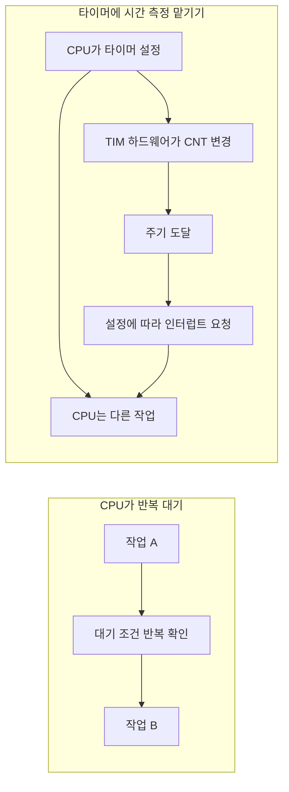
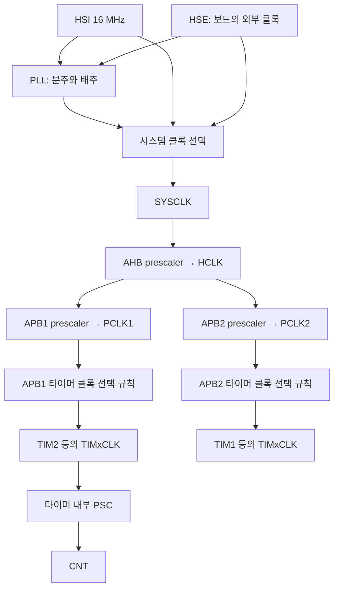
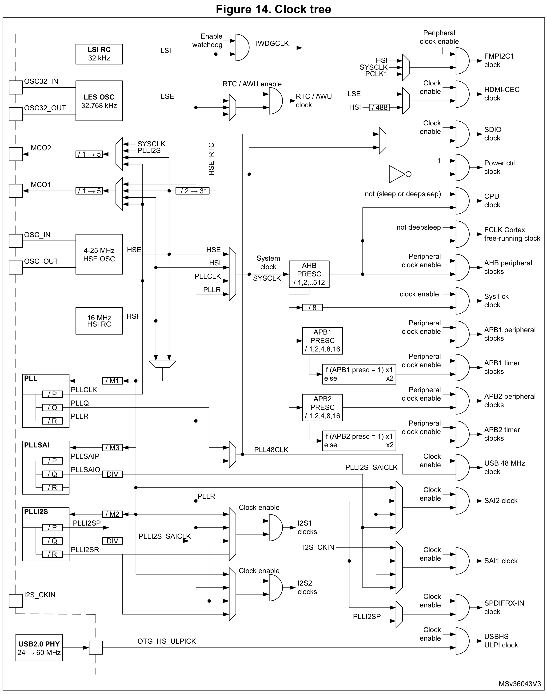
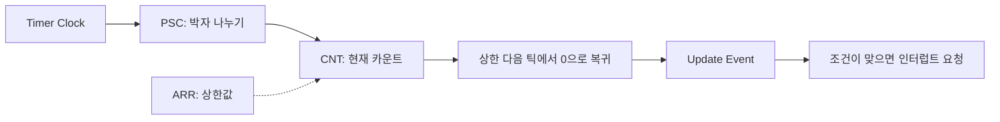
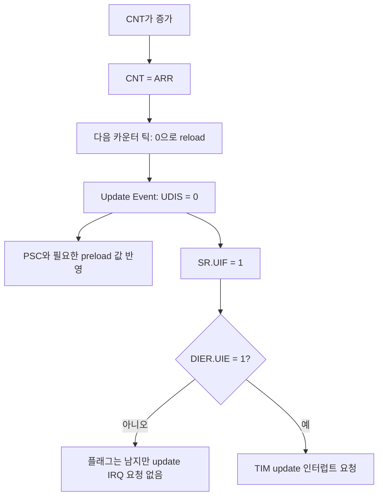
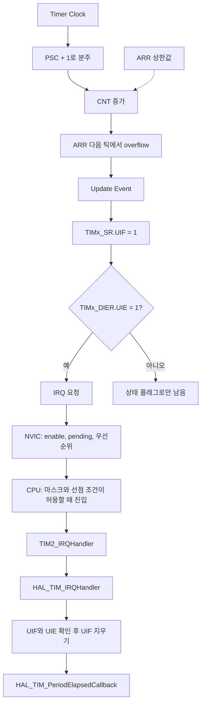
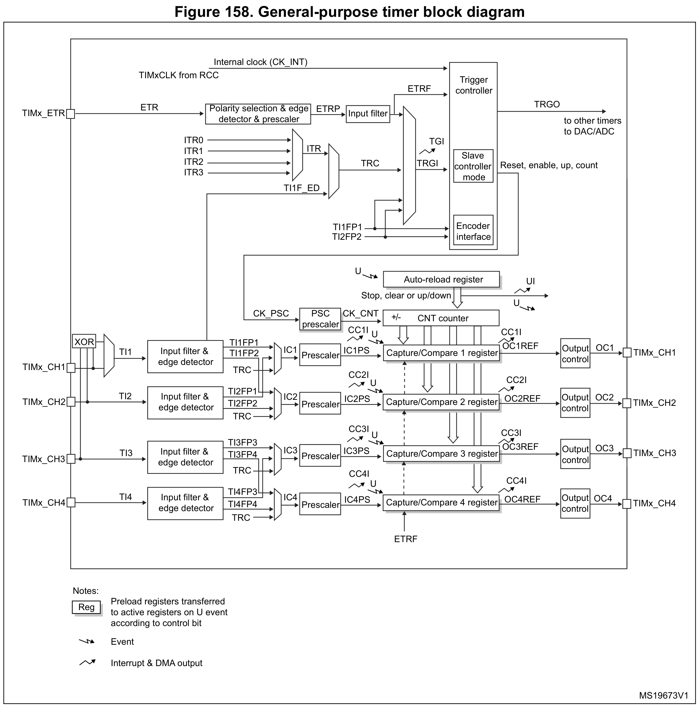
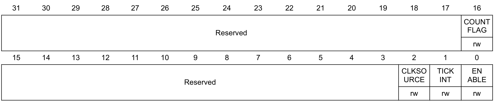
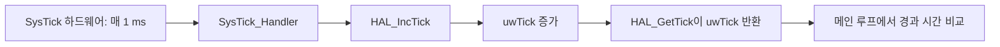

# STM32F446 Timer 완전 이해

**대상 MCU: STM32F446xx · 실습 기준 보드: NUCLEO-F446ZE**

이 문서는 클록이 타이머에 들어와 시간을 세고, 인터럽트로 CPU에 전달되어 LED를 바꾸기까지의 과정을 연결해서 설명한다. 이어서 Cortex-M4의 SysTick과 STM32의 TIM을 구분하고, `HAL_GetTick()`으로 여러 작업을 함께 처리하는 방법을 익힌다.

> **현재 폴더에서 확인한 범위**: `docs/reference/`는 없으며, 프로젝트 루트에 있는 RM0390 **Rev 9, February 2026**과 PM0214 **Rev 10, March 2020** PDF를 우선 근거로 사용했다. `.ioc`, `SystemClock_Config()`, HAL 드라이버 등 펌웨어 소스는 제공되지 않았다. 따라서 아래 **168 MHz 클록과 모든 코드는 학습용 구성**이며, 현재 보드에 설정된 값이나 실행 검증 결과를 뜻하지 않는다. 실제 프로젝트에 적용할 때는 해당 프로젝트의 클록과 초기화 코드를 먼저 확인한다.

본문의 TIM 계산은 별도 설명이 없으면 **TIM2, 내부 클록, 연속 상향 카운팅, edge-aligned, `UDIS=0`, `TIMPRE=0`**을 전제로 한다. 고급 타이머의 repetition counter, 외부 클록, center-aligned 모드에는 조건을 다시 확인해야 한다.

## 목차

| 타이머의 원리 | SysTick과 실습 |
| --- | --- |
| [1. Timer를 왜 사용하는가?](#timer-purpose) | [10. SysTick이란?](#systick) |
| [2. STM32의 Clock 구조](#clock) | [11. SysTick 레지스터](#systick-registers) |
| [3. 공식 Clock Tree](#clock-tree) | [12. HAL_GetTick()과 SysTick](#hal-tick) |
| [4. TIM의 기본 구조](#tim-structure) | [13. SysTick과 TIM 비교](#comparison) |
| [5. PSC의 동작 원리](#prescaler) | [14. HAL_GetTick()을 이용한 두 LED 동시 제어](#polling-led) |
| [6. CNT와 ARR의 관계](#counter-arr) | [15. TIM Interrupt를 이용한 LED 제어](#interrupt-led) |
| [7. Update Event](#update-event) | [학습 확인과 문제 해결](#checks) |
| [8. TIM Interrupt와 NVIC](#interrupt-nvic) | [공식 Reference 문서 출처](#references) |
| [9. 공식 TIM Block Diagram](#tim-diagram) | |

<a id="timer-purpose"></a>
## 1. Timer를 왜 사용하는가?

LED를 1초마다 바꾸려면 누군가 1초를 재야 한다. CPU가 반복문을 계속 실행하며 기다릴 수도 있고, 별도의 타이머 하드웨어에 시간 측정을 맡길 수도 있다.

```c
/* 시간 측정 원리를 보여주기 위한 예시: 정확한 1초가 아니다. */
for (volatile uint32_t i = 0; i < 1000000U; ++i)
{
    /* CPU가 계속 이 반복문을 실행한다. */
}
```

이 반복문에 걸리는 시간은 CPU 클록, 생성된 기계어, 컴파일러 최적화, 중간에 실행된 인터럽트에 따라 달라진다. 기다리는 동안 메인 코드는 다음 일을 시작하지 못한다. 이처럼 조건이 만족될 때까지 반복 확인하며 CPU 시간을 쓰는 것을 **busy waiting**이라고 한다.

TIM을 사용하면 클록 펄스를 세는 전용 하드웨어가 `CNT` 값을 바꾼다. CPU가 `CNT++`를 실행하는 것이 아니다. CPU는 초기 설정을 한 뒤 다른 일을 하다가, 필요할 때 값을 읽거나 타이머 인터럽트를 처리하면 된다. 다만 TIM의 클록과 카운터가 켜져 있어야 하며, 저전력·디버그 정지 시 동작은 별도 설정에 따른다.



**Blocking**은 호출한 코드가 완료될 때까지 다음 단계로 진행하지 못하는 방식이다. **Non-blocking**은 지금 처리할 일이 있는지만 확인하고, 아직 때가 아니면 다른 작업으로 진행하는 방식이다. 하드웨어 타이머를 사용해도 그 값을 `while`로 기다리면 코드는 여전히 blocking이다.

`HAL_Delay()`도 기본 구현에서는 tick 차이를 반복 확인하므로 blocking이다. 이때 인터럽트까지 정지하는 것은 아니다. 14장에서는 기다리는 반복문 대신, 시간이 되었을 때만 LED를 바꾸는 구조를 만든다.

<a id="clock"></a>
## 2. STM32의 Clock 구조

클록은 회로가 동작하는 기준 박자다. **주파수 84 MHz**는 1초에 84,000,000번의 주기가 있다는 뜻이지, 타이머 인터럽트가 그만큼 발생한다는 뜻은 아니다. 이 빠른 박자를 나누고 여러 번 세어 원하는 시간을 만든다.

### 2.1 클록의 출발점에서 TIM까지

| 용어 | 역할 | 타이머를 공부할 때의 의미 |
| --- | --- | --- |
| HSI | MCU 내부의 고속 RC 발진기, 공칭 16 MHz | 외부 발진기 없이 사용할 수 있는 클록 원천 |
| HSE | 외부 고속 크리스털/공진자 또는 외부 클록 입력 | 주파수와 연결 방식은 보드 회로에 따라 확인 |
| PLL | 입력 클록을 분주·배주해 다른 주파수를 생성하는 회로 | HSI/HSE에서 높은 시스템 클록 등을 만듦 |
| SYSCLK | 선택된 시스템 클록 | HSI/HSE/PLL 경로 등에서 선택하며, PLL을 반드시 거치는 것은 아님 |
| AHB | Advanced High-performance Bus, CPU·메모리·고속 주변장치 측 버스 구조 | APB 버스로 이어지는 상위 경로 |
| HCLK | SYSCLK을 AHB prescaler로 나눈 클록 | CPU/AHB의 동작 클록, SysTick 클록의 기준 |
| APB1 / APB2 | Advanced Peripheral Bus의 두 주변장치 버스 영역 | 연결된 주변장치와 허용 속도가 서로 다름 |
| PCLK1 / PCLK2 | HCLK을 각 APB prescaler로 나눈 버스 클록 | APB 레지스터 인터페이스의 클록 |
| Timer Clock, TIMxCLK | 해당 TIM 하드웨어에 공급되는 클록 | PCLKx와 같을 수도, 더 빠를 수도 있음 |

아래는 내부 클록을 쓰는 TIM의 대표 경로를 단순화한 것이다. **버스인 AHB/APB와 그 버스의 클록인 HCLK/PCLK를 구분**해서 읽는다.



### 2.2 왜 APB가 둘이고, TIM1과 TIM2의 클록이 다른가?

모든 주변장치를 CPU와 같은 고속으로 동작시킬 필요는 없다. 버스 영역을 나누면 주변장치의 속도 한도를 지키면서 필요한 속도를 설정할 수 있다. STM32F446의 최대 HCLK는 180 MHz, PCLK1은 45 MHz, PCLK2는 90 MHz다. 이 값은 허용 한도이며 현재 설정값은 아니다.

| 연결 버스 | STM32F446의 TIM |
| --- | --- |
| APB1 | TIM2, TIM3, TIM4, TIM5, TIM6, TIM7, TIM12, TIM13, TIM14 |
| APB2 | TIM1, TIM8, TIM9, TIM10, TIM11 |

따라서 TIM1과 TIM2에 서로 다른 클록이 들어가는 중요한 이유는 **서로 다른 APB 클록 영역에 연결되어 있기 때문**이다. TIM1이 고급 타이머라는 기능 분류만으로 클록 주파수를 결정해서는 안 된다. 같은 영역에서도 각 TIM의 PSC와 ARR을 다르게 설정하면 다른 주기를 만들 수 있다.

### 2.3 APB prescaler와 타이머 클록의 ×2 규칙

STM32F446에서는 `RCC_DCKCFGR.TIMPRE`도 함께 확인해야 한다. 기본 리셋값인 **`TIMPRE=0`**에서는 다음 규칙이다.

```text
APB 분주비 = 1     → TIMxCLK = PCLKx
APB 분주비 = 2/4/8/16 → TIMxCLK = 2 × PCLKx
```

예를 들어 HCLK=168 MHz에서 APB1을 4로 나누면 PCLK1=42 MHz지만, APB1 TIM에는 84 MHz가 공급된다. **APB 분주비 4를 TIM의 PSC 값 4와 혼동하지 않는다.** APB 분주와 TIM 내부 PSC는 다른 위치에서 작동한다.

`TIMPRE=1`은 별도 규칙이다. 이를 빠뜨리면 계산한 주기가 실제와 두 배 차이 날 수 있다.

| APB 분주비 | `TIMPRE=0`의 TIMxCLK | `TIMPRE=1`의 TIMxCLK |
| --- | --- | --- |
| 1 | PCLKx = HCLK | HCLK |
| 2 | 2 × PCLKx = HCLK | HCLK |
| 4 | 2 × PCLKx = HCLK / 2 | HCLK |
| 8 또는 16 | 2 × PCLKx | 4 × PCLKx |

근거: RM0390 Rev 9, §6.2와 Figure 14의 주석, pp.118–120; §6.3.25의 `RCC_DCKCFGR.TIMPRE` bit 24, p.166. 이 규칙은 STM32F446 기준이므로 다른 STM32 계열에 그대로 일반화하지 않는다.

### 2.4 이 문서의 168 MHz 학습용 구성

프로젝트 소스가 없으므로 HSE 실장 상태를 가정하지 않고 **공칭 HSI 16 MHz를 PLL 입력으로 사용하는 계산 예**를 든다.

```text
HSI 16 MHz ÷ PLLM 16 × PLLN 336 ÷ PLLP 2 = SYSCLK 168 MHz
```

| 지점 | 설정/계산 | 주파수 |
| --- | --- | --- |
| SYSCLK | PLL 출력 선택 | 168 MHz |
| HCLK | SYSCLK / 1 | 168 MHz |
| PCLK1 | HCLK / 4 | 42 MHz |
| PCLK2 | HCLK / 2 | 84 MHz |
| APB1 Timer Clock | `TIMPRE=0`: 2 × PCLK1 | **84 MHz** |
| APB2 Timer Clock | `TIMPRE=0`: 2 × PCLK2 | **168 MHz** |

실제 설정 시에는 전원·Flash latency·PLL 허용 범위를 포함한 CubeMX 검증이 필요하다. 위 표는 클록 계산을 위한 예이며 완성된 `SystemClock_Config()` 구현이 아니다. 실제 시간의 정확도는 입력 발진기의 오차도 따른다.

실제 프로젝트가 준비되면 `.ioc`의 Clock Configuration, `SystemClock_Config()`, `RCC_CFGR`의 AHB/APB 분주비, `RCC_DCKCFGR.TIMPRE`를 확인한다. `HAL_RCC_GetPCLK1Freq()`가 42 MHz를 반환한다고 해서 TIM2 Clock도 42 MHz인 것은 아니다.

<a id="clock-tree"></a>
## 3. 공식 Clock Tree

공식 그림은 처음부터 모든 선을 읽기보다 **HSI/HSE → PLL → SYSCLK → AHB prescaler → APB prescaler → timer clocks** 순서로 따라가면 이해하기 쉽다.



> Source: STMicroelectronics, **RM0390 — STM32F446xx advanced Arm®-based 32-bit MCUs**, **Rev 9, February 2026**, **Figure 14. “Clock tree”**, **p.118**. [로컬 원본 PDF](rm0390-stm32f446xx-advanced-armbased-32bit-mcus-stmicroelectronics.pdf#page=118)에서 Figure 영역을 추출했다. TIMPRE 관련 그림 주석은 pp.118–119에 이어지며, 그 조건은 2.3절 표에 정리했다.

그림에서 확인할 것은 세 가지다.

1. CPU와 TIM은 같은 클록 원천에서 출발할 수 있지만, 서로 다른 분주 경로를 거친다.
2. APB peripheral clocks와 APB timer clocks는 구분되어 있다.
3. SysTick은 APB TIM 경로가 아닌 HCLK 계열 경로에 있다.

이미지의 작은 글씨는 이미지를 열어 확대하면 읽을 수 있다. 위 Mermaid는 이 공식 그림에서 학습에 필요한 경로만 단순화한 것이다.

<a id="tim-structure"></a>
## 4. TIM의 기본 구조

타이머는 “얼마나 빠르게 셀 것인가”와 “몇 번 세면 한 주기인가”를 나누어 설정한다. **PSC가 세는 속도, ARR이 한 주기의 길이**를 결정하며, CNT는 지금 어디까지 셌는지를 보여준다.



흔히 `Clock → PSC → CNT → ARR → Update → Interrupt`라고 외우지만, ARR은 카운트가 통과하는 별도 단계가 아니라 **CNT가 참조하는 상한값**이다.

| 레지스터 | 쉬운 의미 | 이 문서에서 보는 값/비트 |
| --- | --- | --- |
| `TIMx_PSC` | 입력 박자를 몇 개씩 묶을지 설정 | 실제 분주비는 `PSC + 1` |
| `TIMx_CNT` | 현재까지 센 값 | 상향 모드에서 `0 → … → ARR → 0` |
| `TIMx_ARR` | 카운트의 상한값 | 한 주기는 `ARR + 1`개의 카운터 틱 |
| `TIMx_CR1` | 타이머 기본 동작 제어 | `CEN` bit 0: 카운터 동작 허용 |
| `TIMx_DIER` | 인터럽트/DMA 요청 허용 | `UIE` bit 0: update 인터럽트 요청 허용 |
| `TIMx_SR` | 발생한 사건의 상태 | `UIF` bit 0: update 발생 표시 |

`CEN`은 **세는가**, `UIE`는 **CPU에 요청할 것인가**, `UIF`는 **사건이 발생했는가**를 뜻한다. 서로 대신할 수 없다. 예를 들어 `CEN=1, UIE=0`이면 카운터는 동작하지만 update 인터럽트 요청은 보내지 않는다.

그보다 앞서 RCC에서 해당 TIM의 클록 공급도 허용해야 한다. TIM2의 예는 `__HAL_RCC_TIM2_CLK_ENABLE()`이며, CubeMX 프로젝트에서는 보통 `HAL_TIM_Base_MspInit()`에 생성된다. **RCC 클록 허용 → TIM 동작 설정 → CEN으로 시작**이라는 관계다.

근거: RM0390 Rev 9, §17.3.1–17.3.2, pp.511–513; §17.4.1, §17.4.4–17.4.5, §17.4.10–17.4.12.

<a id="prescaler"></a>
## 5. PSC의 동작 원리

84 MHz의 박자를 LED 점멸에 직접 사용하기에는 너무 빠르다. Prescaler는 여러 입력 펄스를 묶어서 CNT가 움직일 박자를 느리게 만든다.

```text
카운터 클록 fCNT = Timer Clock / (PSC + 1)
카운터 한 틱의 시간 Δt = (PSC + 1) / Timer Clock
```

왜 `+1`인가? PSC에 저장하는 값은 실제 분주비보다 1 작은 값이다. 내부 분주 카운터가 0부터 설정값까지 세므로, `PSC=0`은 1개마다, `PSC=1`은 2개마다, `PSC=3`은 4개마다 CNT 쪽에 한 틱을 전달한다고 이해하면 된다.

```text
PSC = 3일 때의 개념 그림

입력 펄스 번호     1  2  3  4 | 5  6  7  8 | 9 10 11 12
묶음              <--- 4 ---> | <--- 4 ---> | <--- 4 --->
CNT 변화                    +1           +1           +1
```

TIM2에 84 MHz가 들어오고 `PSC=8399`라면:

```text
분주비 = 8399 + 1 = 8400
fCNT = 84,000,000 Hz / 8400 = 10,000 Hz
Δt   = 1 / 10,000 s = 0.0001 s = 0.1 ms = 100 μs

84 MHz 입력 ── 8400개 펄스 묶기 ──▶ CNT가 0.1 ms마다 1 증가
```

즉 PSC가 1초를 완성하는 것이 아니다. **한 칸을 0.1 ms로 만든 것**이며, 몇 칸을 셀지는 ARR로 정한다.

HAL에서는 이 값을 `htim2.Init.Prescaler = 8399;`로 지정한다. TIM2~TIM5의 PSC는 16비트이므로 0~65535를 설정하여 1~65536으로 나눌 수 있다. PSC는 버퍼를 거치므로 값을 쓴 뒤 적용되는 시점은 update event와 관련된다. 이 부분은 7장에서 연결한다.

<a id="counter-arr"></a>
## 6. CNT와 ARR의 관계

CNT는 타이머의 현재 위치이고, ARR은 한 바퀴의 끝이다. 0부터 세기 때문에 끝 번호가 9999여도 한 바퀴는 10000칸이다.

```text
상향 카운팅, ARR = 9999

CNT: 0 → 1 → 2 → 3 → … → 9998 → 9999 → 0 → 1 → …
     └──────── 10000개의 카운트 상태 ────────┘

시작 후 경과 시간       CNT
0 ms                     0
0.1 ms                   1
0.2 ms                   2
...
999.9 ms              9999
1000.0 ms                0  ← overflow/reload, update 발생
```

이 표는 이미 PSC가 적용된 정상 주기에서 `CNT=0`인 기준점부터 그린 것이다. 시작 명령과 첫 내부 클록의 동기화 지연까지 표현한 것은 아니다.

먼저 CNT의 한 칸은 `(PSC + 1) / Timer Clock`초다. 한 바퀴에 `ARR + 1`칸이 필요하므로 다음 식이 나온다.

```text
Timer Period = 한 칸의 시간 × 한 바퀴의 칸 수
             = ((PSC + 1) × (ARR + 1)) / Timer Clock

Update Frequency = Timer Clock / ((PSC + 1) × (ARR + 1))
```

84 MHz, PSC=8399, ARR=9999를 대입하면:

```text
T = (8400 × 10000) / 84,000,000 = 1 s
fupdate = 1 Hz
```

같은 PSC로 ARR만 바꾸어 다른 주기를 만들 수도 있다.

| TIM2 Clock | PSC | ARR | CNT 한 틱 | Update 주기 |
| --- | --- | --- | --- | --- |
| 84 MHz | 8399 | 9999 | 0.1 ms | 1000 ms |
| 84 MHz | 8399 | 4999 | 0.1 ms | 500 ms |
| 84 MHz | 83 | 999 | 1 μs | 1 ms |

HAL의 `Init.Period`에는 시간 단위가 아니라 **ARR 값**을 넣는다. `htim2.Init.Period = 9999;`는 9999 ms라는 뜻이 아니다.

**공식의 적용 범위**도 기억한다. 위 식은 연속 상향 카운팅에서 overflow마다 update가 나는 경우다. Center-aligned 모드나 repetition counter를 사용하는 TIM1/TIM8에는 그대로 대입하지 않는다. 또한 RM0390의 이 TIM들은 `ARR=0`이면 카운터가 막히므로, `ARR=0`을 위 식의 1틱 주기로 해석해서는 안 된다. TIM2/TIM5의 CNT·ARR은 32비트, TIM3/TIM4는 16비트라는 차이도 있다.

<a id="update-event"></a>
## 7. Update Event

Update Event(UEV)는 타이머 내부에서 “한 주기를 마쳤으니 내부 상태를 갱신할 때”임을 알리는 사건이다. **UEV 자체가 CPU의 인터럽트 실행은 아니다.**

기본 상향 모드에서는 CNT가 ARR에 도달한 순간이 아니라 **그다음 카운터 틱에서 0으로 돌아갈 때** overflow가 발생한다. `UDIS=0`이면 이 overflow로 UEV가 발생한다.



위 그림은 overflow로 발생한 update를 나타낸다. `UIF`는 사건을 기억하는 **1비트 표시**이지 횟수를 누적하는 카운터가 아니다. UIE가 꺼져 있어도 UIF가 설정될 수 있다. UIF가 남은 상태에서 UIE를 켜면 새 주기를 기다리지 않고 요청이 발생할 수 있다.

### Update가 레지스터 적용에도 필요한 이유

동작 중 PSC나 ARR을 바꾸면 현재 주기의 중간에서 길이가 갑자기 달라질 수 있다. 그래서 하드웨어에는 소프트웨어가 쓰는 값과 실제 동작에 사용하는 값을 분리하는 버퍼 기능이 있다.

| 설정 | 값이 실제 동작에 반영되는 방식 |
| --- | --- |
| PSC | 항상 버퍼를 거치며 다음 UEV에서 새 분주비 반영 |
| ARR, `CR1.ARPE=0` | preload 대기 없이 반영 |
| ARR, `CR1.ARPE=1` | 다음 UEV에서 active 값으로 반영 |
| `EGR.UG=1` | 소프트웨어가 update를 발생시켜 초기값 반영 등에 사용 |

`UG`는 카운터와 prescaler 내부 카운터를 재초기화하므로 동작 중 무심코 실행하면 현재 주기가 달라진다. HAL 초기화도 PSC 적용을 위해 UG를 사용한다.

여기에는 두 가지 제어 비트가 더 있다.

- **`CR1.UDIS`**: 1이면 update event 생성을 막는다. 단순히 인터럽트만 끄는 UIE와 역할이 다르다.
- **`CR1.URS`**: 1이면 overflow/underflow만 update 요청의 원인이 된다. `UDIS=0, URS=1`에서 소프트웨어 UG는 내부 값을 갱신하지만 UIF를 세우지 않는다. 따라서 **모든 종류의 UEV가 언제나 UIF를 만든다**고 일반화하면 안 된다.

초기화 후 UIF 상태는 HAL 버전과 UG/URS 처리에 따라 다를 수 있다. 예를 들어 확인한 HAL v1.8.5는 초기 UG 전에 URS를 설정해 불필요한 UIF 생성을 방지한다. 15장의 시작 전 플래그 정리는 초기 상태를 명확히 하기 위한 것이다.

근거: RM0390 Rev 9, §17.3.1–17.3.2, pp.512–513; §17.4.1, p.549; §17.4.5–17.4.6, pp.555–556.

<a id="interrupt-nvic"></a>
## 8. TIM Interrupt와 NVIC

타이머가 CPU에 일을 요청할 수 있다고 해서 CPU가 즉시 그 함수를 실행하는 것은 아니다. **TIM은 요청의 원인을 관리하고, NVIC는 여러 인터럽트의 허용 여부와 우선순위를 관리한다.**

| 위치 | 설정 | 역할 |
| --- | --- | --- |
| TIM 내부 | `TIMx_DIER.UIE` | 이 TIM의 update 사건으로 IRQ를 요청하도록 허용 |
| Cortex-M4 NVIC | 해당 `TIMx_IRQn` enable | 이 IRQ를 CPU가 처리할 수 있도록 허용 |
| Cortex-M4 실행 상태 | 우선순위, `PRIMASK`/`BASEPRI` 등 | 허용된 IRQ라도 언제 실행 가능한지 결정 |

TIM에는 update 외에 capture/compare 등 여러 요청 원인이 있다. TIM 내부에서 원인을 골라 허용하고, NVIC에서는 여러 주변장치의 요청을 조정하므로 두 단계가 필요하다. NVIC가 꺼져 있어도 카운터가 정지하는 것은 아니며 요청이 pending 상태로 남을 수 있다.



실제 함수 연결은 다음과 같다. 여기서 `TIM2_IRQHandler()`는 벡터 테이블이 가리키는 함수이고, `HAL_TIM_IRQHandler()`는 여러 TIM에서 공통으로 쓰는 HAL 처리 함수다.

```c
/* 보통 stm32f4xx_it.c에 CubeMX가 생성한다. 기존 함수와 중복 정의하지 않는다. */
void TIM2_IRQHandler(void)
{
    HAL_TIM_IRQHandler(&htim2);
}
```

`HAL_TIM_IRQHandler()`의 update 경로는 UIF와 UIE를 확인하고 **UIF를 지운 다음** 사용자 콜백을 호출한다. 기본 `USE_HAL_TIM_REGISTER_CALLBACKS=0` 설정에서는 `HAL_TIM_PeriodElapsedCallback()`을 재정의해 처리한다. 콜백 등록 기능을 사용하는 프로젝트는 등록한 함수로 연결된다.

UIF는 0을 써서 지우는 플래그다. HAL 경로에서는 HAL이 처리하므로 콜백에서 별도로 지울 필요가 없다. 직접 ISR을 작성하는 경우에는 상태 플래그를 처리해야 같은 원인으로 계속 재진입하는 일을 막을 수 있다.

`HAL_TIM_Base_Start_IT()`는 TIM의 update interrupt와 카운터를 켜지만 **NVIC 설정까지 대신하지 않는다**. NVIC priority/enable은 생성된 MSP 초기화 또는 별도 설정에서 확인한다. 또 모든 TIM의 IRQ 이름이 독립적인 `TIMx_IRQn` 형태인 것은 아니다. 예를 들어 TIM1 update와 TIM10은 `TIM1_UP_TIM10_IRQn`을 공유한다.

근거: RM0390 Rev 9, §10의 interrupt vector table 및 §17.4.4–17.4.5; PM0214 Rev 10, §2.3, §4.3; [ST 공식 HAL TIM v1.8.5 소스](https://github.com/STMicroelectronics/stm32f4xx-hal-driver/blob/v1.8.5/Src/stm32f4xx_hal_tim.c).

<a id="tim-diagram"></a>
## 9. 공식 TIM Block Diagram

지금까지 배운 PSC·CNT·ARR은 TIM 전체 기능 중 **time-base unit**에 해당한다. 아래 공식 그림은 그 주변에 입력 측정과 출력 제어 회로가 어떻게 연결되는지도 보여준다.



> Source: STMicroelectronics, **RM0390 — STM32F446xx advanced Arm®-based 32-bit MCUs**, **Rev 9, February 2026**, **Figure 158. “General-purpose timer block diagram”**, **p.511**, Chapter 17 “General-purpose timers (TIM2 to TIM5)”. [로컬 원본 PDF](rm0390-stm32f446xx-advanced-armbased-32bit-mcus-stmicroelectronics.pdf#page=511)에서 Figure 영역을 추출했다.

그림은 다음 순서로 읽는다.

| 그림의 표시 | 지금까지 배운 개념과의 연결 |
| --- | --- |
| `TIMxCLK from RCC` / Internal clock `CK_INT` | RCC에서 타이머에 공급되는 내부 클록 경로 |
| `CK_PSC` | 선택된 prescaler 입력. 이 문서의 내부 클록 모드에서는 CK_INT 경로 사용 |
| `PSC` / `CK_CNT` | 입력을 PSC+1로 나눈 뒤 CNT에 공급하는 클록 |
| `CNT` | 현재 카운트를 유지하는 counter |
| Auto-reload register | 상한과 주기를 정하는 ARR |
| `U` / `UI` | 그림 범례의 update event / update interrupt |
| Capture/Compare 1~4 | CNT를 이용한 입력 측정 또는 출력 시점 제어 |

**Input Capture**는 외부 신호의 에지가 들어온 순간의 CNT를 CCR에 저장해 펄스 간격 등을 측정한다. **Output Compare**는 CNT와 CCR의 일치 시점을 이용하고, **PWM**은 이러한 카운트·비교 회로로 반복 파형을 만든다. 모든 펄스마다 CPU가 GPIO를 바꿀 필요 없이 하드웨어가 처리할 수 있다.

TIM2/TIM5는 32비트, TIM3/TIM4는 16비트 카운터이지만 이 그림으로 공통 구조를 설명한다. 그림에 외부 입력 경로도 있다는 점은 기억하되, 현재 주기 계산 예제에서는 내부 클록 경로만 사용한다.

<a id="systick"></a>
## 10. SysTick이란?

SysTick도 시간을 세는 하드웨어이지만, TIM1·TIM2와는 소속이 다르다. **SysTick은 Arm Cortex-M4의 core peripheral이고, TIM은 ST가 MCU에 구성한 주변장치다.**

```text
STM32F446
├─ Arm Cortex-M4와 core peripherals
│  ├─ CPU core
│  ├─ NVIC / SCB
│  └─ SysTick: 24비트 하향 카운터 1개
└─ STM32 peripherals
   ├─ TIM1, TIM8: advanced-control timers
   ├─ TIM2~TIM5, TIM9~TIM14: general-purpose timers
   ├─ TIM6, TIM7: basic timers
   └─ GPIO, USART, ADC 등
```

SysTick은 정해진 값을 불러온 뒤 `… → 2 → 1 → 0`으로 감소하고, 다음 클록에 reload 값을 다시 불러온다. 일정한 간격으로 시스템에 기준 박자를 제공하기에 적합해서 HAL의 기본 시간 기준이나 RTOS의 tick에 사용된다.

반면 TIM에는 다양한 카운터 모드, 독립 주기, capture/compare 채널 등이 있다. **SysTick으로 시스템의 공통 시간을 세면서 TIM으로 모터 PWM이나 별도 주기 작업을 처리**할 수 있으므로 두 장치는 함께 필요하다. SysTick 자체가 날짜·시각을 관리하는 RTC라는 뜻도 아니다.

SysTick 인터럽트는 Cortex-M의 **system exception**이다. TIM2 같은 외부 IRQ와 같은 방식으로 `HAL_NVIC_EnableIRQ(SysTick_IRQn)`을 호출하는 대상이 아니다. 발생 허용은 SysTick의 `TICKINT`로 제어하고, 우선순위는 시스템 예외 우선순위 설정을 따른다.

근거: PM0214 Rev 10, §1.3.4, p.16; §2.3; §4.5, p.246. TIM 분류는 RM0390 Chapters 16–19와 [DS10693 Rev 11, Table 6](https://www.st.com/resource/en/datasheet/DM00141306.pdf#page=31)을 참고한다.

<a id="systick-registers"></a>
## 11. SysTick 레지스터

SysTick의 핵심 질문은 세 가지다. **얼마부터 셀 것인가, 지금 얼마인가, 계속 세고 CPU에 알릴 것인가?** 각각 LOAD, VAL, CTRL에 대응한다.

| PM0214의 이름 | CMSIS C 표기 | 역할 |
| --- | --- | --- |
| `STK_CTRL` | `SysTick->CTRL` | 카운터 동작·클록·예외 요청을 제어하고 상태를 표시 |
| `STK_LOAD` | `SysTick->LOAD` | 다음 주기에 불러올 24비트 reload 값 |
| `STK_VAL` | `SysTick->VAL` | 현재 24비트 하향 카운트 값 |



> Source: STMicroelectronics, **PM0214 — STM32 Cortex®-M4 MCUs and MPUs programming manual**, **Rev 10, March 2020**, **§4.5.1 “SysTick control and status register (STK_CTRL)”**, **p.247**. 이 도면에는 원문에 **Figure 번호가 없다**. [로컬 원본 PDF](pm0214-stm32-cortexm4-mcus-and-mpus-programming-manual-stmicroelectronics%20%281%29.pdf#page=247)의 레지스터 비트 배치 영역을 추출했다.

| `STK_CTRL` 비트 | 의미 | 주의할 점 |
| --- | --- | --- |
| `ENABLE`, bit 0 | 1이면 카운터 동작 | 클록이 공급되어야 셀 수 있음 |
| `TICKINT`, bit 1 | 1이면 1→0 카운트에서 SysTick 예외 요청 | 0이어도 카운터 자체는 동작 가능 |
| `CLKSOURCE`, bit 2 | STM32F446에서 1: HCLK, 0: HCLK/8 | TIM의 APB ×2 규칙과 무관 |
| `COUNTFLAG`, bit 16 | 마지막 CTRL 읽기 이후 0에 도달했으면 1 | CTRL을 읽으면 지워지는 상태 표시; 경과 ms나 발생 횟수가 아님 |

`STK_VAL`에 어떤 값을 쓰든 현재 값과 COUNTFLAG가 0으로 지워진다. COUNTFLAG를 읽는 것과 SysTick 예외 pending 상태를 해제하는 것은 별개의 동작이다. HAL이 SysTick을 사용 중이라면 레지스터를 임의로 재설정하지 않는다.

주기적으로 반복하는 SysTick의 계산은 다음과 같다.

```text
SysTick 주기 = (LOAD + 1) / SysTick Clock

HCLK = 168 MHz, CLKSOURCE = 1, 목표 주기 = 1 ms
필요 클록 수 = 168,000,000 × 0.001 = 168,000
LOAD = 168,000 - 1 = 167,999
```

24비트 LOAD의 최대값은 `0xFFFFFF`다. 반복 tick을 만들 때는 유효한 양의 reload 값을 사용한다. `LOAD=0`은 1→0 전이가 없어 일반적인 주기 tick을 만들지 못한다.

CMSIS의 `SysTick_Config(168000U)`는 **주기에 필요한 클록 수**를 받아 내부에서 1을 빼 LOAD에 기록한다. 직접 LOAD에 넣는 값과 함수에 전달하는 값을 구분한다. HAL 기본 프로젝트에서는 `HAL_InitTick()`이 이 설정 경로를 사용하므로 사용자가 다시 호출할 필요는 없다.

근거: PM0214 Rev 10, §4.5–4.5.5, pp.246–250; RM0390 Rev 9, §6.2, p.120; HAL의 `HAL_InitTick()`과 `HAL_SYSTICK_Config()`.

<a id="hal-tick"></a>
## 12. HAL_GetTick()과 SysTick

SysTick은 빠르게 내려가는 하드웨어 카운터이고, HAL tick은 소프트웨어가 관리하는 누적 시간이다. **`HAL_GetTick()`은 SysTick 레지스터를 직접 읽지 않고 HAL의 tick 변수 `uwTick`을 반환한다.**

### 12.1 기본 초기화와 1 ms tick

일반적인 HAL 프로젝트의 초기화 흐름은 다음과 같다.

```text
HAL_Init()
  └─ 기본 HAL_InitTick(TICK_INT_PRIORITY)
       └─ 현재 SystemCoreClock을 기준으로 SysTick 구성

SystemClock_Config()
  └─ 일반적으로 HAL_RCC_ClockConfig() 호출
       ├─ SystemCoreClock 갱신
       └─ HAL_InitTick()을 다시 호출하여 새 클록에 맞춤
```

확인한 기본 HAL 구현에서 tick 간격은 1 ms다. 클록 설정을 HAL 경로로 바꾸면 SysTick도 새 HCLK에 맞춰 다시 설정한다. 클록을 레지스터로 직접 바꾸는 경우에는 자동으로 이 경로를 거친다고 가정해서는 안 된다.



생성된 `SysTick_Handler()`에서 `HAL_IncTick()`을 호출하는 연결이 있어야 한다. 일반적인 핵심 부분은 다음과 같다. 프로젝트에 이미 있는 handler를 확인하는 예이며, 같은 함수를 추가 정의하는 지시가 아니다.

```c
void SysTick_Handler(void)
{
    HAL_IncTick();
    /* 생성 설정에 따라 다른 처리도 포함될 수 있다. */
}
```

기본 HAL 구현의 핵심 의미를 간추리면 다음과 같다.

```c
/* HAL 내부 동작 설명용. 프로젝트에 별도로 정의하지 않는다. */
void HAL_IncTick(void)
{
    uwTick += uwTickFreq;  /* 기본 1 ms 설정에서는 1씩 증가 */
}

uint32_t HAL_GetTick(void)
{
    return uwTick;
}
```

`HAL_GetTick()`을 읽을 때마다 시간이 증가하는 것이 아니다. tick ISR에서 값이 증가하고, 읽기 함수는 그 순간의 값을 반환한다. HAL의 tick frequency를 변경하면 증가 단위와 해상도도 달라질 수 있으므로, 이 문서의 LED 예제는 **기본 1 ms timebase**를 가정한다.

또한 긴 인터럽트 마스킹으로 SysTick 처리가 지연되면 tick 증가가 늦거나 누락될 수 있다. HAL tick은 어떤 상황에서도 실제 경과 시간을 완벽히 복원하는 시계가 아니다.

근거: [ST 공식 HAL 공통 소스 v1.8.5](https://github.com/STMicroelectronics/stm32f4xx-hal-driver/blob/v1.8.5/Src/stm32f4xx_hal.c), [HAL RCC 소스 v1.8.5](https://github.com/STMicroelectronics/stm32f4xx-hal-driver/blob/v1.8.5/Src/stm32f4xx_hal_rcc.c).

### 12.2 HAL timebase를 TIM으로 바꿀 수 있다

CubeMX에서 HAL Timebase Source를 다른 TIM으로 선택하면, 기본 weak `HAL_InitTick()` 등을 대체하는 구현을 사용해 HAL의 시간 기준을 TIM으로 만들 수 있다. 예를 들어 TIM6을 사용하면 다음 관계가 된다.

```text
TIM6의 1 ms update
  → TIM6_DAC_IRQHandler()
  → HAL_TIM_IRQHandler()
  → timebase 콜백에서 HAL_IncTick()
  → uwTick 증가
  → HAL_GetTick()의 반환값 증가
```

이때도 `HAL_GetTick()`이라는 API는 유지된다. 바뀌는 것은 `uwTick`을 증가시키는 하드웨어 경로다. 그래서 **SysTick과 `HAL_GetTick()`을 동일한 것으로 보면 안 된다.** RTOS가 SysTick을 사용할 때 HAL timebase를 별도 TIM으로 분리하는 구성도 가능하다.

생성된 timebase 파일과 콜백을 먼저 확인한다. 여러 TIM이 같은 콜백을 사용하면 `htim->Instance`로 분기하여 **timebase TIM에서만** `HAL_IncTick()`을 호출해야 한다. 그 TIM을 LED용으로 재설정하면 HAL의 시간 기준도 바뀐다.

근거: [ST 공식 TIM timebase template v1.8.5](https://github.com/STMicroelectronics/stm32f4xx-hal-driver/blob/v1.8.5/Src/stm32f4xx_hal_timebase_tim_template.c), [STM32CubeMX 공식 문서의 Timebase Source 설명](https://dev.st.com/stm32cube-docs/stm32cubemx/6.18.1/en/docs/markup/CubeMX_UserManual/chapters/04_4_stm32cubemx_user_interface.html). 해당 TIM template의 클록 계산은 기본 APB ×2 규칙이므로 `TIMPRE=1` 구성에 무조건 적용하지 않는다.

<a id="comparison"></a>
## 13. SysTick과 TIM 비교

| 항목 | SysTick | STM32F446의 TIM |
| --- | --- | --- |
| 하드웨어 위치 | Cortex-M4 core peripheral | STM32 peripheral |
| 개수 | 1개 | TIM1~TIM14, 총 14개 |
| 카운터 | 24비트 하향 | 종류에 따라 16/32비트, 지원 카운트 모드도 다름 |
| 주요 목적 | 시스템의 공통 tick, 간단한 시간 기준 | 독립적인 시간 측정·주기·파형 제어 |
| 클록 | HCLK 또는 HCLK/8 | APB 영역·TIMPRE 및 내부/외부 클록 선택에 따름 |
| `HAL_GetTick()`과 관계 | 기본 HAL timebase | timebase 변경 시 HAL tick의 근거가 될 수 있음 |
| PWM 하드웨어 출력 | 전용 출력 채널 없음 | TIM1~5, TIM8~14 등 채널 보유 TIM에서 가능 |
| Input Capture | 전용 기능 없음 | 채널 보유 TIM에서 가능; TIM6/7은 불가 |
| Output Compare | 전용 기능 없음 | 채널 보유 TIM에서 가능; TIM6/7은 불가 |
| Encoder interface | 전용 기능 없음 | TIM1/TIM8, TIM2~TIM5에서 지원 |
| 독립 주기 작업 | 공통 tick 위에서 여러 소프트웨어 주기 구성 가능 | 개별 TIM의 PSC/ARR로 독립 하드웨어 주기 구성 가능 |
| CPU 알림 | SysTick system exception | TIM의 IRQ; 일부는 IRQ 벡터 공유 |

둘 다 시간을 센다는 점은 같다. 하지만 **하드웨어 위치, 제공 기능, 시스템에서 맡는 역할**이 다르다. 예를 들어 LED 두 개를 느리게 바꾸는 데는 HAL tick으로 충분하지만, 정확한 PWM 파형이나 입력 펄스 측정에는 TIM의 전용 기능이 적합하다.

TIM6/7은 **basic timer**라 capture/compare 채널이 없다. 따라서 “TIM이면 모두 PWM을 출력한다”는 설명은 틀리다. 또한 데이터시트의 “17 timers” 표현에는 TIM1~14 외에 SysTick과 watchdog 두 개가 포함되므로, TIM17까지 있다는 뜻으로 읽지 않는다. 근거: [DS10693 Rev 11, §3.21 및 Table 6](https://www.st.com/resource/en/datasheet/DM00141306.pdf#page=31), RM0390 Chapters 16–19.

<a id="polling-led"></a>
## 14. HAL_GetTick()을 이용한 두 LED 동시 제어

목표는 **빨강 LED를 1000 ms마다, 파랑 LED를 500 ms마다 toggle**하는 것이다. 두 LED마다 “마지막으로 바꾼 시각”을 따로 기억하면 하나를 기다리느라 다른 하나를 놓치지 않는다.

### 14.1 보드와 초기화 조건

NUCLEO-F446ZE/MB1137의 사용자 LED 연결은 다음과 같다.

| LED | MCU 핀 | 켜짐 | 꺼짐 |
| --- | --- | --- | --- |
| LD3, RED | PB14 | HIGH | LOW |
| LD2, BLUE | PB7 | HIGH | LOW |

출처: [STMicroelectronics UM1974 Rev 11, August 2025, §7.5 “LEDs”, p.25](https://www.st.com/resource/en/user_manual/dm00244518-stm32-nucleo-144-boards-mb1137-stmicroelectronics.pdf#page=25).

실제 CubeMX 프로젝트를 만들 때 PB14/PB7을 **GPIO_Output, Output Push Pull, No pull, Low speed, 초기 출력 Low**로 설정한다. `MX_GPIO_Init()`에 GPIOB 클록 enable과 핀 초기화가 생성되었는지 확인한다. 이 예제는 LED를 GPIO로 바꾸므로 TIM alternate function 핀 설정은 필요하지 않다.

아래 코드는 HAL과 `main.h`가 있는 생성 프로젝트에 넣어 볼 학습용 조각이다. 이 폴더에 빌드 가능한 펌웨어가 들어 있다는 의미는 아니다. 두 방식 모두 같은 LED 정의를 사용한다.

```c
/* main.c의 사용자 정의 영역: main.h가 포함된 상태 */
#define LEARN_RED_PORT   GPIOB
#define LEARN_RED_PIN    GPIO_PIN_14
#define LEARN_BLUE_PORT  GPIOB
#define LEARN_BLUE_PIN   GPIO_PIN_7
```

### 14.2 HAL_Delay()를 연속 사용하면 생기는 문제

```c
/* HAL_Init(), SystemClock_Config(), MX_GPIO_Init() 이후 */
while (1)
{
    HAL_GPIO_TogglePin(LEARN_RED_PORT, LEARN_RED_PIN);
    HAL_Delay(1000);

    HAL_GPIO_TogglePin(LEARN_BLUE_PORT, LEARN_BLUE_PIN);
    HAL_Delay(500);
}
```

빨강을 바꾼 다음 1000 ms를 기다리고, 파랑을 바꾼 다음 다시 500 ms를 기다린다. 따라서 루프 한 바퀴는 약 1500 ms 이상이고, **두 LED 모두 약 1500 ms마다 한 번씩 toggle**된다. 원하는 “빨강 1000 ms, 파랑 500 ms”의 독립 주기가 아니다. 첫 toggle은 빨강이 바로, 파랑이 첫 delay 이후라는 위상 차이도 생긴다.

`HAL_Delay()`의 tick 해상도와 최소 대기 보장 처리, 실행 오버헤드 때문에 정확히 1500 ms라고 단정하지 않는다. 이 시간 동안 메인 루프의 버튼 검사나 통신 처리도 다음 단계로 진행하지 못한다.

### 14.3 경과 시간만 확인하는 Non-blocking 구조

```c
/* HAL_Init(), SystemClock_Config(), MX_GPIO_Init() 이후,
   main() 안에서 기존 while(1)을 아래 구조로 구성한다. */
HAL_GPIO_WritePin(LEARN_RED_PORT, LEARN_RED_PIN, GPIO_PIN_RESET);
HAL_GPIO_WritePin(LEARN_BLUE_PORT, LEARN_BLUE_PIN, GPIO_PIN_RESET);

uint32_t led1_time = HAL_GetTick();
uint32_t led2_time = led1_time;

while (1)
{
    uint32_t now = HAL_GetTick();

    if ((uint32_t)(now - led1_time) >= 1000U)
    {
        led1_time = now;
        HAL_GPIO_TogglePin(LEARN_RED_PORT, LEARN_RED_PIN);
    }

    if ((uint32_t)(now - led2_time) >= 500U)
    {
        led2_time = now;
        HAL_GPIO_TogglePin(LEARN_BLUE_PORT, LEARN_BLUE_PIN);
    }

    /* 버튼 확인, 통신 상태 처리 등 짧게 끝나는 다른 작업 */
}
```

`led1_time`과 `led2_time`은 매 루프에서 새로 만드는 변수가 아니다. `while` 밖에서 초기화하여 **각 LED의 마지막 처리 시각을 유지**한다. 두 조건도 `if ... else if`가 아니라 별개의 `if`여야 같은 루프에서 둘 다 처리할 수 있다.

여기서 “동시 제어”란 여러 작업이 서로의 주기를 기다리지 않는다는 뜻이다. GPIO 쓰기 두 개가 CPU에서 완전히 같은 순간에 실행된다는 뜻은 아니다.

### 14.4 Timeline으로 읽기

두 LED를 OFF로 시작하고 메인 루프가 충분히 빠르다고 가정한다. 각 칸은 500 ms이며, 그림의 상태는 해당 시각 직후의 상태다.

```text
시각(ms)     0        500       1000      1500      2000
             |---------|---------|---------|---------|
RED 상태     OFF       OFF       ON        ON        OFF
RED toggle                        ↑                   ↑
BLUE 상태    OFF       ON        OFF       ON        OFF
BLUE toggle             ↑         ↑         ↑         ↑

RED : OFF ────────────────┐ ON ──────────────┐ OFF …
BLUE: OFF ─────┐ ON ─────┐ OFF ────┐ ON ────┐ OFF …
```

**1000 ms마다 toggle**하면 OFF→ON에 1000 ms, ON→OFF에 또 1000 ms가 걸린다. 빨강의 완전한 점멸 주기(ON→OFF→ON)는 **2000 ms**, 파랑은 **1000 ms**다. 따라서 1초 toggle과 1초 점멸 주기는 다르다.

### 14.5 unsigned 뺄셈과 polling의 한계

`uint32_t`의 기본 1 ms tick은 약 49.7일 뒤 `0xFFFFFFFF → 0`으로 돌아간다. `now >= last + interval`처럼 미래 절대값을 비교하면 덧셈 overflow에 취약하다. 위 코드처럼 **unsigned 차이**를 비교하면 wrap 경계를 통과한 경과 시간도 계산할 수 있다.

```text
last = 0xFFFFFFF0, now = 0x00000020
(uint32_t)(now - last) = 0x30 = 48 ms
```

단, 마지막 기록 이후 경과 시간이 32비트 tick 한 바퀴보다 짧아야 한다. 여러 번 wrap된 시간을 복원할 수는 없다.

이 코드는 시간을 기다리며 멈추지 않지만 여전히 메인 루프에서 확인하는 **polling**이다. 다른 함수가 오래 걸리면 LED 처리도 늦어진다. `last = now`는 늦게 처리한 시각을 새 기준으로 삼으므로 지연이 누적될 수 있다. `last += interval`은 원래 일정에 맞추는 방식이지만, 많이 늦었을 때 밀린 실행을 처리할지 건너뛸지 정책이 필요하다. 위 예제는 이해하기 쉬운 `last = now` 방식을 사용한다.

<a id="interrupt-led"></a>
## 15. TIM Interrupt를 이용한 LED 제어

이번에는 “시간이 되었는가?”를 메인 루프에서 확인하지 않고 **TIM2가 500 ms마다 CPU에 알려 주도록** 한다. 파랑은 매번, 빨강은 두 번에 한 번 바꾸면 앞 장과 같은 목표 주기를 만들 수 있다.

### 15.1 TIM2 설정

다음 예제는 2장의 **TIM2 Clock=84 MHz, TIMPRE=0** 구성과 14장의 LED 초기화를 전제로 한다. HAL timebase는 기본 SysTick을 유지하며, TIM2를 다른 용도로 사용하지 않는 상황이다.

| 설정 | 값 | 의미 |
| --- | --- | --- |
| TIM2 Clock Source | Internal Clock | CK_INT 사용 |
| Counter Mode | Up | 0부터 ARR까지 증가 |
| Prescaler | 8399 | CNT가 0.1 ms마다 증가 |
| Counter Period | 4999 | 5000번 세어 500 ms |
| Auto-reload preload | Disable | ARR을 preload 대기 없이 적용하는 단순 예 |
| Clock Division | DIV1 | 필터 등의 샘플링 기준; PSC를 대신하는 CNT 분주가 아님 |
| NVIC | TIM2 global interrupt enable | TIM2 IRQ 처리 허용 |

```text
Tupdate = (8399 + 1) × (4999 + 1) / 84,000,000
        = 0.5 s
```

CubeMX에서 위 값을 설정하면 `MX_TIM2_Init()`의 핵심은 다음과 같다. **생성 함수를 이해하기 위한 발췌**이며 기존 함수와 중복으로 추가하지 않는다.

```c
/* htim2는 생성 프로젝트의 전역 TIM_HandleTypeDef이다. */
htim2.Instance = TIM2;
htim2.Init.Prescaler = 8399;
htim2.Init.CounterMode = TIM_COUNTERMODE_UP;
htim2.Init.Period = 4999;
htim2.Init.ClockDivision = TIM_CLOCKDIVISION_DIV1;
htim2.Init.AutoReloadPreload = TIM_AUTORELOAD_PRELOAD_DISABLE;
if (HAL_TIM_Base_Init(&htim2) != HAL_OK)
{
    Error_Handler();
}

TIM_ClockConfigTypeDef clock_config = {0};
clock_config.ClockSource = TIM_CLOCKSOURCE_INTERNAL;
if (HAL_TIM_ConfigClockSource(&htim2, &clock_config) != HAL_OK)
{
    Error_Handler();
}
```

MSP 초기화에서는 `__HAL_RCC_TIM2_CLK_ENABLE()`, `HAL_NVIC_SetPriority(TIM2_IRQn, ..., ...)`, `HAL_NVIC_EnableIRQ(TIM2_IRQn)`에 해당하는 설정이 필요하다. 예를 들어 RTOS 없는 학습 구성에서 preemption priority 5, subpriority 0을 사용할 수 있다. 우선순위는 프로젝트 전체 정책에 맞추며 숫자가 작을수록 높은 우선순위다.

### 15.2 인터럽트 시작과 처리 연결

`main.c`의 기존 초기화 흐름에서 `HAL_Init() → SystemClock_Config() → MX_GPIO_Init() → MX_TIM2_Init()` 이후 실행할 코드다. **TIM2가 아직 시작되지 않았고**, 해당 IRQ의 다른 사용자가 없다는 조건에서 초기 상태를 정리한다.

```c
HAL_GPIO_WritePin(LEARN_RED_PORT, LEARN_RED_PIN, GPIO_PIN_RESET);
HAL_GPIO_WritePin(LEARN_BLUE_PORT, LEARN_BLUE_PIN, GPIO_PIN_RESET);

__HAL_TIM_SET_COUNTER(&htim2, 0U);
__HAL_TIM_CLEAR_FLAG(&htim2, TIM_FLAG_UPDATE);
HAL_NVIC_ClearPendingIRQ(TIM2_IRQn);

if (HAL_TIM_Base_Start_IT(&htim2) != HAL_OK)
{
    Error_Handler();
}

while (1)
{
    /* LED의 시간 확인은 필요 없다. 다른 메인 작업을 실행한다. */
}
```

8장의 `TIM2_IRQHandler()`가 `HAL_TIM_IRQHandler(&htim2)`로 연결되어 있어야 한다. 이어서 `main.c`의 함수 정의 영역에 다음 콜백을 둔다. 같은 이름의 콜백이 이미 있다면 그 함수 안에 TIM2 분기를 통합한다.

```c
void HAL_TIM_PeriodElapsedCallback(TIM_HandleTypeDef *htim)
{
    static uint8_t red_divider = 0U;

    if (htim->Instance == TIM2)
    {
        HAL_GPIO_TogglePin(LEARN_BLUE_PORT, LEARN_BLUE_PIN);

        ++red_divider;
        if (red_divider >= 2U)
        {
            red_divider = 0U;
            HAL_GPIO_TogglePin(LEARN_RED_PORT, LEARN_RED_PIN);
        }
    }
}
```

500 ms마다 파랑이 바뀌고, 두 번의 callback마다 빨강이 바뀐다. 빨강은 두 인터럽트를 소프트웨어로 세므로 별도 하드웨어 타이머를 하나 더 쓰는 것은 아니다. 이 예제의 분주 변수는 ISR 안에서만 접근한다. 메인 루프와 값을 공유하도록 바꾸면 `volatile` 여부뿐 아니라 접근의 원자성과 동기화도 검토해야 한다.

콜백은 **인터럽트 문맥**에서 실행된다. `HAL_Delay()`나 긴 출력·대기를 넣지 않고 짧게 끝낸다. 긴 처리가 필요하면 콜백에서 작업 필요 상태를 기록하고 메인 루프에서 처리한다. ISR에서 tick이 선점하지 못하는데 `HAL_Delay()`를 호출하면 tick이 증가하지 않아 빠져나오지 못할 수도 있다.

### 15.3 Polling과 TIM Interrupt의 차이

| 관점 | `HAL_GetTick()` polling | TIM interrupt |
| --- | --- | --- |
| 시간 기준 | HAL 공통 tick, 기본 1 ms | 해당 TIM의 PSC/ARR |
| 실행 시점 결정 | 메인 루프가 경과 시간 확인 | 하드웨어 update가 IRQ 요청 |
| LED 변경을 수행하는 곳 | 메인 루프 | 이 예제에서는 ISR callback |
| 메인 루프의 긴 작업 | LED 처리 지연 | 인터럽트가 허용되면 메인 작업을 선점해 처리 |
| 긴 인터럽트 마스킹/상위 ISR | tick 또는 처리 지연 가능 | ISR 처리 지연·update 횟수 유실 가능 |
| 추가 자원 | 주기별 시각 변수 | TIM과 IRQ 설정 |
| 잘 맞는 용도 | 버튼 상태, 느린 LED, 여러 소프트웨어 주기 | 독립 주기 알림, 주변장치와 연계할 기준 시간 |

TIM의 update 시점은 하드웨어가 정하지만 **콜백에서 GPIO를 바꾸는 시점에는 인터럽트 지연이 포함**된다. 특히 ISR 처리가 한 주기 이상 막히면 UIF/pending 비트가 여러 사건을 모두 저장하지 못하므로, 위 빨강 분주 횟수도 실제 경과 시간과 어긋날 수 있다. 정확한 핀 파형이 필요하면 TIM의 PWM/Output Compare 출력을 사용한다.

학습할 때는 polling 예제와 interrupt 예제 중 하나만 LED의 소유자로 둔다. 둘을 동시에 같은 핀에 적용하면 서로 toggle해 관찰한 주기를 해석하기 어렵다.

<a id="checks"></a>
## 학습 확인과 문제 해결

### 숫자로 확인하기

| 질문 | 확인할 답 |
| --- | --- |
| TIM2 Clock=84 MHz, PSC=8399이면 CNT 한 틱은? | 0.1 ms |
| 여기에 ARR=9999이면 update 주기는? | 10000틱, 1 s |
| 같은 설정을 TIM1 Clock=168 MHz에 넣으면? | 단순 upcount, repetition 영향이 없을 때 0.5 s |
| CNT가 9999가 된 순간 바로 update인가? | ARR=9999이면 다음 틱에서 0으로 돌아갈 때 overflow update |
| UIE=0이면 CNT도 멈추는가? | 아니다. CEN과 클록 조건이 맞으면 카운트 계속 |
| UIF=1이면 CPU가 이미 ISR을 실행했는가? | 아니다. 요청 허용·NVIC·CPU 실행 조건이 별도로 필요 |
| `HAL_GetTick()`을 반복 호출해야 tick이 증가하는가? | 아니다. 기본 구성에서는 SysTick ISR의 `HAL_IncTick()`이 증가시킴 |
| RED를 1000 ms마다 toggle하면 한 점멸 주기는? | 2000 ms |

### 증상에서 점검 위치 찾기

| 증상 | 우선 확인할 곳 |
| --- | --- |
| CNT가 움직이지 않음 | RCC TIM 클록 enable, CEN, 선택한 클록/슬레이브 모드, ARR=0 여부 |
| 예상 주기가 절반/두 배 | 해당 APB, PCLK와 TIMxCLK 구분, APB 분주비, TIMPRE |
| CNT는 도는데 콜백이 오지 않음 | UIF, UIE, NVIC enable, CPU interrupt mask, 실제 IRQ handler 연결 |
| 시작 직후 예상보다 빨리 콜백이 옴 | 시작 시 CNT·UIF·NVIC pending, UG 발생 여부와 HAL 버전 |
| GetTick 값이 멈추거나 HAL_Delay가 끝나지 않음 | 선택한 HAL timebase, ISR의 HAL_IncTick 연결, 긴 interrupt mask/ISR |
| 주기보다 LED 전체 점멸이 두 배 느림 | toggle 간격과 ON→OFF→ON 주기를 혼동했는지 확인 |
| ISR은 실행되는데 LED가 안 바뀜 | PB14/PB7 설정, GPIOB 클록, 출력 모드, HIGH 켜짐, 다른 코드의 핀 접근 |

디버거로 관찰할 때도 차이가 있다. SysTick은 core가 debug halt 상태이면 카운트가 정지한다. TIM은 `DBGMCU`의 해당 timer freeze 설정에 따라 정지 여부가 달라진다. Breakpoint에서 읽은 CNT/UIF만으로 실시간 동작을 단정하지 않는다. TIM2~TIM5의 debug 동작 근거는 RM0390 Rev 9 §17.3.16, p.547이다.

이 문서의 수식·레지스터 의미·도면 출처는 아래 공식 문서와 대조했다. 다만 현재 폴더에 펌웨어 빌드 환경이나 실제 실행 결과가 없으므로, **보드에서의 컴파일·다운로드·주기 측정은 수행하지 않았다.**

<a id="references"></a>
## 공식 Reference 문서 출처

페이지는 실제 확인한 판본의 문서 표기 기준이다. 아래 두 로컬 PDF는 표기 페이지와 PDF 페이지가 일치한다. 온라인 PDF는 이후 개정될 수 있으므로 문서 번호와 Revision을 함께 확인한다.

| 출처 | 확인한 판본과 사용 위치 |
| --- | --- |
| [로컬 RM0390](rm0390-stm32f446xx-advanced-armbased-32bit-mcus-stmicroelectronics.pdf) — STM32F446xx advanced Arm®-based 32-bit MCUs | **Rev 9, February 2026, 1321쪽**. 클록: §6.2, pp.118–120; APB enable: §6.3.13–6.3.14; TIMPRE: §6.3.25, p.166. TIM2~5: Chapter 17, pp.510–570. Figure 14 p.118, Figure 158 p.511. |
| [로컬 PM0214](pm0214-stm32-cortexm4-mcus-and-mpus-programming-manual-stmicroelectronics%20%281%29.pdf) — STM32 Cortex®-M4 MCUs and MPUs programming manual | **Rev 10, March 2020, 262쪽**. Core peripherals: §1.3.4, p.16; exceptions/NVIC: §2.3/§4.3; SysTick: §4.5, pp.246–251; 번호 없는 STK_CTRL 비트 도면: §4.5.1, p.247. |
| [ST DS10693](https://www.st.com/resource/en/datasheet/DM00141306.pdf) — STM32F446xC/xE datasheet | **Rev 11, May 2026**, §3.21, Table 6 p.31와 §3.21.1–3.21.3 p.32. TIM의 분류·비트 수·채널 기능 확인. 로컬에는 없어서 공식 웹 PDF를 사용했다. |
| [ST UM1974](https://www.st.com/resource/en/user_manual/dm00244518-stm32-nucleo-144-boards-mb1137-stmicroelectronics.pdf) — STM32 Nucleo-144 boards (MB1137) | **Rev 11, August 2025**, §7.5 p.25. NUCLEO-F446ZE의 LD2/LD3 핀과 출력 극성 확인. 로컬에는 없어서 공식 웹 PDF를 사용했다. |
| [ST STM32F4 HAL driver](https://github.com/STMicroelectronics/stm32f4xx-hal-driver/tree/v1.8.5) | **v1.8.5 태그**를 보충 근거로 확인. 이 폴더에 실제로 설치된 HAL 버전이라는 뜻은 아니다. |
| [ST STM32CubeMX 문서](https://dev.st.com/stm32cube-docs/stm32cubemx/6.18.1/en/docs/markup/CubeMX_UserManual/chapters/04_4_stm32cubemx_user_interface.html) | **6.18.1 문서**, HAL Timebase Source 및 생성 코드 관련 설명. |

HAL 함수별로 따라 읽을 공식 소스는 다음과 같다.

- [`stm32f4xx_hal.c`](https://github.com/STMicroelectronics/stm32f4xx-hal-driver/blob/v1.8.5/Src/stm32f4xx_hal.c): `HAL_Init()`, `HAL_InitTick()`, `HAL_IncTick()`, `HAL_GetTick()`, `HAL_Delay()`.
- [`stm32f4xx_hal_rcc.c`](https://github.com/STMicroelectronics/stm32f4xx-hal-driver/blob/v1.8.5/Src/stm32f4xx_hal_rcc.c): `HAL_RCC_ClockConfig()`과 timebase 재설정.
- [`stm32f4xx_hal_cortex.c`](https://github.com/STMicroelectronics/stm32f4xx-hal-driver/blob/v1.8.5/Src/stm32f4xx_hal_cortex.c): `HAL_SYSTICK_Config()`과 CMSIS 호출.
- [`stm32f4xx_hal_tim.c`](https://github.com/STMicroelectronics/stm32f4xx-hal-driver/blob/v1.8.5/Src/stm32f4xx_hal_tim.c): `TIM_Base_SetConfig()`, `HAL_TIM_Base_Start_IT()`, `HAL_TIM_IRQHandler()`.
- [`stm32f4xx_hal_timebase_tim_template.c`](https://github.com/STMicroelectronics/stm32f4xx-hal-driver/blob/v1.8.5/Src/stm32f4xx_hal_timebase_tim_template.c): TIM 기반 HAL timebase의 예.

그림 3개는 로컬 공식 PDF의 해당 영역을 **360 dpi PNG**로 직접 추출한 것이다. 원본 도면의 내용은 변경하지 않았고, 출처와 Figure/section을 각 이미지 바로 아래에 표시했다. 추출 페이지·영역·원본 및 이미지 SHA-256은 [`docs/images/sources.json`](docs/images/sources.json)에 기록했다. Mermaid와 ASCII 그림은 위 문서의 동작을 학습 목적으로 단순화해 작성한 설명 그림이며 ST 원본 Figure는 아니다.
