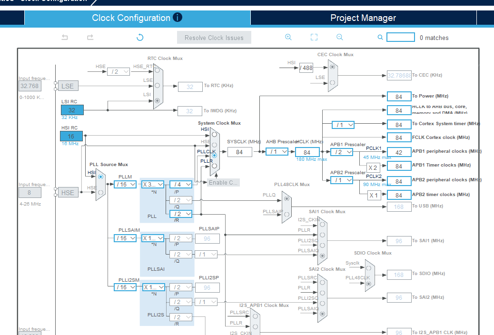
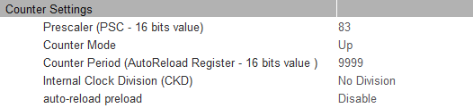

# SYSCLK

## SysClk이 뭐임?

마이크로 컨트로러 안에서는 **모든 회로**가 일정한 박자로 움직여야함

예를 들면 CPU가

```
명령어 실행
레지스터 읽기
메모리 접슨
버스 통신
Timer 증가
UART baud 생성
```

같은 작업을 하기 위한 기준 박자가 Clock임

근데 F446RE 에는 여러 clock source가 있음

```
HSI = High Speed Internal
      내부 RC oscillator
      16 MHz

HSE = High Speed External
      외부 crystal 또는 외부 clock

LSI = Low Speed Internal
      약 32 kHz
      Watchdog 등에 사용

LSE = Low Speed External
      보통 32.768 kHz
      RTC 등에 사용
```

<details>
<summary>RC oscilator, crystal 등등이 뭔데?</summary>
<div markdown="1">

```
Clock을 만드는 장치
│
├─ RC Oscillator
│    └─ 저항(R) + 커패시터(C) 특성을 이용
│       빠르고 싸고 칩 내부에 넣기 쉬움
│       하지만 정확도는 상대적으로 낮음
│
└─ Crystal Oscillator
     └─ 수정(Crystal)의 물리적 진동 이용
        매우 정확하고 안정적
        하지만 외부 부품이 필요함
```

</div>
</details>

리셋 직후에는 **HSI 16MHz**가 **SYSCLK**으로 선택됨

즉 아무 설정도 안했다면 개념적으로 다음과 같음

```
HSI 16 MHz
    ↓
 SYSCLK
    ↓
   CPU
```

근데 F446RE는 180MHz까지 동작이 가능함 어떻게? PLL을 이용해서

## PLL이 뭔데?

PLL은 간단히 말하면 입력 clock을 곱하고 나눠서 원하는 frequency를 만들어 주는 장치

STM32F446의 main PLL은 대략

```
            PLLN
Clock ── /PLLM ── ×PLLN ── /PLLP ──> SYSCLK
```

이런 구조임

```
PLL input = source / PLLM

VCO = PLL input x PLLN

PLL output = VCO / PLLP
```

예를들어 PLLM = 16, PLLN = 360, PLLP =2 라면

```
16 MHz / 16
= 1 MHz

1 MHz × 360
= 360 MHz

360 MHz / 2
= 180 MHz
```

그래서 SYSCLK이 180MHz가 됨

실제로 우리가 CubeMX에서 처음 코드 생성할때도 Clock configuration을 보면 이런 값들을 볼 수 있음



## SYSCLK에서 CPU와 Peripheral Clock이 갈라짐

```
                    ┌──────── CPU
                    │
HSI/HSE → PLL → SYSCLK
                    │
                    ↓
              AHB Prescaler
                    ↓
                  HCLK
                    │
          ┌─────────┴─────────┐
          ↓                   ↓
   APB1 Prescaler       APB2 Prescaler
          ↓                   ↓
        PCLK1                 PCLK2
          ↓                   ↓
   APB1 peripherals     APB2 peripherals
```

위의 clock config 사진 보면 됨

## TIM clock은 PCLK과 다름

PCLK는 peripherals의 CLK이고 TIM clock은 타이머의 CLK임

위의 사진을 보면 AHB1의 경우 타이머의 CLK이 x2가 되어 있는 것을 볼 수 있음 (이게 기본 설정이라 보면 됨)

## 어떤 TIMER가 어느 APB에 있음?

다음과 같음

| Timer | Bus  | 특징                        |
| ----- | ---- | --------------------------- |
| TIM1  | APB2 | Advanced, 16-bit            |
| TIM2  | APB1 | General Purpose, **32-bit** |
| TIM3  | APB1 | General Purpose, 16-bit     |
| TIM4  | APB1 | General Purpose, 16-bit     |
| TIM5  | APB1 | General Purpose, **32-bit** |
| TIM6  | APB1 | Basic Timer                 |
| TIM7  | APB1 | Basic Timer                 |
| TIM8  | APB2 | Advanced, 16-bit            |
| TIM9  | APB2 | General Purpose             |
| TIM10 | APB2 | General Purpose             |
| TIM11 | APB2 | General Purpose             |
| TIM12 | APB1 | General Purpose             |
| TIM13 | APB1 | General Purpose             |
| TIM14 | APB1 | General Purpose             |

## Timer 내부

Timer의 가장 기본 구조는 다음과 같음

```
TIMxCLK
   ↓
Prescaler
   PSC
   ↓
Counter Clock
 CK_CNT
   ↓
Counter
  CNT
   ↓
0 → 1 → 2 → 3 → ... → ARR
                        ↓
                   Update Event
```

여기서 중요 레지스터는

```
PSC
Prescaler

CNT
현재 Timer counter

ARR
Auto Reload Register

CR1
Timer 동작 제어

DIER
Interrupt / DMA enable

SR
Status Register

EGR
Event Generation Register
```

그리고 ARR이 약간 목표값? 이라고 보면됨

ARR을 다음 사진처럼



ARR을 정해주는데 CNT가 증가하다가 ARR과 같은 값이 되면 다음에 0이됨

음 뭐라하지 그냥 오버플로 나면 0으로 설정된다고 보면됨

즉 어떤 변수의 한계값을 0~9999로 설정하는 느낌임

예를들면 uint8_t 와 같은 변수형은 255가 된 후 1을 더하면 256이 아니고 0이 되는 것처럼 그냥 어떤 변수를 uint8_t는 아니지만 임의의 0부터 9999까지 가지는 값으로 설정되는 느낌? 물론 이건 정확한 건 아니고 어디까지나 비유일 뿐임

## PSC가 뭐임?

PSC는 Prescaler임

Prescaler가 뭐냐고? 클럭수를 나누는 값임

지금 기본 설정이 timer의 clock들이 84MHz인 걸 볼 수 있을거임

이 84MHz를 prescaler로 나누면 타이머의 CNT가 84MHz/PSC값 만큼 진동하면 1증가함

예를들어 PSC값을 83으로 설정하면(왜 83으로 설정하냐면 PSC도 0부터 카운팅한다고 생각하면됨 사실상 84라고 보면 됨)

84MHz/84 CNT가 1초에 1,000,000번 증가하고, 1μs마다 1 증가함

그러니까 그냥 84번 TIM Clk이 진동하면 CNT가 1증가한다고 생각해

그럼 CNT가 1증가할 때 마다 1μs가 지나겠지? 그럼 10000이 되면 10ms가 되는거임

여기서 아까 설정한 ARR값의 의미가 생김

ARR을 9999로 설정함으로써 CNT가 9999가 되면 인터럽트 플래그를 올려서 NVIC에 인터럽트 신호를 보내게 됨

그리고 CNT는 0으로 돌아가게 됨

NVIC은 인터럽트 플래그가 올라온 걸 보고 처리하는거고

처리하고 나면 인터럽트 플래그를 내리게됨 (만약 안내리면 계속 인터럽트 있는 줄 알겠지?)

정확히는 다음과 같음 토글 열어서 확인

<details>
<summary> 상세 내용 </summary>
<div markdown="1">

제대로 된 전체 인터럽트 과정

```
TIM Clock 84 MHz
     ↓
PSC = 83
     ↓
CNT Clock = 1 MHz
     ↓
CNT
0 → 1 → ... → 9999
     ↓
Update Event 발생
     ↓
CNT → 0
TIMx_SR.UIF = 1
     ↓
UIE가 Enable되어 있다면
TIM이 NVIC 쪽으로 Interrupt Request 발생
     ↓
NVIC Pending
     ↓
CPU가 해당 IRQ Handler 실행
     ↓
UIF Clear
     ↓
인터럽트 처리 종료
```

정확히는 CNT가 ARR에 도달한 뒤 Update Event가 발생하면서 UIF 가 설정된다

Up-counting 기준으로

```
CNT = 9997
CNT = 9998
CNT = 9999
    ↓ 다음 카운트 시점
Update Event
CNT = 0
UIF = 1
```

그래서 ARR=9999일 때 정확히 10000개의 CNT tick이 필요함

또한

</div>
</details>

## TIM내부에서는 무슨 일이 발생할까?

위에 상세내용 토글과 같은 이야기긴 한데 한 번 더 정리하겠음

```
CNT = 9998

다음 clock

CNT = 9999

다음 clock

Overflow
 ↓
CNT = 0
 ↓
UIF = 1
 ↓
Update Interrupt Request
```

이렇게 10ms가 되면 UIF가 1이 됨

> UIF = Update Interrupt Flag

TIMx_SR안에 존재함

그리고

> TIMx_DIER.UIE = 1

이면 Update interrupt를 발생시킴

그럼 NVIC이 받아 처리하는 거

## 코드쪽을 보면 TIM_HandleTypeDef이 있음

그게 뭐임??

다음처럼 정의된 게 있음

```
typedef struct
{
    TIM_TypeDef *Instance;
    TIM_Base_InitTypeDef Init;

    HAL_TIM_ActiveChannel Channel;

    DMA_HandleTypeDef *hdma[7];

    HAL_LockTypeDef Lock;

    __IO HAL_TIM_StateTypeDef State;

    __IO HAL_TIM_ChannelStateTypeDef ChannelState[4];
    __IO HAL_TIM_ChannelStateTypeDef ChannelNState[4];

    __IO HAL_TIM_DMABurstStateTypeDef DMABurstState;

    // 설정에 따라 callback 함수 포인터들이 추가될 수 있음

} TIM_HandleTypeDef;
```

여기서 가장 중요한 거는 사실상 처음 두개임

```
htim2
│
├── Instance ──────→ 실제 TIM2 하드웨어 레지스터
│
├── Init
│   ├── Prescaler
│   ├── CounterMode
│   ├── Period
│   ├── ClockDivision
│   ├── RepetitionCounter
│   └── AutoReloadPreload
│
├── Channel
├── hdma[]
├── Lock
├── State
├── ChannelState[]
└── ...
```

main 코드도 보면 타이머 설정하고 코드를 만들었다면

45번 라인에 이렇게 정의 된 걸 볼 수 있음

아무튼 instance부터 알아보자

### instance

이게 가장 중요함

```
TIM_TypeDef *Instance;
```

이렇게 돼 있는데
TIM_TypeDef 구조체를 가리키는 포인터임

근데 TIM_TypeDef가 뭐냐?

그건 바로 메모리 주소를 가르키는 거임

```
typedef struct
{
    __IO uint32_t CR1;     // offset 0x00
    __IO uint32_t CR2;     // offset 0x04
    __IO uint32_t SMCR;    // offset 0x08
    __IO uint32_t DIER;    // offset 0x0C
    __IO uint32_t SR;      // offset 0x10
    __IO uint32_t EGR;     // offset 0x14
    __IO uint32_t CCMR1;   // offset 0x18
    __IO uint32_t CCMR2;   // offset 0x1C
    __IO uint32_t CCER;    // offset 0x20
    __IO uint32_t CNT;     // offset 0x24
    __IO uint32_t PSC;     // offset 0x28
    __IO uint32_t ARR;     // offset 0x2C

    ...
} TIM_TypeDef;
```

이렇게 생겼음 대충 TIMER_BASE 뭐 이런 코드에 TIM_TypeDef 의 offset만큼 자동으로 더해져서 값을 넣는거임

# SYSTICK

## SYSTICK이 뭐임

SysTick은 System Tick Timer임

이것도 결국 클럭 받아서 카운트하는 타이머는 맞는데 TIM2 TIM3 같은 Timer Peripheral과는 별개임

SysTick 내부에는 본질적으로 24비트 Down Counter가 있음(우리가 지금까지 쓴건 Up 타이머)

초기에 83999 부터 0까지 내려가는거임

예를들어 HCLK가 84 MHz고 SysTick이 HCLK를 직접 받으면

84MHz = 84,000,000 clock/sec

1ms마다 interrupt를 발생 시키려면:

84,000,000 / 1,000
= 84,000

따라서 카운터를 83999 -> 0으로 설정하면 1ms마다 인터럽트가 발생함

## 근데 이거 실제로 쓰긴함??

ㅇㅇ 실제로 씀

너도 모르는 사이에 쓰고 있었음

대표적으로

```
HAL_Delay(1000);
```

이거임

기본적인 HAL 설정에서는 SysTick interrupt가 보통 1ms 마다 발생하고 그때 HAL 내부의 tick값이 증가함

개념적으로는

```
volatile uint32_t uwTick;

void SysTick_Handler(void)
{
    HAL_IncTick();
}
```

```
HAL_IncTick();
```

내부에서

```
uwTick++;
```

따라서

```
SysTick interrupt
       ↓
1ms마다 발생
       ↓
uwTick++
       ↓
0
1
2
3
...
999
1000
```

이런 느낌임

# SysTick과 TIM의 관계

둘다 본질적으로는 Clock을 세서 시간을 측정하는 하드웨어 카운터라는 점에서 같음

하지만 목적과 기능이 다름

| 구분           | SysTick             | TIM2, TIM3 등의 TIM |
| -------------- | ------------------- | ------------------- |
| 누가 만듦      | ARM                 | STMicroelectronics  |
| 위치           | Cortex-M CPU 내부   | STM32 Peripheral    |
| 목적           | 시스템 시간 기준    | 범용 Timer 기능     |
| Counter        | 24-bit Down Counter | Up/Down Counter 등  |
| 기능           | 매우 단순           | 매우 다양           |
| Interrupt      | 가능                | 가능                |
| PWM            | 불가능              | 가능                |
| Input Capture  | 불가능              | 가능                |
| Output Compare | 불가능              | 가능                |
| Encoder        | 불가능              | 일부 TIM 가능       |
| 주기 Interrupt | 가능                | 가능                |

즉 SysTick은 쉽게 말하면

> OS나 HAL이 시스템 시간을 세기 위한 간단한 전용 타이머

반면 TIM은

> 개발자가 원하는 하드웨어 시간 제어를 하기위한 범용 타이머
