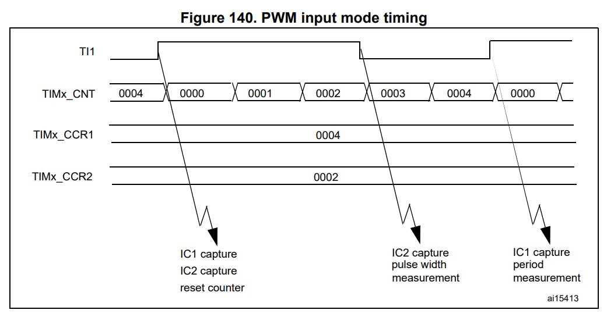
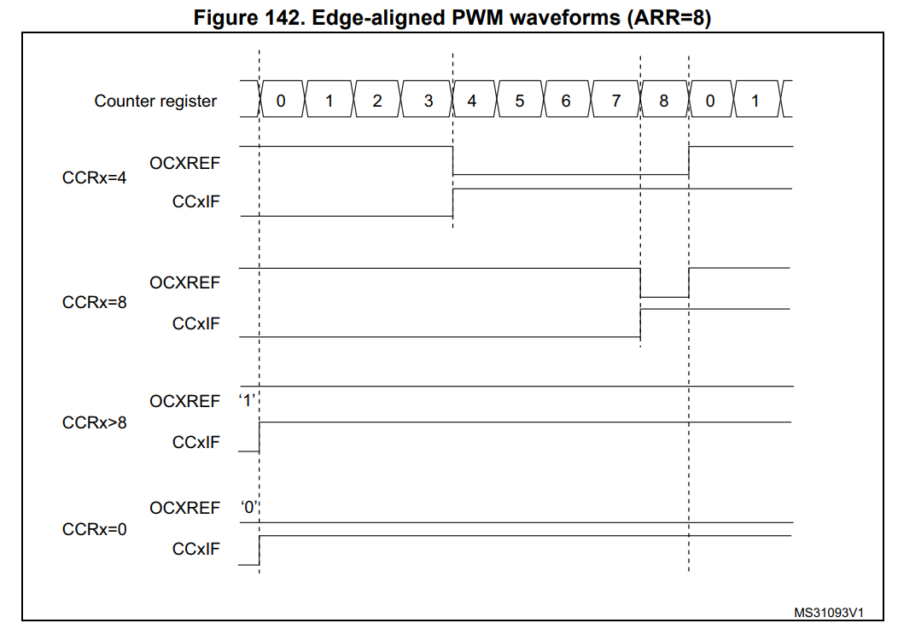
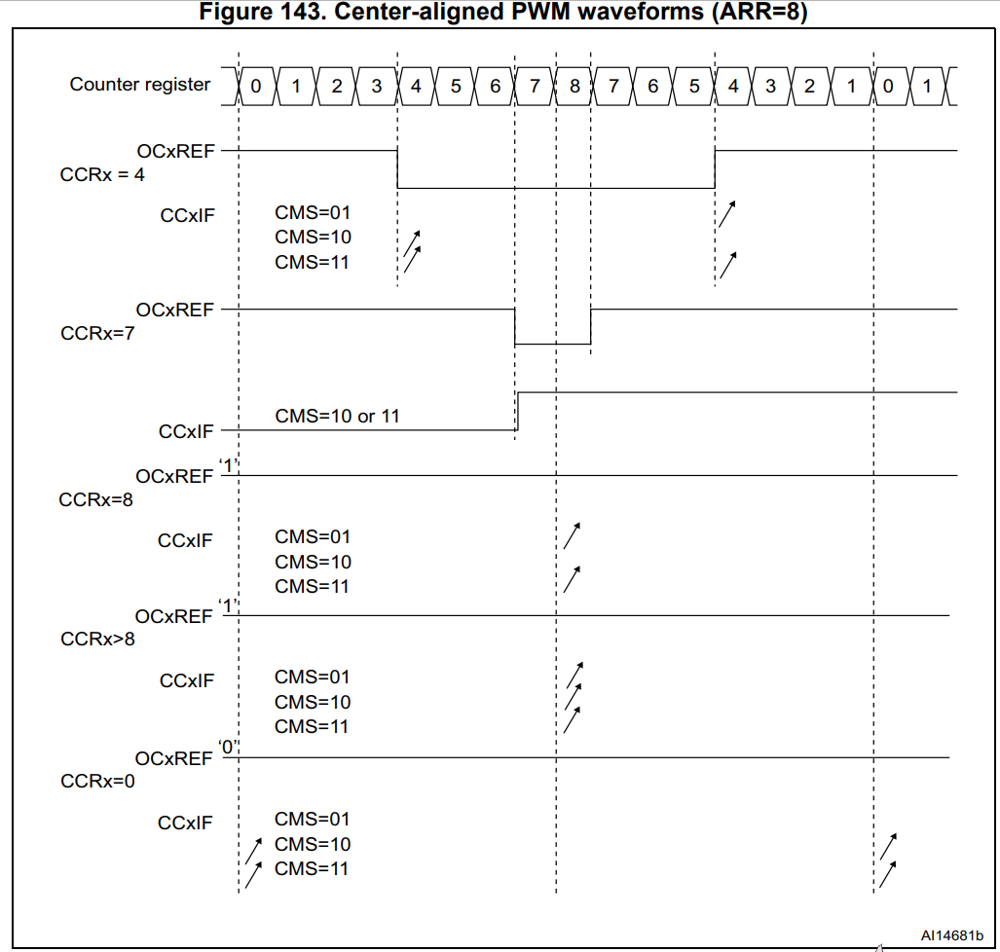
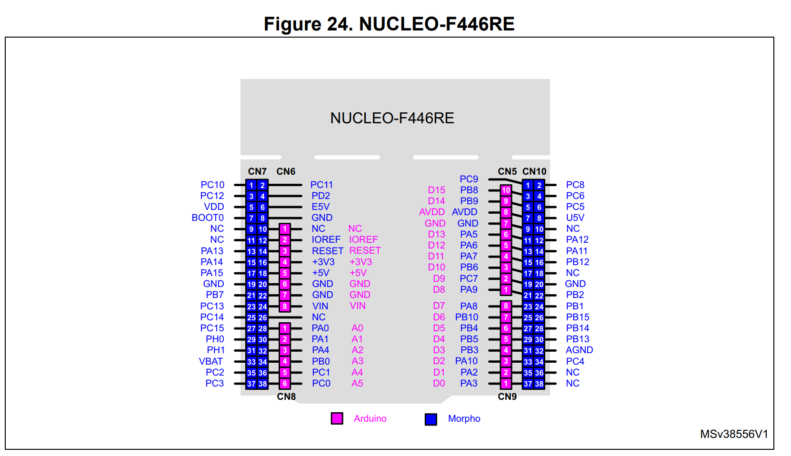
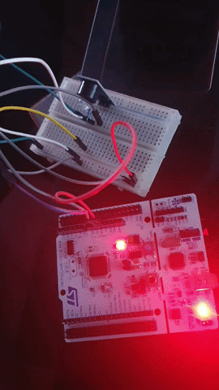

# WEEK 8
## PWM
---
## 🛖 장소 : 서울 강남구 논현로 522 6층

## 📝 8주차 과제
- PWM의 개념
- STM32F446RE에서의 PWM 제어
- 실습 : Passive 부저로 도레미파솔라시도 출력하기
    -  제가 드린 부저 중 더 큰 부저(기판에 달려있는 부저) passive 부저입니다.
    -  정확한 PWM 값은 웹에도 잘 나와 있고, AI가 잘 알려줍니다.
- ** 과제를 하실 때, 실습 -> 이론 순으로 하면 좀 더 이론을 정리할 때 좀 더 머리에 남는 게 많으니 이런 방식도 해보시길 추천드립니다! **

---


# STM32F446RE PWM (Pulse Width Modulation) 정리

STM32F446RE에서 PWM(Pulse Width Modulation, 펄스 폭 변조)은 타이머(Timer) 주변장치를 활용하여 주파수(Frequency)와 듀티 사이클(Duty Cycle)을 자유롭게 조절할 수 있는 출력 기능입니다. 모터 속도 제어, LED 밝기 조절(Dimming), 서보 모터 제어 등에 널리 사용됩니다.

---

## 1. PWM 작동 원리 핵심 요소

PWM 신호의 핵심은 카운터(`TIMx_CNT`), 자동 재로드 레지스터(`TIMx_ARR`), 출력 비교 레지스터(`TIMx_CCRx`) 간의 비교 동작입니다.

### 주파수 (Frequency / Period)
* **ARR (Auto-Reload Register)** 값이 신호의 주기(Period)를 결정합니다.
* 카운터(`CNT`)가 0부터 ARR 값까지 증가(Upcounting)한 후 다시 0으로 리셋됩니다.

### 듀티 사이클 (Duty Cycle)
* **CCR (Capture/Compare Register)** 값이 High(또는 Low) 구간의 비율(폭)을 결정합니다.
* **PWM Mode 1 (Upcounting) 기준:**
  * `CNT < CCR`: 출력 High
  * `CNT >= CCR`: 출력 Low
* **듀티 비 공식:**
  $$\text{Duty Cycle (\%)} = \frac{\text{TIMx\_CCRx}}{\text{TIMx\_ARR} + 1} \times 100$$

---

## 2. PWM 모드 종류

STM32F446RE 타이머는 다양한 PWM 모드를 제공합니다.

### PWM Mode 1 vs PWM Mode 2
* **PWM Mode 1:** 카운트(`CNT`)가 CCR보다 작을 때 Active 레벨을 출력합니다.
* **PWM Mode 2:** 카운트(`CNT`)가 CCR보다 작을 때 Inactive 레벨을 출력합니다 (Mode 1의 반대).

### 정렬 방식 (Alignment)
* **Edge-aligned (엣지 정렬):** 한쪽 끝(상승/하강)을 기준으로 카운터가 증가/감소하며 주기 끝에서 반전합니다.
* **Center-aligned (중앙 정렬):** 카운터가 Up-counting 후 Down-counting을 반복하면서 대칭형 파형을 생성합니다 (모터 드라이버 noise/HARMONIC 감소에 유용).

---

## 3. STM32F446RE의 타이머 분류

STM32F446RE는 총 14개의 타이머를 제공하며, 대부분 PWM을 지원합니다.

* **Advanced-control Timers (TIM1, TIM8)**
  * 상보 출력(Complementary outputs), 데드타임(Dead-time) 삽입, 긴급 브레이크 입력 등 모터 제어 및 인버터에 최적화된 고급 PWM 기능을 지원합니다.
* **General-purpose Timers (TIM2~TIM5, TIM9~TIM14)**
  * 가장 보편적으로 사용되는 타이머입니다.
  * `TIM2`, `TIM5`는 32-bit 카운터를 지원하며, `TIM3`, `TIM4` 등은 16-bit 카운터로 작동합니다.
* **Basic Timers (TIM6, TIM7)**
  * PWM 출력을 지원하지 않으며, 주로 DAC 트리거나 단순 타임베이스용으로 사용됩니다.

---

## 4. PWM 주파수 계산 공식

PWM 출력 주파수는 타이머 클록($f_{\text{TIM\_CLK}}$), 분주기 레지스터(PSC), 그리고 ARR 값에 의해 결정됩니다.

$$\text{PWM Frequency} = \frac{f_{\text{TIM\_CLK}}}{(\text{PSC} + 1) \times (\text{ARR} + 1)}$$

> **예시 (System Clock = 180MHz, TIM 클록 = 90MHz 설정 시):**
> * **PSC = 89** (클록을 90으로 나누어 1MHz로 변경)
> * **ARR = 999** (1MHz / 1000 = 1kHz PWM 주파수 생성)
> * **CCR = 499**로 설정 시 듀티 비 50% 구현

---


# 16.3.7 PWM 입력 모드 (PWM input mode)

이 모드는 입력 캡처 모드(Input Capture Mode)의 특정한 한 형태입니다. 동작 절차는 다음 사항을 제외하고는 입력 캡처 모드와 동일합니다.

* **두 개의 ICx 신호가 동일한 TIx 입력 하나에 매핑(연결)됩니다**.


* **이 두 ICx 신호는 서로 반대 극성(Opposite Polarity)의 엣지(Rising/Falling)에서 활성화됩니다**.


* **두 TIxFP 신호 중 하나가 트리거 입력(Trigger Input)으로 선택되며, 슬레이브 모드 컨트롤러(Slave Mode Controller)는 리셋 모드(Reset Mode)로 설정됩니다**.


예를 들어, 내부 클럭(CK_INT) 주파수와 분주기(Prescaler) 값에 따라 TI1 입력을 통해 들어오는 PWM 신호의 주기(TIMx_CCR1 레지스터)와 듀티 사이클(TIMx_CCR2 레지스터)을 아래의 절차로 측정할 수 있습니다:

1. **TIMx_CCR1에 대한 활성 입력 선택**: TIMx_CCMR1 레지스터의 `CC1S` 비트를 `01`로 설정합니다 (TI1 선택).


2. **TI1FP1의 활성 극성 선택** (TIMx_CCR1 캡처 및 카운터 리셋 겸용): `CC1P` 및 `CC1NP` 비트를 `0`으로 설정합니다 (상승 엣지(Rising Edge)에서 활성화).


3. **TIMx_CCR2에 대한 활성 입력 선택**: TIMx_CCMR1 레지스터의 `CC2S` 비트를 `10`로 설정합니다 (TI1 선택).


4. **TI1FP2의 활성 극성 선택** (TIMx_CCR2 캡처 전용): `CC2P` 비트를 `1`로, `CC2NP` 비트를 `0`으로 설정합니다 (하강 엣지(Falling Edge)에서 활성화).


5. **유효한 트리거 입력 선택**: TIMx_SMCR 레지스터의 `TS` 비트를 `101`로 설정합니다 (TI1FP1 선택).


6. **슬레이브 모드 컨트롤러를 리셋 모드로 설정**: TIMx_SMCR 레지스터의 `SMS` 비트를 `100`으로 설정합니다.


7. **캡처 기능 활성화**: TIMx_CCER 레지스터의 `CC1E` 및 `CC2E` 비트를 `1`로 설정합니다.




---

### 핵심 개념 및 핵심 원리 설명

PWM 입력 모드는 외부에서 들어오는 **PWM 신호의 주기(Period)와 듀티 비(Duty Cycle)를 CPU의 개입 없이 타이머 하드웨어만으로 자동 측정**할 수 있도록 만든 기능입니다.

#### 1. 신호 분기 (1개의 핀으로 2개의 레지스터 활용)

원래는 핀 하나당 입력 캡처 채널 하나만 연결되지만, PWM 입력 모드에서는 **TI1 핀 하나 들어오는 신호를 내부에서 두 경로(TI1FP1, TI1FP2)로 분기**시킵니다.

* **TI1FP1 (상승 엣지 감지)** $\rightarrow$ 카운터를 `0`으로 리셋하고, 1주기 전체의 카운트 값을 `TIMx_CCR1`에 저장 (주기 측정).


* **TI1FP2 (하강 엣지 감지)** $\rightarrow$ 카운터가 `0`에서부터 하강 엣지까지 올라간 높이(High 구간)를 `TIMx_CCR2`에 저장 (High Pulse Width 측정).


#### 2. 동작 과정 (타이밍 순서)

1. **신호가 High로 올라갈 때 (Rising Edge)**:
* `TI1FP1`에 의해 슬레이브 모드 컨트롤러가 **카운터(`TIMx_CNT`)를 `0`으로 즉시 리셋**하고 다시 카운트를 시작합니다.


* 동시에 이전 주기의 전체 카운트 값이 `TIMx_CCR1` 레지스터에 저장됩니다.


2. **신호가 Low로 떨어질 때 (Falling Edge)**:
* `TI1FP2`에 의해 그 순간의 카운트 값이 `TIMx_CCR2` 레지스터에 캡처(저장)됩니다.


#### 3. 최종 계산 방식

측정된 레지스터 값으로 PWM 신호를 다음과 같이 계산할 수 있습니다:

* **신호 전체 주기 (Period)** = `TIMx_CCR1` × (타이머 클럭 주기)
* **High 구간 시간 (Pulse Width)** = `TIMx_CCR2` × (타이머 클럭 주기)
* **듀티 사이클 (Duty Cycle %)** = $\frac{\text{TIMx\_CCR2}}{\text{TIMx\_CCR1}} \times 100\%$


---


# 16.3.10 PWM 모드 (PWM mode)

PWM(펄스 폭 변조) 모드를 사용하면 `TIMx_ARR` 레지스터 값으로 주파수를 결정하고, `TIMx_CCRx` 레지스터 값으로 듀티 사이클(Duty Cycle)을 결정하는 신호를 생성할 수 있습니다.

PWM 모드는 `TIMx_CCMRx` 레지스터의 **OCxM** 비트에 `110`(PWM 모드 1) 또는 `111`(PWM 모드 2)을 기록하여 각 채널별로 독립적으로 선택할 수 있습니다 (OCx 출력당 1개의 PWM). 해당 프리로드(Preload) 레지스터는 `TIMx_CCMRx` 레지스터의 **OCxPE** 비트를 설정하여 활성화해야 하며, 필요에 따라 `TIMx_CR1` 레지스터의 **ARPE** 비트를 설정하여 자동 리로드 프리로드 레지스터(상향 카운팅 또는 중앙 정렬 모드에서)도 활성화해야 합니다.

프리로드 레지스터 값은 업데이트 이벤트(UEV)가 발생할 때만 섀도우(Shadow) 레지스터로 전달되므로, 카운터를 시작하기 전에 `TIMx_EGR` 레지스터의 **UG** 비트를 설정하여 모든 레지스터를 초기화해야 합니다.

OCx 출력 극성은 `TIMx_CCER` 레지스터의 **CCxP** 비트를 통해 소프트웨어로 프로그래밍할 수 있습니다 (Active High 또는 Active Low). OCx 출력은 **CCxE**, **CCxNE**, **MOE**, **OSSI**, **OSSR** 비트의 조합을 통해 활성화됩니다.

PWM 모드(1 또는 2)에서 `TIMx_CNT`와 `TIMx_CCRx`는 항상 비교되어 카운팅 방향에 따라 $\text{TIMx\_CCRx} \le \text{TIMx\_CNT}$ 또는 $\text{TIMx\_CNT} \le \text{TIMx\_CCRx}$ 인지를 판단합니다.

타이머는 `TIMx_CR1` 레지스터의 **CMS** 비트에 따라 엣지 정렬 모드(Edge-aligned mode) 또는 중앙 정렬 모드(Center-aligned mode)로 PWM을 생성할 수 있습니다.

---

### 엣지 정렬 모드 (PWM edge-aligned mode)

#### 상향 카운팅 설정 (Upcounting configuration)
* `TIMx_CR1` 레지스터의 **DIR** 비트가 Low일 때 활성화됩니다.
* **PWM 모드 1 예시:** 참조 PWM 신호인 OCxREF는 $\text{TIMx\_CNT} < \text{TIMx\_CCRx}$인 동안 High(1)를 유지하며, 그 외의 경우에는 Low(0)가 됩니다.
* 만약 `TIMx_CCRx`의 비교 값이 `TIMx_ARR` 값보다 크면 OCxREF는 계속 1로 유지됩니다. 비교 값이 0이면 OCxREF는 계속 0으로 유지됩니다.




#### 하향 카운팅 설정 (Downcounting configuration)
* `TIMx_CR1` 레지스터의 **DIR** 비트가 High일 때 활성화됩니다.
* **PWM 모드 1 예시:** OCxREF 신호는 $\text{TIMx\_CNT} > \text{TIMx\_CCRx}$인 동안 Low(0)를 유지하며, 그 외의 경우에는 High(1)가 됩니다.
* 비교 값이 `TIMx_ARR`보다 크면 OCxREF는 1로 유지됩니다. 이 모드에서는 0% PWM 출력이 불가능합니다.



---

### 중앙 정렬 모드 (PWM center-aligned mode)

중앙 정렬 모드는 `TIMx_CR1` 레지스터의 **CMS** 비트가 `00`이 아닐 때 활성화됩니다. 설정된 CMS 비트에 따라 카운터가 올라갈 때, 내려갈 때, 또는 올라가고 내려갈 때 모두 비교 플래그(Compare Flag)가 세팅됩니다. 방향 비트(DIR)는 하드웨어에 의해 자동으로 업데이트되므로 소프트웨어로 변경해서는 안 됩니다.

#### 중앙 정렬 모드 사용 시 주의사항 (Hints):
* 중앙 정렬 모드로 시작할 때, 현재의 상향/하향 카운트 설정이 사용됩니다 (DIR 비트에 쓰인 값에 따라 시작 방향 결정). 또한, DIR 비트와 CMS 비트를 소프트웨어로 동시에 변경하면 안 됩니다.
* 타이머가 동작 중일 때 카운터(`TIMx_CNT`)에 값을 쓰는 것은 권장되지 않습니다.
* 카운터에 `TIMx_ARR`보다 큰 값을 쓰면 카운팅 방향이 업데이트되지 않습니다 (예: 상향 카운팅 중이었다면 계속 상향 카운트함).
* 카운터에 0이나 `TIMx_ARR` 값을 쓰면 방향은 업데이트되지만, 업데이트 이벤트(UEV)는 발생하지 않습니다.
* 가장 안전한 사용 방법은 카운터를 시작하기 직전에 소프트웨어로 업데이트를 발생(`TIMx_EGR`의 **UG=1**)시키고, 동작 중에는 카운터 값을 직접 수정하지 않는 것입니다.

---

## 핵심 동작 원리 요약

### 주파수 & 듀티비 결정 방식
* **주파수 (Frequency):** `TIMx_ARR` (Auto-Reload Register) 값에 의해 전체 주기 결정.
* **듀티비 (Duty Cycle):** `TIMx_CCRx` (Capture/Compare Register) 값에 의해 High/Low 비율 결정.

### PWM 모드 1 vs PWM 모드 2 (상향 카운트 기준)
* **PWM Mode 1:** $\text{CNT} < \text{CCR}$ 일 때 High, $\text{CNT} \ge \text{CCR}$ 일 때 Low.
* **PWM Mode 2:** $\text{CNT} < \text{CCR}$ 일 때 Low, $\text{CNT} \ge \text{CCR}$ 일 때 High.

### Preload(버퍼) 레지스터의 목적 (OCxPE, ARPE)
* PWM 동작 도중 CCR이나 ARR 값을 변경할 때, 즉시 반영되면 파형 중간에 글리치(Glitch, 원치 않는 펄스)가 발생할 수 있습니다.
* Preload를 켜두면 새로 쓴 값이 버퍼에 대기하다가 한 주기가 끝나는 시점(Update Event)에 섀도우 레지스터로 일괄 반영되어 안정적인 파형을 유지해 줍니다.

---


# STM32CubeMX 프로젝트 생성 및 핀 설정


## 1. STM32CubeMX 프로젝트 생성 및 핀 설정

* **CubeMX 실행 및 MCU 선택**
  * STM32CubeMX를 실행한 후 **New Project**를 클릭합니다.
  * 사용 중인 보드/MCU 모델명(예: STM32F446RE 또는 Nucleo Board)을 검색하고 선택한 뒤 **Start Project**를 누릅니다.

* **PA0 핀 설정**
  * **Pinout & Configuration** 탭에서 PA0 핀을 찾아 클릭합니다.
  * 메뉴에서 **TIM2_CH1** (또는 사용하려는 타이머의 PWM 채널)을 선택합니다.

* **타이머(TIM2) Clock 및 PWM 설정**
  * 좌측 메뉴 **Categories** $\rightarrow$ **Timers** $\rightarrow$ **TIM2**를 선택합니다.
  * **Clock Source**: Internal Clock으로 설정합니다.
  * **Channel 1**: PWM Generation CH1으로 설정합니다.

* **타이머 파라미터 (Parameter Settings) 설정**
  * 아래 **Parameter Settings** 탭에서 클록/주파수 기본값을 입력합니다:
    * **Prescaler (PSC)**: 타이머 클록 카운팅 주파수를 조정합니다. (예: MCU 클록이 84MHz인 경우 83을 입력하면 타이머 카운터 클록이 $84\text{MHz} / (83 + 1) = 1\text{MHz}$가 되어 계산하기 쉬워집니다.)
    * **Counter Period (Auto Reload Register - ARR)**: 아무 값(예: 1000)이나 임시 입력합니다 (코드에서 주파수별로 dynamically 변경함).
    * **Pulse (CCR1)**: 0으로 설정합니다.

---

## 2. 시계열/시스템 클록 설정 (Clock Configuration)

* 상단의 **Clock Configuration** 탭으로 이동합니다.
* 사용하려는 시스템 주파수(예: 84MHz 또는 180MHz 등)를 확인하고, TIM2가 위치한 APB1 Timer Clock 주파수가 얼마인지 확인합니다.

---

## 3. 프로젝트 저장 및 코드 생성 (Code Generation)

* **Project Manager** 탭으로 이동합니다.
  * **Project Name**: 프로젝트 이름을 입력합니다.
  * **Project Location**: 저장 폴더 경로를 지정합니다.
  * **Toolchain / IDE**: 사용하는 개발 환경(예: STM32CubeIDE, Keil MDK-ARM, IAR)을 선택합니다.
* 우측 상단의 **GENERATE CODE** 버튼을 눌러 C 코드를 생성합니다.

---

## 4. 생성된 코드(main.c) 수정 작성

* 코드 생성 완료 후 IDE(예: STM32CubeIDE)에서 `Core/Src/main.c` 파일에 아래와 같이 사용자 코드(USER CODE)를 작성합니다.

```c
uint16_t notes[] = {262, 294, 330, 349, 392, 440, 494, 523};


/* USER CODE BEGIN PFP */
void Play_Tone(uint32_t frequency) {
    if (frequency == 0) {
        // Duty ratio 0%로 소리 끄기
        __HAL_TIM_SET_COMPARE(&htim2, TIM_CHANNEL_1, 0);
        return;
    }

    // 1MHz 타이머 클록 기준 ARR 계산
    uint32_t arr = (1000000 / frequency) - 1;

    // 카운터(CNT)를 0으로 리셋하여 ARR 변경 시 카운터 꼬임 방지
    __HAL_TIM_SET_COUNTER(&htim2, 0);

    // 주파수(ARR) 변경
    __HAL_TIM_SET_AUTORELOAD(&htim2, arr);

    // Duty Cycle 50% 설정
    __HAL_TIM_SET_COMPARE(&htim2, TIM_CHANNEL_1, (arr + 1) / 2);
}
/* USER CODE END PFP */

...
/* Infinite loop */
  /* USER CODE BEGIN WHILE */
  while (1)
  {
    /* USER CODE END WHILE */

    /* USER CODE BEGIN 3 */
    for (int i = 0; i < 8; i++) {
        Play_Tone(notes[i]);
        HAL_Delay(500);     // 0.5초간 음 연주

        Play_Tone(0);        // 음간 분리를 위한 무음
        HAL_Delay(50);      // 0.05초 대기
    }                       // 👈 for 문 종료 위치 변경!
    
    HAL_Delay(1000);        // 도레미파솔라시도 1세트 완료 후 1초 대기
  }
  /* USER CODE END 3 */
  ...


```

