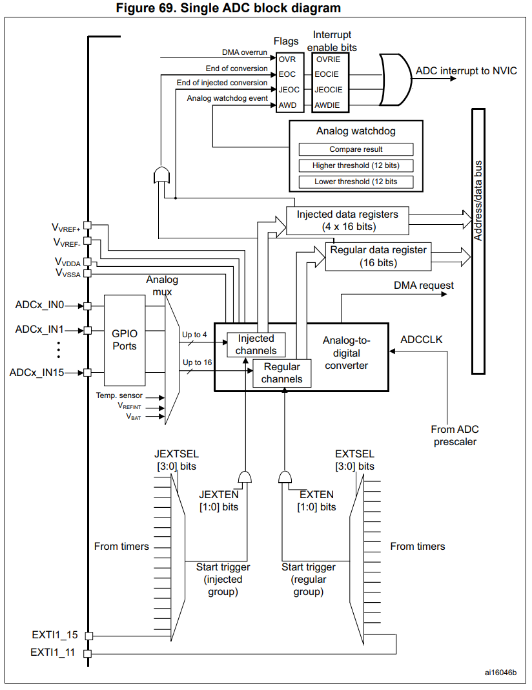
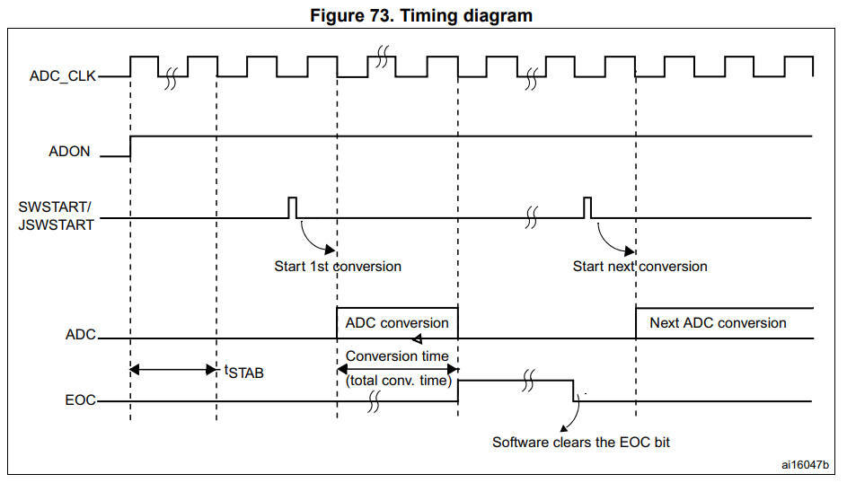

# WEEK 9
## ADC
## 📝 8주차 과제
- ADC의 개념
- STM32F446RE에서의 ADC 동작 과정
- 실습 : X (가변저항이 없어서.. 생략하겠습니다!)
---   
  


Reference Manual **RM0390 13장 "Analog-to-digital converter (ADC)"**(p.349~394)


## 1. ADC란?

**ADC(Analog-to-Digital Converter)** 는 전압 같은 아날로그 신호를 MCU가 다룰 수 있는 **숫자**로 바꿔 주는 장치.


- **분해능(Resolution)**: 12비트면 2¹² = 4096단계예요. 3.3V ÷ 4096이니까 한 단계가 약 **0.8mV**
- **변환 공식**: `전압 = ADC값 × VREF+ / 4095`. VREF+는 기준 전압이고, Nucleo 보드에서는 보통 3.3V

---

## 2. STM32F446RE ADC의 주요 사양 (13.1~13.2, p.349)

| 항목 | 내용 |
|---|---|
| 방식 | **SAR(Successive Approximation, 축차 비교형)** |
| 개수 | ADC1, ADC2, ADC3 세 개 |
| 분해능 | 12 / 10 / 8 / 6비트 중 선택 (`ADC_CR1`의 `RES[1:0]`) |
| 채널 | 최대 19개: 외부 핀 16개 + 내부 2개(온도센서, VREFINT) + VBAT |
| 입력 범위 | VREF− ≤ VIN ≤ VREF+ |
| 결과 저장 | 16비트 데이터 레지스터, 왼쪽 또는 오른쪽 정렬 |
| 부가 기능 | 인터럽트, DMA, 아날로그 워치독, 외부 트리거(타이머/EXTI) |

> **SAR 방식이란?** 이진 탐색과 같은 비교를 최상위 비트부터 한 비트씩 12번 해서 변환에 **12 클럭**

---

## 3. ADC 블록 구조 (Figure 69, p.350)



```
 [GPIO 핀 PA0...]──┐
 [온도센서]──────┤ Analog  ┌─ Regular 그룹 (최대 16개) ──┐            ┌→ ADC_DR (Regular 결과)
 [VREFINT]───────┤  MUX ──┤                             ├→ [SAR ADC] ┤
 [VBAT]──────────┘         └─ Injected 그룹 (최대 4개) ──┘      ↑     └→ ADC_JDR1~4 (Injected 결과)
                                     ↑                        ADCCLK         │
                 시작 트리거: SWSTART(소프트웨어) / 타이머 / EXTI          ▼
                                                     플래그: EOC, JEOC, AWD, OVR → 인터럽트(NVIC)
                                                                               → DMA 요청
```

---

## 4. ADC 동작 과정 (핵심)

### ① 클럭 준비 (13.3.3, p.355)

ADC는 클럭을 두 가지 사용

- **디지털 인터페이스 클럭**: 레지스터를 읽고 쓰는 데 쓰이고, APB2 클럭과 같음. `RCC_APB2ENR`에서 ADC1EN 비트를 켜야 레지스터를 쓸 수 있음.
- **아날로그 클럭(ADCCLK)**: 실제 변환에 쓰임. **APB2 ÷ 2, 4, 6, 8** 중에서 고르고, 설정은 `ADC_CCR`의 `ADCPRE` 비트로.
  - 데이터시트 기준 최대 **36MHz** (VDDA 2.4~3.6V일 때). APB2가 90MHz라면 ÷4를 골라 22.5MHz로 쓰는 식.

 - 입력 핀  
    예를 들어 PA0를 쓰려면 GPIOA 클럭을 켜고 `GPIOA_MODER`에서 PA0를 **Analog 모드(11)** 로 설정. Nucleo 보드에서는 Arduino 헤더의 **A0 = PA0 = ADC123_IN0**

### ② 전원 켜기 (13.3.1, p.351)

- `ADC_CR2`의 **ADON = 1**로 하면 ADC가 Power-down 상태에서 깨어남.
- 정확하게 변환하려면 켠 뒤 **안정화 시간(tSTAB)** 이 필요 (Figure 73).
- ADON = 0으로 하면 소비 전류가 몇 µA 수준인 저전력 상태가 돼요.



### ③ 채널 선택 (13.3.4, p.355)

채널은 두 그룹으로 나눠서 관리.

| 그룹 | 최대 개수 | 설정 레지스터 | 결과 저장 위치 |
|---|---|---|---|
| **Regular** (일반) | 16개 | `ADC_SQR1~3`. 개수는 `SQR1`의 `L[3:0]`에 씀 | `ADC_DR` 하나 |
| **Injected** (우선) | 4개 | `ADC_JSQR` | `ADC_JDR1~4` |

- 순서와 중복은 자유. 예: IN3 → IN8 → IN2 → IN2 → IN0…
- **Injected 그룹**은 인터럽트처럼 Regular 변환 중간에 끼어들어 먼저 변환. 모터 전류 측정처럼 급한 측정 사용.
- 처음에는 **Regular 그룹에 채널 하나**만 쓰는 걸로 시작하면 충분.

### ④ 샘플링 시간 설정 (13.5, p.361)

변환은 두 단계로 진행. 먼저 내부 커패시터에 입력 전압을 **충전(샘플링)** 하고, 그다음 12비트로 **변환**.

```
총 변환 시간 Tconv = 샘플링 시간 + 12 사이클
```

- 샘플링 시간은 채널마다 따로 정할 수 있음: **3, 15, 28, 56, 84, 112, 144, 480 사이클** (`ADC_SMPR1/2`의 `SMP[2:0]`).
- 매뉴얼 예시: ADCCLK가 30MHz이고 샘플링이 3사이클이면 3 + 12 = 15사이클 = **0.5µs**.
- 입력 신호원의 임피던스가 높으면(큰 저항이 달린 센서 등) 샘플링 시간을 **길게** 잡아야 값이 정확함.

### ⑤ 변환 시작: 트리거 (13.6, p.362)

- **소프트웨어 트리거**: `ADC_CR2`의 **SWSTART = 1** (Injected 그룹은 JSWSTART)
- **외부 트리거**: 타이머 이벤트(TIM1_CC1, TIM2_TRGO 등)나 EXTI11
  - `EXTEN[1:0]`: 트리거 극성 (00 = 사용 안 함, 01 = 상승엣지, 10 = 하강엣지, 11 = 양쪽)
  - `EXTSEL[3:0]`: 트리거 소스 선택
  - 타이머 트리거를 쓰면 **"정확히 1ms마다 샘플링"** 같은 일정한 주기 측정을 할 수 있음.

### ⑥ 변환 모드 (13.3.5~13.3.11)

| 모드 | 설정 | 동작 |
|---|---|---|
| **Single** | CONT = 0 | 한 번 변환하고 멈춤 |
| **Continuous** | CONT = 1 | 끝나자마자 다음 변환을 자동으로 시작 |
| **Scan** | `CR1`의 SCAN = 1 | 그룹 안의 여러 채널을 차례로 자동 변환. 여러 채널을 쓸 때 DMA와 같이 써요 |
| **Discontinuous** | DISCEN = 1 | 트리거 한 번에 n개 채널씩 끊어서 변환 |

### ⑦ 변환 완료와 결과 읽기 (13.3.5, 13.4)

변환이 끝나면 다음 순서로 진행.

1. 결과가 **`ADC_DR`** 에 저장.
2. `ADC_SR`의 **EOC(End Of Conversion) 플래그**가 1이 됨.
3. `EOCIE = 1`로 설정했다면 **인터럽트**가 발생.

결과를 가져오는 방법은 세 가지.

- **Polling**: EOC가 1이 될 때까지 기다렸다가 `ADC_DR`을 읽음.
- **Interrupt**: EOC 인터럽트가 걸리면 ISR에서 읽음.
- **DMA**: 변환할 때마다 DMA가 결과를 메모리 배열로 자동 복사. 여러 채널을 연속으로 읽을 때 좋음 (13.8.1).

참고로 `ADC_DR`을 읽으면 EOC 플래그가 자동으로 지워짐.

**데이터 정렬** (`CR2`의 ALIGN 비트):
```
오른쪽 정렬(기본): 0000 D11 D10 ... D1 D0      → 값을 그대로 쓰면 됨 (0~4095)
왼쪽 정렬:        D11 D10 ... D1 D0 0000      → 상위 바이트만 읽어도 대략적인 값이 나옴
```

### ⑧ 부가 기능

- **Analog Watchdog** (13.3.8): 입력이 정해 둔 상한/하한(`ADC_HTR`/`ADC_LTR`)을 벗어나면 AWD 플래그와 인터럽트가 발생. 과전압 감시 같은 데 사용.
- **Overrun (OVR)**: 이전 결과를 읽기 전에 새 결과가 덮어쓰면 발생.
- **내부 채널**: 온도센서와 VBAT는 ADC1_IN18, VREFINT는 ADC1_IN17 (ADC1에서만 쓸 수 있음).

---

## 5. 전체 흐름 요약

```
[RCC] GPIOA, ADC1 클럭 Enable
   ↓
[GPIO] PA0 → Analog 모드
   ↓
[ADC_CCR] 프리스케일러 (ADCCLK ≤ 36MHz)
   ↓
[ADC_CR1] 분해능(RES), SCAN
[ADC_CR2] CONT, ALIGN, 트리거(EXTEN/EXTSEL)
[ADC_SMPRx] 샘플링 시간
[ADC_SQRx] 변환할 채널과 순서
   ↓
[ADC_CR2] ADON = 1 → 안정화 대기
   ↓
[ADC_CR2] SWSTART = 1 (또는 타이머 트리거)
   ↓
샘플링 → SAR 변환 (12클럭)
   ↓
ADC_DR에 결과 저장 + EOC = 1 (+ 인터럽트 / DMA)
   ↓
ADC_DR 읽기 → 전압 = 값 × 3.3 / 4095
```

## 6. 레지스터 직접 제어 예시 (PA0 Polling)

```c
// 1. 클럭 Enable
RCC->AHB1ENR |= RCC_AHB1ENR_GPIOAEN;
RCC->APB2ENR |= RCC_APB2ENR_ADC1EN;

// 2. PA0 → Analog 모드 (MODER0 = 11)
GPIOA->MODER |= (3U << (0 * 2));

// 3. ADC 공통 설정: 프리스케일러 PCLK2/4
ADC->CCR = (ADC->CCR & ~ADC_CCR_ADCPRE) | (1U << ADC_CCR_ADCPRE_Pos);

// 4. ADC1 설정
ADC1->CR1 = 0;                       // 12비트, Scan 끔
ADC1->CR2 = 0;                       // Single 모드, 오른쪽 정렬, 소프트웨어 트리거
ADC1->SMPR2 |= (7U << 0);            // 채널0 샘플링 480사이클
ADC1->SQR1 = 0;                      // L = 0 → 변환 1개
ADC1->SQR3 = 0;                      // 1번째 변환 = 채널0

// 5. 전원 ON
ADC1->CR2 |= ADC_CR2_ADON;

while (1) {
    ADC1->CR2 |= ADC_CR2_SWSTART;            // 6. 변환 시작
    while (!(ADC1->SR & ADC_SR_EOC));        // 7. 완료 대기
    uint16_t raw = ADC1->DR;                 // 8. 읽기 (EOC 자동 클리어)
    float volt = raw * 3.3f / 4095.0f;
}
```

CubeMX/HAL을 쓴다면 위 과정이 `HAL_ADC_Start()` → `HAL_ADC_PollForConversion()` → `HAL_ADC_GetValue()` 세 함수로 감싸져 있음.
