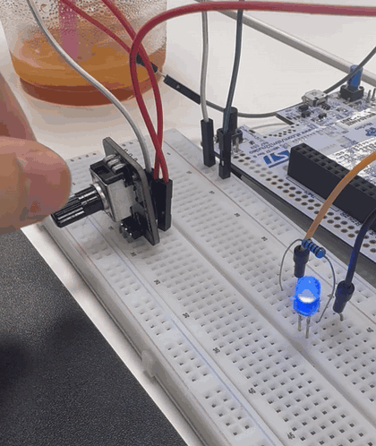
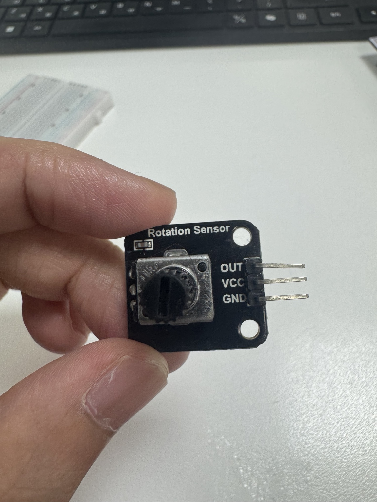

# WEEK 09 · ADC
## NUCLEO-F446ZE에서 이해하는 아날로그 입력과 레지스터

> 가변저항의 전압이 GPIO 핀을 거쳐 ADC 내부로 들어오고, `ADC1->DR`의 숫자가 되어 프로그램에 전달되기까지의 과정을 정리한다.

**보드:** NUCLEO-F446ZE · **MCU:** STM32F446ZET6 · **개발 환경:** STM32CubeMX / STM32CubeIDE · **결과 확인:** USART3 / MobaXterm

이번 주에는 ADC의 개념과 STM32F446의 하드웨어 동작을 학습하고, 가변저항으로 외부 LED의 PWM 밝기를 조절하는 미니프로젝트에 적용했다. 이 문서는 ADC 원리와 레지스터의 관계에 집중한다. 실제 실습 영상과 UART 디버깅 과정은 아래 글에 별도로 정리했다.

**[미니프로젝트 상세 기록 · ADC 측정, LED PWM 제어, 트러블슈팅](https://blog.naver.com/effort1998_/224434181641)**

### 최종 동작 영상

가변저항을 돌리면 ADC 측정값과 TIM2의 CCR1 값이 바뀌고, 이에 따라 LED 밝기가 변한다. 아래 GIF는 직접 촬영한 최종 동작 영상에서 변환했다.



*가변저항 다이얼을 조작하면서 외부 LED 밝기가 달라지는 실제 시연. 약 12.2초, 반복 재생.*

ADC 측정 과정과 UART를 이용한 디버깅 영상은 **[미니프로젝트 상세 기록](https://blog.naver.com/effort1998_/224434181641)**에서 확인할 수 있다.

---

## 목차

[1. 학습 범위와 실습 설정](#scope) · [2. 가변저항의 원리](#potentiometer) · [3. ADC 기초](#adc-basics) · [4. 전체 동작 흐름](#adc-flow) · [5. ADC 클럭](#adc-clock) · [6. Channel과 Rank](#channel-rank) · [7. Sampling과 SAR](#sampling-sar) · [8. 메모리 맵과 레지스터](#memory-map) · [9. GPIO와 RCC](#gpio-rcc) · [10. ADC 레지스터 상세](#adc-registers) · [11. HAL과 레지스터 연결](#hal-registers) · [12. Polling·Interrupt·DMA](#data-transfer) · [13. CubeMX 설정](#cubemx) · [14. 미니프로젝트](#mini-project) · [15. 트러블슈팅](#troubleshooting) · [16. 디버거 확인 항목](#debugging) · [17. 핵심 정리](#takeaways) · [참고 자료](#references)

<a id="scope"></a>
## 1. 학습 범위와 실습 설정

이 문서의 **실습 구성과 문제 해결 기록은 직접 작성한 코드 및 실습 기록**을 기준으로 한다. **ADC 내부 구조, 레지스터 비트 의미, 전기적 조건은 ST 공식 문서와 공개 HAL/CMSIS 소스**를 참고해 보충했다. Interrupt, DMA, 타이머 트리거 등은 동작을 이해하기 위한 확장 내용이며, 이번 미니프로젝트에서 모두 구현했다는 의미는 아니다.

| 구분 | 이번 실습에서 사용한 설정 |
|---|---|
| 시스템 클럭 | HSI 16 MHz, PLL 미사용 |
| AHB / APB1 / APB2 분주 | 모두 `/1` |
| ADC 장치 / 입력 | ADC1 / PA3 / Channel 3 |
| ADC 분해능 / 정렬 | 12-bit / Right alignment |
| ADC Prescaler | PCLK2 / 4 |
| Sampling Time | 56 ADCCLK cycles |
| Regular sequence | Rank 1, 변환 수 1 |
| 변환 방식 | Software start, Single conversion, Polling |
| UART | USART3, PD8 TX / PD9 RX, 115200 bps, 8N1 |
| PWM 출력 | TIM2_CH1, PA5, Alternate Function 1 |
| PWM 설정 | Up-counting, PWM Mode 1, Polarity High, PSC 15, ARR 999 |

보드 이름인 `NUCLEO-F446ZE`와 MCU 이름인 `STM32F446ZE`는 구분한다. ADC 레지스터는 MCU의 기능이고, A0 헤더나 ST-LINK의 USB 가상 COM 포트는 보드의 연결 구성이다. 핀 연결은 NUCLEO-64 등 다른 보드의 예제를 그대로 적용하지 않고 NUCLEO-F446ZE 기준으로 확인한다. [보드 설명서][board]

<a id="potentiometer"></a>
## 2. 가변저항이란 무엇인가?

### 2.1 다이얼 위치를 전압으로 바꾸는 부품

가변저항은 손잡이를 돌리거나 슬라이더를 움직여 저항의 접점 위치를 바꾸는 부품이다. 세 단자를 이용하는 포텐셔미터(potentiometer)는 저항체의 양 끝 단자와, 그 사이를 움직이는 접점인 **와이퍼(wiper)**로 구성된다.

이번에 사용한 모듈에는 `Rotation Sensor`라는 이름과 `OUT`, `VCC`, `GND`가 표시되어 있다. 부품의 정확한 총저항값은 사진만으로 확정하지 않는다.



*실습 부품 사진. OUT이 ADC에 연결되는 신호선이다.*

세 단자를 다음과 같이 연결하면 다이얼 위치에 따라 분압 비율이 바뀐다.

```text
3.3 V ── R위 ──┬── R아래 ── GND
                │
               OUT ── ADC 입력
```

ADC 입력의 부하를 무시하는 이상적인 분압 회로에서는 다음과 같다.

```text
VOUT = VCC × R아래 / (R위 + R아래)
```

예를 들어 위쪽과 아래쪽 저항이 같다면 OUT은 공급전압의 절반인 약 1.65 V다. 다이얼을 움직이면 저항체 전체가 무조건 커지거나 작아지는 것이 아니라, **와이퍼를 기준으로 나눈 두 저항의 비율**이 달라진다. 가변저항이 스스로 전압을 만드는 것은 아니며, 공급받은 전압을 나누어 출력한다.

### 2.2 왜 ADC 학습에 적합한가?

손으로 쉽게 바꿀 수 있는 아날로그 전압이 필요하기 때문이다. 센서의 동작 조건을 별도로 만들지 않아도 다이얼만 돌려 입력을 최소·중간·최대 부근으로 이동시킬 수 있다. 덕분에 입력 전압, ADC 정수값, PWM 출력 사이의 관계를 직접 관찰하기 좋다.

ADC가 직접 측정하는 것은 **저항값이나 회전각이 아니라 OUT 핀의 전압**이다. 회전각을 알고 싶다면 가변저항의 특성과 기계적 회전 범위를 따로 알아야 한다. 펄스를 출력하는 로터리 인코더와도 구분한다.

이번 연결은 `VCC → 3.3 V`, `GND → GND`, `OUT → PA3`다. 가변저항에 5 V를 공급하면 OUT도 그 부근까지 올라갈 수 있으므로 이번 3.3 V ADC 입력에 그대로 연결하면 안 된다. 디지털 입력의 5 V 허용 여부와 ADC의 아날로그 변환 입력 범위는 다른 문제다. [ADC 전기적 조건][datasheet]

### 2.3 가변저항과 Sampling Time의 관계

가변저항 출력도 이상적인 전압원은 아니다. 이상적인 전원에 연결된 분압기의 OUT에서 본 등가 출력저항은 다음과 같다.

```text
R출력 = R위 || R아래
      = (R위 × R아래) / (R위 + R아래)
```

예를 들어 **총저항이 10 kΩ이라고 가정한** 가변저항은 중간 위치에서 `5 kΩ || 5 kΩ = 2.5 kΩ`가 된다. 이것은 설명용 예시이며 실제 모듈이 10 kΩ이라는 뜻은 아니다.

ADC 내부의 샘플링 커패시터는 이 출력저항 등을 거쳐 충전된다. 따라서 “가변저항이니까 가장 짧은 Sampling Time도 항상 충분하다”라고 단정할 수 없다. [입력 임피던스와 샘플링][accuracy]

<a id="adc-basics"></a>
## 3. ADC 기초: 전압을 숫자로 표현한다

### 3.1 Sampling, Quantization, Encoding

ADC는 Analog-to-Digital Converter의 약자다. 연속적인 입력 전압을 유한한 비트 수로 표현한다. 개념적으로는 다음 세 과정으로 나눌 수 있다.

| 과정 | 의미 |
|---|---|
| Sampling · 표본화 | 특정 시점의 입력 신호를 취한다. |
| Quantization · 양자화 | 그 크기를 유한한 단계 중 하나로 표현한다. |
| Encoding · 부호화 | 선택된 단계를 이진수로 나타낸다. |

예를 들어 1.65 V를 측정한 결과가 `2048`이라면, 프로그램은 1.65라는 실수를 직접 받은 것이 아니다. ADC의 출력 코드를 받은 뒤 기준전압과 분해능을 이용해 전압을 계산한 것이다. [ADC 내부 원리][accuracy]

### 3.2 12-bit라는 뜻

이번 설정의 출력 코드 수는 다음과 같다.

```text
2^12 = 4096개
출력 코드 = 0 ~ 4095
```

기준전압 범위를 0~3.3 V로 가정하면 한 단계의 명목상 크기는 다음과 같다.

```text
1 LSB = (VREF+ - VREF-) / 2^12
      = 3.3 / 4096 V
      ≈ 0.8057 mV
```

LSB는 Least Significant Bit의 약자다. 여기서는 인접한 ADC 코드 사이의 명목상 전압 간격으로 이해한다. 이것은 **분해능**이지, 모든 측정값의 오차가 반드시 0.8057 mV 이내라는 뜻은 아니다. 실제 정확도에는 기준전압, 오프셋, 이득 오차, 비선형성, 잡음 등이 영향을 준다. [ADC 오차 설명][accuracy]

### 3.3 기준전압이 있어야 숫자의 의미를 알 수 있다

ADC 결과는 입력전압을 기준전압 범위에 상대적으로 비교한 값이다. `VDDA`는 아날로그 전원이고 `VREF+`는 변환 기준전압이므로 개념적으로 구분한다. 보드 회로에서 연결되는 방식도 확인해야 한다. [데이터시트][datasheet] [보드 설명서][board]

이번 실습은 `VREF- = 0 V`, `VREF+ ≈ 3.3 V`로 가정해 전압을 표시한다.

```c
voltage_mV = (adcValue * 3300U) / 4095U;
```

이 식은 코드의 양 끝 `0 ↔ 0 mV`, `4095 ↔ 3300 mV`를 맞추는 **간단한 끝점 스케일링**이다. 앞의 `LSB = 3.3 / 4096`과 계산 목적이 다르다. 정밀한 측정에서는 실제 기준전압과 ADC 전달 특성, 보정 조건까지 고려해야 한다.

```text
4096 → 표현 가능한 코드의 개수, 명목 LSB 계산의 분모
4095 → 최대 출력 코드, 끝점 스케일링에 사용하는 값
```

3.3 V라는 상수도 측정된 전압이 아니라 가정이다. 실제 VREF+가 다르면 출력되는 `Voltage`에도 그 오차가 반영된다. 화면에 소수점 셋째 자리까지 표시된다고 해서 정밀 계측기와 같은 정확도를 갖는 것은 아니다.

가변저항 전원과 ADC 기준전압이 같은 전원을 따라 변하는 이상적인 경우에는 ADC 코드가 다이얼의 **비율**을 나타내는 성질이 있다. 반면 절대 전압을 알고 싶다면 실제 기준전압을 알아야 한다.

<a id="adc-flow"></a>
## 4. STM32F446에서의 전체 동작 흐름

STM32F446에는 ADC1, ADC2, ADC3가 있다. 이번 실습은 ADC1 하나를 독립적으로 사용한다. 내부 원리와 이번 설정을 연결하면 다음과 같다. [데이터시트][datasheet] [RM0390][rm]

```text
가변저항 OUT
    │ 아날로그 전압
    ▼
PA3 ── GPIO Analog mode
    ▼
ADC1_IN3 ── 입력 Channel 3
    ▼
입력 선택 회로(MUX)
    ▼
Sample & Hold ── 입력 전압 취득 / 유지
    ▼
SAR 변환 ── 12-bit 코드 결정
    ▼
ADC1->DR ── 결과 보관
    │
    ├── Polling: CPU가 완료 확인 후 읽음
    ├── Interrupt: 완료 시 CPU가 콜백에서 처리
    └── DMA: 하드웨어가 결과를 RAM 버퍼로 전송
```

**CPU가 전압을 수천 번 비교해서 ADC 값을 계산하는 것은 아니다.** Sampling과 변환은 ADC 하드웨어가 수행한다. CPU는 사용할 채널과 변환 조건을 설정하고, 시작을 요청하고, 결과를 이용한다.

이후의 미니프로젝트에서는 ADC 결과를 CCR1 값으로 환산한다. TIM2는 그 CCR1과 CNT를 비교하여 PA5에서 PWM을 출력한다. ADC 변환과 PWM 생성은 서로 다른 주변장치의 역할이다.

<a id="adc-clock"></a>
## 5. ADC 클럭: CPU 클럭과 같지 않다

### 5.1 이번 프로젝트의 클럭 경로

작성한 `SystemClock_Config()`는 HSI를 SYSCLK로 사용하며, AHB와 APB 분주를 모두 `/1`로 설정한다. ADC의 Prescaler는 `/4`다.

```text
HSI: 명목 16 MHz
    ↓ SYSCLK
16 MHz
    ↓ AHB /1
HCLK = 16 MHz
    ↓ APB2 /1
PCLK2 = 16 MHz
    ↓ ADC Prescaler /4
ADCCLK = 4 MHz
```

따라서 이 문서의 ADC 시간 계산은 **ADCCLK 4 MHz**를 전제로 한다. PLL이나 APB2 설정을 바꾸면 다시 계산해야 한다. HSI는 내부 RC 발진기이므로 16 MHz도 명목값이다. [클럭 규격][datasheet]

### 5.2 ADC 공통 Prescaler

ADC 클럭은 ADC 공통 제어 레지스터 `ADC_CCR.ADCPRE[1:0]`로 설정한다. 선택 가능한 분주율은 `/2`, `/4`, `/6`, `/8`이다. 이 공통 설정은 ADC1만의 독립적인 분주기가 아니다. [HAL 설정 상수][adc-h] [CMSIS 정의][cmsis]

| ADCPRE 비트 값 | 분주율 |
|---|---:|
| `00` | PCLK2 / 2 |
| `01` | PCLK2 / 4 |
| `10` | PCLK2 / 6 |
| `11` | PCLK2 / 8 |

타이머에서 배웠던 APB 타이머 클럭의 배수 규칙을 ADC에 적용하면 안 된다. ADC는 위의 ADC Prescaler 경로로 계산한다.

또한 분주율이 작다고 무조건 좋은 것은 아니다. 데이터시트의 ADC 클럭 허용 범위를 지켜야 한다. 예를 들어 VDDA가 2.4~3.6 V인 조건에서 명시된 ADC 최대 클럭은 36 MHz이며, 더 낮은 전원 조건에서는 제한이 달라진다. [DS10693, ADC characteristics][datasheet]

<a id="channel-rank"></a>
## 6. 핀, ADC 장치, Channel, Rank를 구분한다

### 6.1 서로 다른 네 가지 이름

```text
PA3       = MCU의 물리적인 GPIO 이름
ADC1      = 사용할 ADC 주변장치
Channel 3 = ADC에서 선택할 입력 경로
Rank 1    = Regular sequence에서 첫 번째 변환 순서
```

보드의 `A0`는 헤더에 붙은 이름이며, NUCLEO-F446ZE에서는 PA3에 연결된다. 따라서 **A0라고 해서 ADC Channel 0인 것은 아니다.** 이번 설정은 `A0 → PA3 → ADC1 Channel 3`이다. [UM1974, NUCLEO-F446ZE pin assignments][board]

### 6.2 Rank는 입력 번호가 아니라 순서다

여러 채널을 변환할 때는 다음처럼 순서를 지정할 수 있다.

```text
Rank 1 → Channel 3
Rank 2 → Channel 10
Rank 3 → Channel 5
```

단일 ADC는 이 입력들을 한 번에 모두 변환하는 것이 아니라 설정된 순서로 선택해 변환한다. Rank 1이라고 해서 Channel 1을 읽는 것도 아니다.

채널별 Sampling Time은 `SMPR` 레지스터에, 변환 순서는 `SQR` 레지스터에 저장된다. CubeMX는 Rank 아래에서 Sampling Time을 편집하게 보여주지만, **하드웨어의 Sampling Time 설정 단위는 해당 ADC의 Channel**이다. 같은 ADC의 같은 채널을 여러 Rank에서 반복하면 동일한 채널 Sampling Time을 공유한다. [채널 설정 구현][adc-c] [레지스터 정의][cmsis]

### 6.3 Regular, Injected, Scan, Continuous

| 개념 | 의미 |
|---|---|
| Regular group | 일반 변환 시퀀스. 최대 16개의 순서를 구성할 수 있다. |
| Injected group | 별도의 우선 처리 변환 그룹. 최대 4개이며 별도 결과 레지스터를 사용한다. |
| Scan | 시퀀스에 설정된 여러 채널을 순차적으로 변환한다. |
| Continuous | 한 번 시작한 뒤 다음 변환 또는 시퀀스를 자동으로 반복한다. |

`Regular`는 “계속 반복한다”라는 의미가 아니다. `Scan`과 `Continuous`도 별도의 설정이다. 이번에는 **Regular / 1개 채널 / Scan 비활성화 / Continuous 비활성화**를 사용한다. [RM0390, ADC functional description][rm] [HAL ADC 설정][adc-h]

<a id="sampling-sar"></a>
## 7. Sampling과 SAR 변환은 어떻게 일어나는가?

### 7.1 Sample & Hold

ADC 내부의 입력 선택 회로가 Channel 3을 연결하면 샘플링 스위치와 커패시터가 입력 전압을 취득한다. 입력과 연결되어 전압을 따라가는 시간이 Sampling 구간이다. 그다음 입력으로부터 분리된 전압을 유지하면서 변환을 수행한다. [SAR 내부 구조][accuracy]

```text
Sampling                         Hold / Conversion
입력 전압을 취득한다.             취득한 전압으로 코드를 결정한다.
──────── 56 cycles ────────┬──────── 12 cycles ────────
                          ↑
                  Sampling 구간 종료
```

입력이 계속 움직이는 동안 변환의 기준까지 바뀌는 일을 줄이기 위해, 한 번 취득한 전압을 대상으로 변환한다고 이해하면 된다.

### 7.2 왜 56 Cycles를 선택했는가?

Sampling Time이 너무 짧으면 내부 커패시터가 입력 전압에 충분히 가까워지기 전에 Sampling이 끝날 수 있다. 이때는 단순히 값이 흔들리는 것뿐 아니라 **일관되게 치우친 값**이 나올 수도 있다.

충전 시간을 좌우하는 단순화된 관계는 다음과 같다.

```text
시정수 τ ≈ (신호원의 출력저항 + ADC 입력 스위치 저항) × 샘플링 커패시턴스
```

출력저항이 클수록 같은 오차 수준까지 도달하는 시간이 길어진다. 이번에는 빠른 신호를 수집하는 것이 목적이 아니므로 56 cycles로 입력 취득 시간을 확보했다. 다만 모듈의 실제 저항값과 배선 조건을 측정한 결과로 최적화한 값은 아니다. [Sampling Time 선택 조건][accuracy]

**56 Cycles는 56번 측정해 평균 낸다는 뜻이 아니다.** 한 번의 변환 전에 입력 전압을 받아들이는 시간을 ADCCLK 56주기로 정했다는 뜻이다. 56-bit ADC라는 뜻도 아니다. Sampling Time을 늘려도 전원 잡음이나 접촉 불량이 모두 해결되는 것은 아니다.

### 7.3 SAR: 큰 비트부터 하나씩 결정한다

SAR는 Successive Approximation Register의 약자다. 변환 원리를 단순화하면, 내부의 비교 전압과 취득한 입력 전압을 비교하면서 가장 큰 비트부터 차례로 결정하는 과정이다. SAR 변환에 사용하는 내부 DAC 구조는 사용자가 외부 핀으로 출력하는 DAC 주변장치와 구분한다. [AN2834, SAR ADC internal structure][accuracy]

VREF+가 3.3 V이고 입력이 2.0 V인 예를 생각하면 다음과 같다.

```text
입력 2.0 V를 1.65 V와 비교 → 더 크다.
다음 후보 2.475 V와 비교    → 더 작다.
다음 후보 2.0625 V와 비교   → 더 작다.
다음 후보 1.85625 V와 비교  → 더 크다.
…
```

매번 남아 있는 전압 구간을 좁혀 가는 방식이므로 이진 탐색에 비유할 수 있다. CPU가 0부터 4095까지 순서대로 대입하는 방식이 아니다.

### 7.4 이번 설정에서 걸리는 시간

STM32F446의 12-bit 설정에서 Sampling 이후의 변환 단계는 12 ADCCLK cycles다. 다른 STM32 계열의 `12.5 cycles` 같은 값을 그대로 가져오지 않는다. [RM0390, Channel-wise programmable sampling time][rm] [DS10693, ADC characteristics][datasheet]

```text
ADCCLK            = 4 MHz
1 ADC cycle       = 0.25 μs
Sampling Time     = 56 × 0.25 μs = 14 μs
SAR 변환 시간     = 12 × 0.25 μs = 3 μs
Sampling + 변환   = (56 + 12) / 4 MHz = 17 μs
```

이 17 μs는 **Sampling과 변환의 하드웨어 시간 계산값**이다. ADC 전원 활성화 후 안정화 시간, 소프트웨어 호출 비용, 트리거 지연, UART 전송, 루프 대기까지 모두 포함한 실제 측정 주기는 아니다.

단순히 `1 / 17 μs`를 계산하면 약 58.8 kconversion/s지만, 이번 펌웨어가 그 속도로 샘플을 저장했다는 뜻은 아니다. 특히 루프 끝에 `HAL_Delay(500)`이 있으면 새 밝기 값의 갱신은 약 0.5초보다 긴 간격으로 이루어진다.

<a id="memory-map"></a>
## 8. 레지스터란 무엇이며 C 코드와 어떻게 연결되는가?

### 8.1 일반 변수와 하드웨어 레지스터

```c
uint32_t adcValue;
```

이 변수는 프로그램의 데이터를 저장하는 RAM 공간이다. 반면 다음 표현은 하드웨어 주변장치의 레지스터를 읽는 접근이다.

```c
adcValue = ADC1->DR;
```

STM32는 주변장치 레지스터를 메모리 주소 공간에 배치하는 **Memory-mapped I/O** 방식을 사용한다. CPU는 특정 주소를 읽거나 쓰는 명령으로 ADC의 결과를 읽고 설정을 바꾼다.

CMSIS 장치 헤더는 베이스 주소와 C 구조체를 연결한다. STM32F446의 ADC1 베이스 주소는 `0x40012000`이고 DR 오프셋은 `0x4C`이므로 주소 관계는 다음과 같다. [STM32F446 CMSIS 장치 헤더][cmsis]

```text
ADC1 베이스 주소       0x40012000
DR 오프셋            + 0x0000004C
                     ────────────
ADC1->DR 주소          0x4001204C
```

따라서 `ADC1->DR`은 ADC 결과를 담는 일반 C 변수를 선언한 것이 아니다. 고정 주소의 하드웨어 레지스터를 편리하게 표현한 것이다.

### 8.2 hadc1과 ADC1도 다른 대상이다

```text
hadc1
  ├─ Instance → ADC1의 하드웨어 레지스터 주소
  ├─ Init     → 분해능, 분주율 등 설정 정보
  ├─ State    → HAL이 관리하는 소프트웨어 상태
  └─ ErrorCode
```

`hadc1`은 RAM에 있는 HAL 핸들 구조체이며, `hadc1.Instance = ADC1`은 이 핸들이 ADC1을 제어한다는 뜻이다. `HAL_ADC_GetValue(&hadc1)`은 이 Instance를 통해 결과 레지스터를 읽는다. [ADC HAL 핸들][adc-h] [결과 읽기 구현][adc-c]

### 8.3 이번 실습과 관련된 ADC 레지스터 지도

아래 오프셋은 ADC1 베이스 주소 `0x40012000`을 기준으로 한다. ADC2와 ADC3도 각각의 베이스 주소에 동일한 ADC 레지스터 구조가 배치된다. [CMSIS ADC_TypeDef][cmsis]

| 레지스터 | 오프셋 | 역할 |
|---|---:|---|
| `ADC_SR` | `0x00` | 완료·시작·오버런 등의 상태 |
| `ADC_CR1` | `0x04` | 분해능, Scan, 인터럽트 설정 |
| `ADC_CR2` | `0x08` | ADC 활성화, 시작, 연속 변환, 정렬, 트리거 |
| `ADC_SMPR1` | `0x0C` | Channel 10~18의 Sampling Time |
| `ADC_SMPR2` | `0x10` | Channel 0~9의 Sampling Time |
| `ADC_SQR1` | `0x2C` | Regular 시퀀스 길이와 Rank 13~16 |
| `ADC_SQR2` | `0x30` | Rank 7~12의 채널 |
| `ADC_SQR3` | `0x34` | Rank 1~6의 채널 |
| `ADC_DR` | `0x4C` | Regular 변환 결과 |

공통 영역은 별도로 존재한다.

```text
ADC 공통 영역 베이스   = 0x40012300
공통 CCR 주소         = 0x40012304
```

**ADC의 `CCR`과 타이머의 `CCR1`은 다른 레지스터다.**

```text
ADC_CCR     → Common Control Register: ADC 공통 제어
TIM2_CCR1   → Capture/Compare Register 1: TIM2 채널 1 비교값
```

이름이 비슷해도 용도가 다르다. 프로그램의 `ccrValue`는 이번 프로젝트에서 TIM2_CCR1에 넣을 소프트웨어 변수다.

### 8.4 비트 필드와 Read–Modify–Write

하나의 레지스터에는 여러 설정이 비트 단위로 들어 있다. 특정 필드만 바꾸려면 기존 값을 읽고, 대상 비트를 지우고, 새 값을 넣는다.

```c
/* 일반적인 설정 레지스터의 특정 필드를 바꾸는 형태 */
reg = (reg & ~mask) | new_value;
```

`& ~mask`는 해당 비트들을 0으로 만들고, `| new_value`는 원하는 값을 넣는다. 단순히 `|=`만 하면 이전 필드의 1비트가 남을 수 있다.

다만 상태 플래그 레지스터는 읽기나 쓰기 자체에 특별한 동작이 있을 수 있다. 따라서 이 패턴을 모든 레지스터에 기계적으로 적용하면 안 된다. `ADC_SR`의 플래그 제거 규칙은 뒤에서 따로 구분한다. [RM0390, ADC registers][rm]

<a id="gpio-rcc"></a>
## 9. GPIO와 RCC: 전압을 받을 준비

> 아래 레지스터 코드는 비트 의미를 설명하기 위한 조각이다. 실행 순서와 전원 안정화까지 포함한 독립형 펌웨어가 아니며, 기존 HAL 초기화에 그대로 중복 삽입하지 않는다.

### 9.1 RCC로 주변장치 클럭을 허용한다

ADC 설정 전에 ADC와 GPIO의 클럭을 켜야 한다. GPIOA는 AHB1, ADC1은 APB2의 클럭 게이트를 사용한다. [CMSIS RCC 정의][cmsis]

```c
/* GPIOAEN: RCC_AHB1ENR bit 0 */
RCC->AHB1ENR |= RCC_AHB1ENR_GPIOAEN;

/* ADC1EN: RCC_APB2ENR bit 8 */
RCC->APB2ENR |= RCC_APB2ENR_ADC1EN;
```

HAL에서는 대응하는 클럭 Enable 매크로를 사용한다. 클럭 게이트를 여는 것과 ADCCLK의 분주율을 정하는 것은 서로 다른 설정이다. 클럭 활성화 직후 접근에 필요한 지연 등도 HAL의 구현과 장치 요구조건을 따라야 한다.

### 9.2 PA3를 Analog Mode로 설정한다

GPIO의 `MODER`는 핀 하나당 2비트를 사용한다. PA3는 `[7:6]`을 사용하므로 Analog Mode의 값 `11`을 넣는다. PUPDR의 같은 위치에는 내부 풀업·풀다운을 쓰지 않는 `00`을 넣는다. [GPIO 비트 정의][cmsis] [GPIO 동작 설명][rm]

```c
GPIOA->MODER = (GPIOA->MODER & ~(3UL << 6)) | (3UL << 6);
GPIOA->PUPDR &= ~(3UL << 6);
```

```text
GPIOA_MODER[7:6] = 11 → PA3 Analog mode
GPIOA_PUPDR[7:6] = 00 → No pull-up / pull-down
```

ADC 입력을 일반 Digital Input으로 설정하면 전압의 크기를 숫자로 읽는 설정이 되지 않는다. Analog Mode에서는 디지털 입력 경로 등을 비활성화해 불필요한 디지털 동작을 줄이며 아날로그 사용에 맞게 핀을 구성한다.

또한 PA3의 ADC 입력은 `GPIO_AFx`를 골라 연결하는 방식이 아니다. 이번 프로젝트에서 **PA3는 Analog Mode**, **PA5의 PWM은 Alternate Function Mode**다.

```c
/* CubeMX가 생성하는 ADC 입력 설정의 핵심 */
GPIO_InitStruct.Pin = GPIO_PIN_3;
GPIO_InitStruct.Mode = GPIO_MODE_ANALOG;
GPIO_InitStruct.Pull = GPIO_NOPULL;
HAL_GPIO_Init(GPIOA, &GPIO_InitStruct);
```

<a id="adc-registers"></a>
## 10. ADC 레지스터를 이번 설정에 대입하기

### 10.1 ADC_CCR: 독립 모드와 /4 분주

공통 제어 레지스터의 `ADCPRE[17:16]`에 `01`을 넣으면 PCLK2 / 4가 된다. `MULTI[4:0] = 00000`은 독립 모드다. 아래 예시는 ADC 공통 영역을 `ADC123_COMMON`으로 표현한 CMSIS 이름을 사용한다. 패키지에 따라 같은 영역의 레거시 별칭 `ADC`가 보일 수도 있다. [CMSIS][cmsis] [ADC Prescaler 정의][adc-h]

```c
/* ADC들을 멈춘 초기화 단계에서 공통 설정을 구성한다는 전제 */
ADC123_COMMON->CCR =
    (ADC123_COMMON->CCR & ~(ADC_CCR_ADCPRE | ADC_CCR_MULTI))
    | ADC_CCR_ADCPRE_0;
```

다른 ADC가 동작하는 상태에서 공통 분주 설정을 임의로 바꾸지 않는다. 공통 설정은 여러 ADC에 영향을 줄 수 있다.

### 10.2 ADC_CR1: 12-bit, Scan 미사용

이번 실습에서 주로 볼 필드는 다음과 같다. [CR1 정의][cmsis] [분해능 및 Scan 설정][adc-h]

| 필드 | 비트 | 이번 값 | 뜻 |
|---|---:|---:|---|
| `RES` | `[25:24]` | `00` | 12-bit |
| `SCAN` | `8` | `0` | 다중 채널 Scan 미사용 |
| `DISCEN` | `11` | `0` | Regular 불연속 모드 미사용 |
| `EOCIE` | `5` | `0` | 완료 인터럽트 미사용 |

분해능 필드는 `00 → 12-bit`, `01 → 10-bit`, `10 → 8-bit`, `11 → 6-bit`다. 분해능이 바뀌면 출력 범위와 변환 시간도 함께 확인해야 한다.

### 10.3 ADC_SMPR2: Channel 3의 Sampling Time

Channel 3은 `SMPR2`에서 관리하며, `SMP3[2:0]`은 레지스터의 `[11:9]`에 위치한다. HAL 상수의 숫자 자체가 실제 cycle 수인 것은 아니고, 하드웨어가 해석하는 **인코딩**이다. [Sampling Time 상수][adc-h] [SMP3 위치][cmsis]

| SMP 인코딩 | Sampling Time |
|---|---:|
| `000` | 3 cycles |
| `001` | 15 cycles |
| `010` | 28 cycles |
| `011` | 56 cycles |
| `100` | 84 cycles |
| `101` | 112 cycles |
| `110` | 144 cycles |
| `111` | 480 cycles |

따라서 Channel 3을 56 cycles로 설정하는 비트 조작은 다음과 같다.

```c
ADC1->SMPR2 = (ADC1->SMPR2 & ~(7UL << 9)) | (3UL << 9);
```

```text
Channel 3 필드 위치 = 3 × 3 = bit 9부터
필드 크기           = 3 bits
56 cycles 인코딩    = 011₂ = 3
해당 필드의 값      = 3 << 9 = 0x00000600
```

여기에 `56 << 9`를 넣는 것이 아니다. 실제 의미가 56 cycles인 **3비트 코드 3**을 넣는 것이다. 다른 채널 설정이 있으면 SMPR2 전체 값이 꼭 `0x600`이 되는 것은 아니므로 해당 비트만 마스킹해서 확인한다.

HAL에서는 다음 설정이 이 작업으로 연결된다.

```c
sConfig.Channel = ADC_CHANNEL_3;
sConfig.SamplingTime = ADC_SAMPLETIME_56CYCLES;
HAL_ADC_ConfigChannel(&hadc1, &sConfig);
```

### 10.4 ADC_SQR1: 변환 수는 N−1로 저장한다

`SQR1.L[23:20]`은 Regular 시퀀스의 변환 수를 **실제 개수−1**로 저장한다. [SQR 정의][cmsis] [HAL 시퀀스 길이 설정][adc-c]

```text
1개 변환  → L = 0
2개 변환  → L = 1
16개 변환 → L = 15
```

이번에는 한 채널만 변환하므로 L 필드를 0으로 설정한다.

```c
ADC1->SQR1 &= ~ADC_SQR1_L;
```

CubeMX의 `Number Of Conversion = 1`과 레지스터의 `L = 0`은 모순이 아니다. 프로그램 화면의 값과 하드웨어 필드의 표현 방식이 다를 뿐이다.

### 10.5 ADC_SQR3: Rank 1에 Channel 3을 넣는다

`SQR3.SQ1[4:0]`에는 첫 번째로 변환할 채널 번호가 들어간다. 이번에는 3을 넣는다. [SQR3 정의][cmsis] [HAL Rank 설정 구현][adc-c]

```c
ADC1->SQR3 = (ADC1->SQR3 & ~ADC_SQR3_SQ1) | 3UL;
```

```text
SQR1.L  = 0 → 시퀀스에 변환 1개
SQR3.SQ1 = 3 → 그 첫 변환은 Channel 3
```

Sampling Time은 SMPR2에 있고, 순서는 SQR3에 있다. 서로 역할이 다르다.

### 10.6 ADC_CR2: 시작 조건과 결과 형식

CR2의 핵심 필드는 다음과 같다. [CR2 정의][cmsis] [HAL 초기화·시작 구현][adc-c]

| 필드 | 비트 | 이번 설정과 역할 |
|---|---:|---|
| `ADON` | `0` | ADC 활성화. 시작 함수에서 설정한다. |
| `CONT` | `1` | `0`: 자동 연속 변환을 하지 않는다. |
| `DMA` | `8` | `0`: 이번에는 DMA 요청을 사용하지 않는다. |
| `DDS` | `9` | DMA 요청 지속 동작 관련. 이번에는 미사용. |
| `EOCS` | `10` | `1`: 각 변환 완료를 EOC로 표시한다. |
| `ALIGN` | `11` | `0`: 결과를 오른쪽 정렬한다. |
| `EXTSEL` | `[27:24]` | 하드웨어 트리거 소스 선택. |
| `EXTEN` | `[29:28]` | `00`: 하드웨어 트리거 감지 비활성화. |
| `SWSTART` | `30` | Regular 소프트웨어 변환 시작 요청. |

`ADC_SOFTWARE_START`는 HAL의 설정 표현이다. 이를 “하드웨어 EXTSEL에 소프트웨어 시작이라는 별도 입력선이 연결된다”라고 해석하지 않는다. 이번 흐름에서는 EXTEN을 끄고 SWSTART를 통해 시작한다.

```c
/* 개념적인 시작 순서: 초기화와 안정화 조건을 만족한 뒤 */
ADC1->CR2 |= ADC_CR2_ADON;
/* 전원 활성화 후 필요한 안정화 시간을 확보한다. */
ADC1->CR2 |= ADC_CR2_SWSTART;
```

`ADON`은 ADC를 사용할 수 있게 활성화하는 비트이고, `SWSTART`는 변환을 시작하라는 요청이다. 역할이 다르다. SWSTART는 변환 시작 후 하드웨어에 의해 해제되므로 디버거에서 계속 1로 보이지 않아도 이상한 것이 아니다. [RM0390, Single conversion / CR2][rm]

직접 레지스터를 다룬다면 ADON 직후 필요한 안정화 시간을 포함해야 한다. HAL의 시작 함수에도 ADC를 새로 활성화할 때 안정화를 기다리는 코드가 있다. 위 두 줄만으로 완전한 직접 제어 예제가 되는 것은 아니다. [HAL_ADC_Start 구현][adc-c]

### 10.7 ADC_SR: 완료와 오류를 나타내는 플래그

| 필드 | 비트 | 의미 |
|---|---:|---|
| `EOC` | `1` | Regular 변환 또는 시퀀스 완료 |
| `STRT` | `4` | Regular 변환이 시작되었음을 나타냄 |
| `OVR` | `5` | 새 결과 처리 과정에서 데이터 손실 발생 |
| `AWD` | `0` | 아날로그 워치독 범위 이탈 |

EOC의 완료 기준은 `CR2.EOCS`에 따라 달라진다. `EOCS=1`이면 개별 변환 완료, `EOCS=0`이면 시퀀스 완료를 표시한다. 이번에는 한 채널이고 EOCS=1이다. OVR 검출 조건도 DMA 또는 EOCS 설정과 관계가 있으므로 다중 채널·연속 변환에서는 함께 확인해야 한다. [RM0390, ADC_SR][rm]

Polling의 중심 동작을 단순화하면 다음과 같다.

```c
/* 개념 설명용: 실제 사용 코드에서는 timeout도 확인한다. */
while ((ADC1->SR & ADC_SR_EOC) == 0U)
{
    /* 변환 완료를 기다린다. */
}
```

이 반복문이 ADC 변환을 수행하는 것은 아니다. **이미 진행 중인 ADC의 상태를 CPU가 확인**하는 것이다.

ADC_SR의 상태 플래그는 `rc_w0` 규칙을 가지며, 소프트웨어에서 해당 비트에 0을 써서 제거한다. EOC는 DR을 읽어도 해제된다. 다른 주변장치의 `1을 써서 지우는 플래그`와 혼동하지 않는다. [RM0390, ADC_SR][rm]

### 10.8 ADC_DR: 결과를 읽는다

12-bit 오른쪽 정렬에서는 하위 12비트에 결과 코드가 배치된다.

```text
데이터 필드 하위 16 bits

bit 15       12 11                         0
    ┌─────────┬────────────────────────────┐
    │  0000   │       12-bit 결과          │
    └─────────┴────────────────────────────┘
```

```c
uint32_t raw = ADC1->DR;
```

왼쪽 정렬을 선택하면 12비트 결과가 하위 16비트 데이터 필드의 `[15:4]`에 놓인다. 현재 스케일 계산은 오른쪽 정렬을 전제로 한다. CMSIS 구조체는 레지스터 접근 멤버를 32-bit로 제공하지만 **변환 결과의 유효 비트 수가 32비트라는 뜻은 아니다.** [ADC 데이터 정렬][rm] [ADC_TypeDef][cmsis]

Regular 결과 레지스터는 채널마다 하나씩 따로 존재하는 것이 아니다. 여러 채널을 연속으로 읽는 경우에도 새로운 결과가 DR에 들어오므로, 순서에 맞게 읽거나 DMA로 버퍼에 저장해야 한다.

<a id="hal-registers"></a>
## 11. HAL 함수가 실제로 하는 일

### 11.1 초기화 호출의 연결

기본적인 CubeMX 생성 코드에서는 다음 흐름을 볼 수 있다. 콜백 등록 기능을 별도로 사용하면 세부 호출 방식은 달라질 수 있다. [HAL 초기화 구현][adc-c]

```text
main()
  └─ MX_ADC1_Init()
       ├─ hadc1.Instance / Init 설정
       ├─ HAL_ADC_Init(&hadc1)
       │    ├─ 최초 초기화 시 HAL_ADC_MspInit()
       │    │    ├─ ADC1 클럭 활성화
       │    │    └─ PA3 Analog / No Pull 구성
       │    └─ CR1 / CR2 / SQR1 / 공통 CCR 등의 설정
       └─ HAL_ADC_ConfigChannel()
            ├─ SMPR2: Channel 3의 Sampling Time
            └─ SQR3: Rank 1에 Channel 3 등록
```

따라서 `main.c`의 `MX_GPIO_Init()`에 PA3 설정이 안 보인다고 바로 누락으로 판단하지 않는다. ADC 핀 설정은 `stm32f4xx_hal_msp.c`의 `HAL_ADC_MspInit()`에서 생성될 수 있다.

### 11.2 네 개의 함수로 본 Polling

```c
HAL_ADC_Start(&hadc1);
HAL_ADC_PollForConversion(&hadc1, timeout_ms);
adcValue = HAL_ADC_GetValue(&hadc1);
HAL_ADC_Stop(&hadc1);
```

| 함수 | 하드웨어와의 연결 |
|---|---|
| `HAL_ADC_Start()` | 필요하면 ADC 활성화·안정화를 수행하고, 소프트웨어 시작 설정에서는 SWSTART를 설정한다. |
| `HAL_ADC_PollForConversion()` | EOC를 확인하며 기다리고 timeout을 처리한다. |
| `HAL_ADC_GetValue()` | `hadc1.Instance->DR`을 읽는다. |
| `HAL_ADC_Stop()` | ADC를 비활성화한다. |

이 표는 HAL의 상태·잠금 처리 등을 생략한 핵심 요약이다. 실제 구현은 프로젝트의 `Drivers/STM32F4xx_HAL_Driver/Src/stm32f4xx_hal_adc.c`에서 확인할 수 있다. [공개 HAL ADC 소스][adc-c]

Single conversion은 한 번의 변환/시퀀스 후 **자동으로 다음 변환을 시작하지 않는 모드**다. 변환이 끝났다는 것과 ADC의 ADON이 해제되었다는 것은 구분한다. 변환마다 Stop을 호출하는 방식은 이해하기 쉽지만, 모든 설계에서 매번 ADC를 꺼야 하는 것은 아니다.

### 11.3 중요한 주의점: Poll 함수가 EOC를 지울 수 있다

확인한 STM32F4 HAL 구현은 PollForConversion이 성공하면 EOC와 STRT 플래그를 지운다. 따라서 함수에서 돌아온 뒤 디버거로 SR을 봤을 때 **EOC가 0이어도 방금 변환이 실패했다는 뜻은 아니다.** 완료 이벤트는 이미 HAL이 확인한 상태다. 로컬 HAL 버전의 실제 코드를 기준으로 확인한다. [HAL_ADC_PollForConversion][adc-c]

또한 DR을 읽는 행위 자체도 EOC 상태에 영향을 줄 수 있다. 디버거의 레지스터 자동 읽기와 실행 코드가 동시에 DR을 읽는 상황은 피하고, 일반적인 값 관찰에는 RAM으로 복사한 `adcValue`를 사용한다. [RM0390, ADC_SR][rm]

### 11.4 timeout과 반환값을 확인하는 예

초기 학습에서는 `HAL_MAX_DELAY`를 쓰기 쉽지만, 설정이 잘못되면 완료를 무한히 기다릴 수 있다. 아래는 결과가 유효할 때만 사용하는 정리용 함수다.

```c
static HAL_StatusTypeDef ADC_ReadOnce(uint32_t *value)
{
    if (value == NULL)
    {
        return HAL_ERROR;
    }

    HAL_StatusTypeDef status = HAL_ADC_Start(&hadc1);
    if (status != HAL_OK)
    {
        return status;
    }

    status = HAL_ADC_PollForConversion(&hadc1, 10U);
    if (status == HAL_OK)
    {
        *value = HAL_ADC_GetValue(&hadc1);
    }

    HAL_StatusTypeDef stopStatus = HAL_ADC_Stop(&hadc1);
    return (status == HAL_OK) ? stopStatus : status;
}
```

여기서 `10U`는 변환 시간이 10 ms라는 뜻이 아니라 **기다릴 수 있는 제한 시간**이다. HAL의 timeout은 tick 기반이며 호출 경로에 따라 그 tick이 정상 동작하는지도 고려해야 한다.

<a id="data-transfer"></a>
## 12. Polling, Interrupt, DMA는 무엇이 다른가?

세 방식 모두 Sampling과 SAR 변환은 동일한 ADC 하드웨어가 수행한다. 차이는 완료를 확인하고 결과를 전달하는 방식이다. [HAL ADC 사용법][adc-c]

| 방식 | CPU가 하는 일 | 고려할 점 |
|---|---|---|
| Polling | 완료될 때까지 확인한 뒤 DR을 읽는다. | 구현이 단순하지만 대기 중 CPU를 점유한다. |
| Interrupt | 시작 후 다른 일을 하다가 완료 인터럽트에서 처리한다. | NVIC와 주변장치의 인터럽트 Enable을 함께 설정한다. |
| DMA | ADC의 요청에 따라 결과가 RAM 버퍼로 옮겨진다. | 버퍼 길이, 전송 폭, 순환 모드, 처리 속도를 설계한다. |

DMA에서는 데이터가 `ADC → CPU → RAM`으로 매 샘플 복사되는 것이 아니라, DMA가 주변장치에서 RAM으로 전송한다. CPU는 버퍼 일부 또는 전체가 준비된 뒤 처리할 수 있다.

ADC 완료 인터럽트를 쓰려면 ADC의 `EOCIE`와 NVIC의 해당 IRQ 경로를 구성해야 한다. 단순히 **TIM2 global interrupt를 켜는 것은 ADC 완료 인터럽트를 켜는 것과 다르다.** [ADC 제어 비트][cmsis] [HAL_ADC_Start_IT][adc-c]

확장 구조로는 다음을 생각할 수 있다.

```text
타이머의 지원되는 하드웨어 트리거
             ↓
            ADC
             ↓
            DMA
             ↓
          RAM 버퍼
             ↓
      CPU의 필터링·분석
```

이때 지원되는 트리거 소스를 EXTSEL/EXTEN 설정과 매핑표에서 확인해야 한다. 타이머 ISR에서 ADC를 호출하는 방식과, 타이머의 하드웨어 이벤트가 ADC를 직접 시작하는 방식도 서로 다르다. [RM0390, ADC trigger selection][rm]

이번처럼 손으로 돌리는 다이얼로 LED 밝기를 바꾸는 실습은 Polling으로도 충분히 빠르게 갱신할 수 있다. Interrupt나 DMA로 바꾼다고 입력 잡음이 자동으로 줄거나 LED의 인지 밝기가 자동으로 선형화되는 것은 아니다.

<a id="cubemx"></a>
## 13. CubeMX 설정과 레지스터 대응

### 13.1 ADC1 설정

```text
Pinout & Configuration
  → Analog
  → ADC1
  → IN3 활성화
  → Parameter Settings
```

| CubeMX 설정 | 이번 값 | 레지스터의 핵심 대응 |
|---|---|---|
| Clock Prescaler | PCLK2 divided by 4 | 공통 `CCR.ADCPRE = 01` |
| Resolution | 12 bits | `CR1.RES = 00` |
| Data Alignment | Right | `CR2.ALIGN = 0` |
| Scan Conversion Mode | Disabled | `CR1.SCAN = 0` |
| Continuous Conversion Mode | Disabled | `CR2.CONT = 0` |
| Discontinuous Conversion Mode | Disabled | `CR1.DISCEN = 0` |
| End Of Conversion Selection | Single conversion | `CR2.EOCS = 1` |
| Number Of Conversion | 1 | `SQR1.L = 0` |
| External Trigger Conversion Edge | None | `CR2.EXTEN = 00` |
| Rank 1 / Channel | Channel 3 | `SQR3.SQ1 = 3` |
| Sampling Time | 56 Cycles | `SMPR2.SMP3 = 011` |

표의 대응은 HAL 설정 코드와 STM32F446 비트 정의를 함께 읽어 확인할 수 있다. [HAL ADC 초기화][adc-c] [CMSIS][cmsis]

이번 CubeMX 화면은 트리형으로 표시되었다. Sampling Time은 다음 위치에서 찾았다.

```text
Parameter Settings
  → ADC_Regular_ConversionMode
  → Rank 왼쪽의 펼치기 화살표
  → Channel 3 확인
  → Sampling Time = 56 Cycles
```

저장 후 Code Generate를 실행하고 다음 줄을 확인한다.

```c
sConfig.Channel = ADC_CHANNEL_3;
sConfig.Rank = 1;
sConfig.SamplingTime = ADC_SAMPLETIME_56CYCLES;
```

직접 작성한 코드는 `USER CODE BEGIN / END` 영역에 둔다. 재생성 시 사용자 코드 보존 설정도 확인하고 변경 전후 차이를 살펴본다. 생성된 설정 영역을 수동으로 바꾸면 다음 Code Generate에서 원래 `.ioc` 설정으로 돌아갈 수 있다.

### 13.2 Analog와 Alternate Function의 차이

```text
PA3: Analog Mode                 → ADC1_IN3
PA5: Alternate Function 1        → TIM2_CH1
PD8 / PD9: Alternate Function 7  → USART3 TX / RX
```

PA5가 TIM2_CH1을 지원한다는 것은 데이터시트의 Alternate function 표에서 확인한다. PA3의 ADC 기능은 같은 AF 번호 선택 방식이 아니다. [DS10693, Pinout / Alternate function][datasheet]

<a id="mini-project"></a>
## 14. 미니프로젝트: 가변저항 → ADC → PWM → LED

### 14.1 배선과 통신

```text
가변저항 VCC ── 보드 3.3 V
가변저항 GND ── 보드 GND
가변저항 OUT ── A0 / PA3 / ADC1_IN3

PA5 / TIM2_CH1 ── 직렬 전류 제한 저항 ── LED 애노드
                                             LED 캐소드 ── GND
```

LED의 저항은 사용 LED의 순방향 전압과 목표 전류, GPIO 허용 전류를 고려해 정한다. 예를 들어 3.3 V 출력, LED 순방향 전압 2.0 V, 330 Ω을 가정하면 전류는 약 `(3.3−2.0)/330 = 3.9 mA`다. 이는 계산 예시이며 실제 사용 저항이나 LED 사양을 확정한 값은 아니다. 배선은 전원을 끈 상태에서 변경한다. [GPIO 전기적 조건][datasheet]

`PA5`와 보드 헤더의 `A5`는 같은 이름이 아니다. NUCLEO-F446ZE의 A0는 PA3지만, A5를 PA5라고 읽으면 다른 핀에 연결할 수 있다. [보드 핀 배치][board]

통신 경로는 `USART3 → PD8/PD9 → ST-LINK Virtual COM Port → USB → PC`이며 MobaXterm에서는 해당 COM 포트와 `115200 / 8 data bits / No parity / 1 stop bit / No flow control`을 맞춘다. ST-LINK 연결은 보드의 기본 연결 구성을 전제로 한다. [UM1974, USART communication][board]

### 14.2 PWM 주파수와 밝기 값

TIM2는 APB1에 연결된다. 이번 HSI 16 MHz, APB1 `/1` 조건에서는 TIM2 입력 클럭도 명목 16 MHz다. 다른 클럭 구성에서는 APB 분주와 `TIMPRE` 설정을 함께 확인해야 하며, TIM2가 언제나 16 MHz라고 일반화하지 않는다. [RM0390, RCC clock tree / TIMPRE][rm]

```text
CNT 클럭 = 16 MHz / (PSC + 1)
         = 16 MHz / 16 = 1 MHz

PWM 주파수 = 1 MHz / (ARR + 1)
           = 1 MHz / 1000 = 1 kHz
```

Up-counting, PWM Mode 1, Polarity High 기준에서는 다음과 같이 생각할 수 있다.

```text
CNT < CCR1  → HIGH
CNT ≥ CCR1  → LOW

Duty = CCR1 / (ARR + 1)
```

이번 문제를 해결할 때 실제로 사용한 스케일링 식은 다음과 같다.

```c
ccrValue = (adcValue * 1000U) / 4096U;
```

이 식의 결과 범위는 **0~999**다. ARR=999일 때 최고 Duty는 99.9%다. `4095`로 나누면 ADC 최댓값에서 CCR=1000으로 매핑할 수 있지만, 그것은 끝점을 100%로 맞추는 별도의 선택이다. 아래의 실제 문제 해결 기록에서는 사용했던 `/4096`을 유지한다.

### 14.3 초기화와 시작은 별개다

CubeMX의 `MX_TIM2_Init()` 다음에 실제 PWM 시작을 한 번 수행한다. [HAL_TIM_PWM_Start 구현][tim-c]

```c
/* USER CODE BEGIN 2 */
if (HAL_TIM_PWM_Start(&htim2, TIM_CHANNEL_1) != HAL_OK)
{
    Error_Handler();
}
/* USER CODE END 2 */
```

그다음은 ARR를 계속 바꾸거나 CNT를 매번 0으로 되돌리지 않고 CCR1만 갱신하면 된다.

```c
static void Led_SetBrightness(uint32_t ccr)
{
    if (ccr > 1000U)
    {
        ccr = 1000U;
    }

    __HAL_TIM_SET_COMPARE(&htim2, TIM_CHANNEL_1, ccr);
}
```

PWM 주파수는 고정하고 Duty를 바꾸는 함수이므로 `SetFrequency`보다 `SetBrightness`라는 이름이 역할을 잘 나타낸다.

### 14.4 핵심 처리 코드

아래는 기존 실습을 읽기 쉽게 정리한 예시이며 전체 CubeMX 프로젝트를 대체하는 독립 `main.c`는 아니다. `hadc1`, `htim2`, `huart3` 초기화와 앞의 PWM 시작이 선행되어야 한다. 반환값 확인과 출력 형식의 명시적 형 변환은 문서에서 보강한 내용이다.

```c
/* USER CODE BEGIN Includes */
#include <stdio.h>
/* USER CODE END Includes */

/* USER CODE BEGIN PV */
uint32_t adcValue;
uint32_t voltage_mV;
uint32_t ccrValue;
char msg[100];
/* USER CODE END PV */
```

```c
/* main()의 while (1) 내부에서 수행할 핵심 처리 */
if (ADC_ReadOnce(&adcValue) == HAL_OK)
{
    voltage_mV = (adcValue * 3300U) / 4095U;
    ccrValue = (adcValue * 1000U) / 4096U;
    Led_SetBrightness(ccrValue);

    int len = snprintf(
        msg, sizeof(msg),
        "ADC = %lu, Voltage = %lu.%03lu V, ccrValue = %lu\r\n",
        (unsigned long)adcValue,
        (unsigned long)(voltage_mV / 1000U),
        (unsigned long)(voltage_mV % 1000U),
        (unsigned long)ccrValue
    );

    if (len > 0 && (size_t)len < sizeof(msg))
    {
        HAL_StatusTypeDef uartStatus = HAL_UART_Transmit(
            &huart3, (uint8_t *)msg, (uint16_t)len, 100U
        );
        if (uartStatus != HAL_OK)
        {
            /* 필요에 따라 통신 오류를 기록한다. */
        }
    }
}
```

`%lu`가 요구하는 타입은 정확히 `unsigned long`이다. `uint32_t`의 실제 typedef가 항상 같다고 가정하지 않고 명시적 형 변환을 했다. `snprintf()`는 버퍼가 부족할 때 실제 저장 길이보다 큰 값을 반환할 수 있으므로 길이 확인도 넣었다. [C의 형식 지정과 snprintf][c-standard]

<a id="troubleshooting"></a>
## 15. 트러블슈팅 요약

상세 영상과 디버깅 과정은 **[네이버 블로그의 미니프로젝트 기록](https://blog.naver.com/effort1998_/224434181641)**에 정리했다. 여기서는 ADC와 PWM을 연결하며 확인한 핵심 원인만 요약한다.

### 15.1 ADC 값은 변하는데 ccrValue가 항상 0

가변저항을 돌려도 LED가 켜지지 않아 UART 출력에 `ccrValue`를 추가했다. ADC 값과 Voltage는 변하지만 CCR 계산 결과가 0이라는 사실을 확인했다.

```c
/* 수정 전 */
ccrValue = (adcValue / 4096) * 1000;

/* 수정 후 */
ccrValue = (adcValue * 1000) / 4096;
```

`adcValue`가 0~4095의 정수이므로 정수 나눗셈 `adcValue / 4096`은 항상 0이다. 이후 1000을 곱해도 0이다. 이것은 C가 언제나 나눗셈을 곱셈보다 먼저 한다는 뜻이 아니라, **해당 식의 괄호와 정수 연산 때문에 중간 결과가 먼저 잘리는 것**이다. [C11 초안 §6.5.5][c-standard]

```text
ADC = 2048일 때

수정 전: (2048 / 4096) × 1000 = 0 × 1000 = 0
수정 후: (2048 × 1000) / 4096 = 2,048,000 / 4096 = 500
```

곱셈을 먼저 하면 중간의 비율 정보를 더 많이 남길 수 있다. 다만 일반화할 때는 **곱셈의 정수 오버플로**도 확인해야 한다. 이번 최대 중간값 `4095 × 1000 = 4,095,000`은 uint32_t 범위에 들어간다. 더 큰 범위에서는 곱하기 전에 uint64_t로 확장하는 방법 등을 고려한다.

### 15.2 TIM2를 초기화했지만 PWM Start를 호출하지 않음

CCR 값이 정상이어도 PWM 출력 채널과 타이머가 실제로 시작되지 않으면 LED 밝기 제어가 동작하지 않는다. 초기화 뒤 `HAL_TIM_PWM_Start(&htim2, TIM_CHANNEL_1)`을 호출해 해결했다.

TIM2의 일반적인 내부 클럭 PWM 시작에서는 채널 출력 Enable과 카운터 Enable이 필요하다. HAL 시작 함수는 이를 처리한다. 반면 `__HAL_TIM_SET_COMPARE()`는 CCR 값을 갱신하는 것이지 PWM을 새로 시작하는 함수가 아니다. [HAL TIM 시작][tim-c] [Compare 매크로][tim-h]

### 15.3 밝기 반응 속도와 ADC 방식은 구분한다

기존 코드에 있던 `HAL_Delay(500)`은 새로운 CCR 값을 적용하는 간격을 길게 만든다. ADC Sampling+변환이 약 17 μs여도 주 루프가 500 ms 이상 기다리면 다이얼 반응은 계단식으로 보일 수 있다.

개선 방향은 ADC/CCR 갱신과 UART 출력 주기를 분리하는 것이다. 예를 들어 밝기 갱신은 수 ms 간격으로 시도하고, UART는 `HAL_GetTick()`의 경과 시간을 확인해 200~500 ms 간격으로 출력할 수 있다. 이는 **개선 설계 예시**이며 최종 영상의 측정 주기를 확인한 값은 아니다.

`HAL_Delay(5)`를 넣더라도 UART 같은 Blocking 작업 시간이 추가되므로 정확히 5 ms 주기가 보장되지는 않는다. 일정한 샘플링 주기가 필요해지면 타이머 트리거와 DMA 등을 검토한다.

PWM의 1 kHz는 LED ON/OFF 파형 자체의 반복 주파수이고, ADC/CCR 갱신 주기는 새 밝기를 적용하는 빈도다. 두 주파수를 혼동하지 않는다. 하드웨어 PWM은 주 루프가 UART 전송을 기다리는 동안에도 마지막 CCR 설정으로 계속 동작한다.

<a id="debugging"></a>
## 16. 디버거에서 확인할 레지스터와 값

ADC 값은 `adcValue`, 계산된 전압은 `voltage_mV`, PWM 입력값은 `ccrValue`로 단계별 확인한다. DR을 반복 감시하기보다는 RAM으로 복사한 변수를 보는 것이 상태 플래그의 부수 효과를 피하기 쉽다.

아래는 이번 설정으로부터 기대할 수 있는 필드 값이다. **실제 보드에서 캡처한 레지스터 덤프는 아니다.** 레지스터 전체 값이 아니라 해당 필드를 마스킹해 확인한다. [레지스터 정의][cmsis]

| 확인 대상 | 기대 값 | 확인 목적 |
|---|---:|---|
| `RCC->AHB1ENR`의 GPIOAEN | `1` | GPIOA 클럭 허용 |
| `RCC->APB2ENR`의 ADC1EN | `1` | ADC1 클럭 허용 |
| `GPIOA->MODER[7:6]` | `11` | PA3 Analog Mode |
| `GPIOA->PUPDR[7:6]` | `00` | PA3 No Pull |
| 공통 `CCR.ADCPRE[17:16]` | `01` | ADC /4 분주 |
| `ADC1->CR1.RES[25:24]` | `00` | 12-bit |
| `ADC1->SMPR2.SMP3[11:9]` | `011` | Channel 3, 56 cycles |
| `ADC1->SQR1.L[23:20]` | `0` | 변환 수 1 |
| `ADC1->SQR3.SQ1[4:0]` | `3` | Rank 1 → Channel 3 |
| `ADC1->CR2.EOCS` | `1` | 각 변환 완료 감지 |
| `ADC1->CR2.ALIGN` | `0` | 오른쪽 정렬 |
| `TIM2->PSC` / `TIM2->ARR` | `15` / `999` | PWM 기본 시간 설정 |
| `TIM2->CCR1` | `ccrValue`에 대응 | 실제 출력 비교값 |

ADON, SWSTART, EOC는 실행 단계에 따라 달라진다. 예를 들어 이번처럼 Stop을 호출하면 ADC가 꺼지고, Poll 함수가 EOC를 지운 뒤에는 EOC가 0일 수 있다. 정적인 설정 필드와 동적인 상태 비트를 구분한다.

레지스터의 CMSIS 멤버는 volatile 접근으로 선언된다. 그러나 일반 변수 모두에 volatile을 붙인다고 디버깅 문제가 해결되지는 않는다. 인터럽트와 공유하는 변수, 최적화 설정, 값의 유효 범위 등을 구분해서 판단한다. volatile은 원자성이나 동시성 안전성을 자동으로 제공하지 않는다. [CMSIS][cmsis] [C 언어 규칙][c-standard]

<a id="takeaways"></a>
## 17. 핵심 정리

### 전압이 숫자로 바뀌는 순서

```text
RCC 클럭 허용
  → PA3 Analog Mode
  → ADC 공통 클럭 분주
  → 분해능과 변환 모드 설정
  → SMPR2에서 Channel 3의 Sampling Time 지정
  → SQR1/SQR3에서 변환 수와 순서 지정
  → ADON과 안정화
  → SWSTART
  → Sampling
  → SAR 변환
  → DR에 결과 저장 / EOC 발생
  → Polling·Interrupt·DMA 중 선택한 방식으로 결과 사용
```

### 혼동하지 말아야 할 관계

| 혼동하기 쉬운 것 | 구분 |
|---|---|
| A0와 Channel 0 | A0는 보드 헤더 이름이다. 이번 보드에서는 PA3 / Channel 3이다. |
| ADC1과 Channel 1 | ADC1은 변환 장치, Channel은 그 장치의 입력 선택이다. |
| Channel과 Rank | 어디를 읽는지와 몇 번째로 읽는지다. |
| 56 cycles와 56회 평균 | Sampling Time과 측정 횟수는 다르다. |
| 12-bit 분해능과 측정 정확도 | 코드 수와 실제 오차는 다르다. |
| ADC_CCR과 TIM2_CCR1 | ADC 공통 제어와 타이머 비교 레지스터다. |
| ADC 완료와 HAL_ADC_Stop | 변환 완료와 주변장치 비활성화는 다르다. |
| PWM Init과 PWM Start | 설정과 실행은 다르다. |
| PWM 주파수와 밝기 갱신 주기 | 파형의 반복 속도와 새 CCR 적용 빈도다. |

또한 STM32라는 이름이 같다고 모든 ADC의 레지스터와 API가 같지는 않다. 다른 계열에서 사용하는 ADC 보정 함수나 변환 cycle 수를 STM32F446에 그대로 적용하지 않는다. **실습 보드, MCU 레퍼런스 매뉴얼, 로컬 HAL 드라이버를 함께 확인하는 것**이 중요하다.

이번 미니프로젝트의 핵심은 LED를 켜는 데서 끝나지 않는다. `adcValue → ccrValue → TIM2_CCR1 → 출력 핀`의 경로를 나누어 확인하고, UART로 내부 값을 관찰해 정수 연산과 시작 함수 누락을 찾아낸 것이 중요한 학습 결과다.

---

<a id="references"></a>
## 참고 자료

하드웨어 상세 조건은 **STM32F446용 문서**를 기준으로 확인한다. 공개 HAL의 `master`는 변경될 수 있으므로, 실제 프로젝트에서는 함께 배포된 `Drivers`의 버전을 우선한다.

| 자료 | 확인하는 내용 |
|---|---|
| [ST RM0390 · STM32F446 reference manual][rm] | RCC, GPIO, ADC, TIM 기능과 상태·제어 레지스터 의미 |
| [ST DS10693 · STM32F446xC/E datasheet][datasheet] | 핀 기능, ADC 클럭·입력 범위·시간 등 전기적 조건 |
| [ST UM1974 · Nucleo-144 MB1137 user manual][board] | NUCLEO-F446ZE 헤더와 USART3/ST-LINK 연결 |
| [ST AN2834 · ADC accuracy application note][accuracy] | SAR 구조, Sampling, 입력 임피던스와 오차 |
| [ST HAL ADC 구현][adc-c] / [HAL ADC 헤더][adc-h] | Init, Start, Poll, GetValue, Stop, 설정 상수 |
| [ST STM32F446 CMSIS 장치 헤더][cmsis] | 베이스 주소, 레지스터 구조체, 비트 위치 |
| [ST HAL TIM 구현][tim-c] / [HAL TIM 헤더][tim-h] | PWM 시작과 CCR 갱신 |
| [WG14 N1570 · C11 committee draft][c-standard] | §6.5.5 정수 나눗셈, 형식 지정, snprintf 반환값 |
| [직접 작성한 미니프로젝트 기록](https://blog.naver.com/effort1998_/224434181641) | ADC/UART 확인 영상, CCR=0 디버깅, 최종 LED 밝기 제어 |

[rm]: https://www.st.com/resource/en/reference_manual/rm0390-stm32f446xx-advanced-armbased-32bit-mcus-stmicroelectronics.pdf
[datasheet]: https://www.st.com/resource/en/datasheet/stm32f446ze.pdf
[board]: https://www.st.com/resource/en/user_manual/um1974-stm32-nucleo144-boards-mb1137-stmicroelectronics.pdf
[accuracy]: https://www.st.com/resource/en/application_note/an2834-how-to-optimize-the-adc-accuracy-in-the-stm32-mcus-stmicroelectronics.pdf
[adc-c]: https://github.com/STMicroelectronics/stm32f4xx-hal-driver/blob/master/Src/stm32f4xx_hal_adc.c
[adc-h]: https://github.com/STMicroelectronics/stm32f4xx-hal-driver/blob/master/Inc/stm32f4xx_hal_adc.h
[cmsis]: https://github.com/STMicroelectronics/cmsis-device-f4/blob/master/Include/stm32f446xx.h
[tim-c]: https://github.com/STMicroelectronics/stm32f4xx-hal-driver/blob/master/Src/stm32f4xx_hal_tim.c
[tim-h]: https://github.com/STMicroelectronics/stm32f4xx-hal-driver/blob/master/Inc/stm32f4xx_hal_tim.h
[c-standard]: https://www.open-std.org/jtc1/sc22/wg14/www/docs/n1570.pdf
